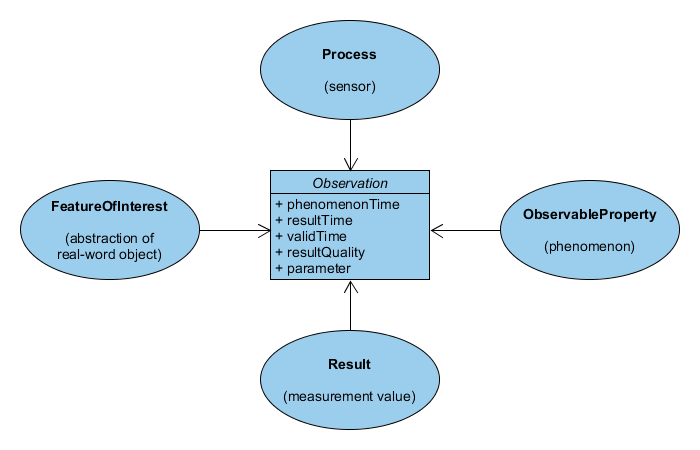

## Observations & Measurements

In addition to the definition of relevant terms within the SWE framework
presented above, a more detailed explanation of how an observation is modeled
is presented subsequently. The information is a summary of the official
OGC **Observations & Measurements** standard version 2.0, which can be downloaded from

> [http://www.opengeospatial.org/standards/om](http://www.opengeospatial.org/standards/om).

The following figure presents an overview of the components of an observation
(Bröring et al. 2011 a). Note that the figure has been simplified in order to
omit complex information.

An observation is a composed object providing relevant observation details.
In consequence, an _observation_ belongs to a _procedure_ that measured a certain
_observedProperty_ at a dedicated _featureOfInterest_ for a certain _phenomenonTime_
and stores a result. The property _resultQuality_ indicates the quality of the
measured result, as each measurement is faulty to a certain extent by nature.

Based on this generic concept, observations are categorized according to
their result type. They may be distinguished in discrete and continuous
observation. An observation is discrete, when the _result_ represents a
spatio-temporal invariant value and applies to the whole area of the referenced
_featureOfInterest_. The possible observation types and their content/result
types are illustrated in the below figure. In contrast, a continuous observation
measures an _observableProperty_ that may vary in time or for the whole area of
a certain _featureOfInterest_. In that case the _result_ is not represented by a
single value, but by a coverage. To model the coverage, distinct sub-geometries
are defined to discretise the whole area of the associated feature. In
consequence, a single coverage consists of multiple entries, one per
sub-geometry and/or timestamp.

 - simplified figure")

The following figure represents the standardized coverage
observation types according to the O&M standard (Cox 2013) in a simplified way.
Considering the discretization of an area-based _featureOfInterest_, the standard
introduces two distinct declarations. The whole _featureOfInterest_ as a single
object (a spatially distributed entity) is denoted as ultimate feature, whereas
each sub-geometry resulting from the discretization process is denoted as a
_sampling feature_. Hence, each concrete measurement value of a coverage
observation refers to a _sampling feature_.

 - simplified figure")

In the following, some examples are given, showcasing encoded O&M documents
within certain use cases.

### Stationary in-situ Sensors

_Stationary in-situ_ sensors are located at a fixed position directly attached
to the associated _featureOfInterest_. In consequence, the properties _procedure_
and _featureOfInterest_ have constant geo-locations and the overall observations
always refer to the same spatial extent (the one of the featureOfInterest). As
an example for _stationary in-situ_ sensors, the below XML illustrates an exemplary
`OM_Observation` instance of a temperature sensor, measuring
the _observedProperty_ “Ambient temperature”. As result, a simple measurement
value (type `OM_Measurement`) of the temperature in degree Celcius (parameter
_uom_ of `om:result` element) is contained. Remarkably, for certain parameters,
only a reference to a named instance is included in the document, e.g. for
the parameters _procedure_ or _featureOfInterest_. This indicates that more
metadata about those entities can be requested via a dedicated operation of
SWE's core service, the **Sensor Observation Service** (more on that later).

~~~ xml
<?xml version="1.0" encoding="UTF-8"?>
<om:OM_Observation xmlns:om="http://www.opengis.net/om/2.0" xmlns:gml="http://www.opengis.net/gml/3.2" xmlns:xlink="http://www.w3.org/1999/xlink" gml:id="o_96084693">
   <!-- observation type; here Measurement -->
   <om:type xlink:href="http://www.opengis.net/def/observationType/OGC-OM/2.0/OM_Measurement" />
   <!-- period in time for which the mesaurment applies -->
   <om:phenomenonTime>
      <gml:TimePeriod gml:id="phenomenonTime_96084693">
         <gml:beginPosition>2014-12-30T23:01:00.000Z</gml:beginPosition>
         <gml:endPosition>2014-12-30T23:02:00.000Z</gml:endPosition>
      </gml:TimePeriod>
   </om:phenomenonTime>
   <!-- point in time when the measurement was observed -->
   <om:resultTime>
      <gml:TimeInstant gml:id="ti_14ED5010C900D2F4B0AF30D8C41CF6895C24F539">
         <gml:timePosition>2014-12-30T23:02:00.000Z</gml:timePosition>
      </gml:TimeInstant>
   </om:resultTime>
   <!-- reference to sensor/procedure using its identifier -->
   <om:procedure xlink:href="ENTPE-AmbT-Vaisala-HMP-45AC-QC1" />
   <!-- reference to phenomena using its identifier -->
   <om:observedProperty xlink:href="Ambient Temperature" />
   <!-- reference to featureOfInterest using its identifier -->
   <om:featureOfInterest xlink:href="ENTPE" xlink:title="ENTPE" />
   <!-- result of the observation -->
   <om:result xmlns:ns="http://www.opengis.net/gml/3.2" xmlns:xsi="http://www.w3.org/2001/XMLSchema-instance" uom="degree C" xsi:type="ns:MeasureType">1.1</om:result>
</om:OM_Observation>
~~~

Another example of an encoded OM_Measurement observation about solar
irradiance is shown in the below XML. This time, the _observedProperty_ is set
to the _phenomenon_ `Direct Horizontal Irradiance` and the measured value comprises
`"96.0" W per m²`.

~~~ xml
<?xml version="1.0" encoding="UTF-8"?>
<om:OM_Observation xmlns:om="http://www.opengis.net/om/2.0" xmlns:gml="http://www.opengis.net/gml/3.2" xmlns:xlink="http://www.w3.org/1999/xlink" gml:id="o_129748204">
   <!-- observation type; here Measurement -->
   <om:type xlink:href="http://www.opengis.net/def/observationType/OGC-OM/2.0/OM_Measurement" />
   <!-- period in time for which the mesaurment applies -->
   <om:phenomenonTime>
      <gml:TimePeriod gml:id="phenomenonTime_129748204">
         <gml:beginPosition>2014-12-31T09:12:00.000Z</gml:beginPosition>
         <gml:endPosition>2014-12-31T09:13:00.000Z</gml:endPosition>
      </gml:TimePeriod>
   </om:phenomenonTime>
   <!-- point in time when the measurement was observed -->
   <om:resultTime>
      <gml:TimeInstant gml:id="ti_E23CEF5CA8211078069BED5B2D21A72AC1798827">
         <gml:timePosition>2014-12-31T09:13:00.000Z</gml:timePosition>
      </gml:TimeInstant>
   </om:resultTime>
   <!-- reference to sensor/procedure using its identifier -->
   <om:procedure xlink:href="ENTPE-BH-KZ-CH1-QCfull" />
   <!-- reference to phenomena using its identifier -->
   <om:observedProperty xlink:href="Direct Horizontal Irradiance" />
   <!-- reference to featureOfInterest using its identifier -->
   <om:featureOfInterest xlink:href="ENTPE" xlink:title="ENTPE" />
   <!-- result of the observation -->
   <om:result xmlns:ns="http://www.opengis.net/gml/3.2" xmlns:xsi="http://www.w3.org/2001/XMLSchema-instance" uom="W m-2" xsi:type="ns:MeasureType">96.0</om:result>
</om:OM_Observation>
~~~

### Mobile in-situ sensors

In contrast to a stationary sensor, _mobile_ sensors are not fixed at a
certain geo-location, but vary in space. As a result, the coordinates of
the sensor/procedure may vary for different points in time. Thus, any
associated observation should be modeled as a so-called _spatial observation_
(type `OM_SpatialObservation`) according to the _Spatial Filtering Profile_ of the
O&M standard. A spatial observation has to include an additional metadata
parameter carrying the sampling feature/geometry, which indicates the
geo-location of the observation, e.g. any `gml:AbstractGeometry` such as points,
lines or polygons. A valid parameter definition of a point feature is
illustrated in the below example. Remarkably, the `xlink:href` attribute value `http://www.opengis.net/def/param-name/OGC-OM/2.0/samplingGeometry` in the element
`om:name` denotes the parameter as the sampling feature. The `om:value` tag
contains a GML point definition.

~~~ xml
<om:parameter>
   <om:NamedValue>
      <om:name xlink:href="http://www.opengis.net/def/param-name/OGC-OM/2.0/samplingGeometry" />
      <om:value>
         <gml:Point gml:id="SamplingPoint1">
            <gml:pos srsName="http://www.opengis.net/def/crs/EPSG/0/4326">52.9 7.52</gml:pos>
         </gml:Point>
      </om:value>
   </om:NamedValue>
</om:parameter>
~~~

Also note the difference between a single _featureOfInterest_ definition and a
sampling feature/geometry. Whereas the _featureOfInterest_ is a static definition
of the area of interest, concrete sampling features/geometries denote dynamic
spatially varying entities to geo-reference a certain observation within the
associated _featureOfInterest_.

An exemplary observation for a _mobile in-situ_ sensor is discussed within the
context of 52°North enviroCar project (enviroCar 2015). In this citizen
science project, floating car data like fuel consumption, speed or pollution
impact is collected/computed using a dedicated device (OBD II adapter) and
a smartphone app. Via associated analysis functionalities, the data can be
used to optimize driving efficiency and other aspects of sustainable mobility.
As each participating user utilizes his/her smartphone as a GPS-sensor to
geo-reference the acquired car data while driving, this setup can be
denoted as a _mobile in-situ_ sensor. To encode the observation as of type
`OM_SpatialObservation`, the following mapping definition is recommended:

| O&M Parameter          | enviroCar Equivalent    |
| ------------- | ------------- |
| Type| OM_SpatialObservation|
| Phenomenon Time| Time instant when performing the measurement|
| Result Time| Time instant when creating/saving the measurement|
| Feature of Interest| No clear definition possible; Within the enviroCar project, multiple measurements are performed/collected for a single track. A track is started by a user when driving around, initiating the systm to frequently perform measurement until the user stops the track. At each measurement, the current GPS position is used as sampling feature (see next table entry). But how can the feature of interest be defined best? An intuitive mapping could be to use the whole geometry of the track (which is a polyline), which is discretized at each concrete measurement location along the path.|
| Parameter Sampling Feature/Geometry| The current (point-based) GPS location of the smartphone when performing the measurement|
| Procedure| OBD II adapter, which is connected to the car|
| Observed Property| One for each car-related phenomenon measured/extracted by the OBD II adapter (e.g. speed, fuel level, ) as well as one for each computed information (such as fuel consumption, estimated fuel cost or CO2 emissions)|
| Result| Stores the measured value according to the observed property|

To illustrate the mapping, an exemplary dataset from the enviroCar project is
presented subsequently. Anonymised data can be retrieved using the
enviroCar REST API via the link

> [https://envirocar.org/api/stable/](https://envirocar.org/api/stable/).

It provides
access to several datasets including tracks, sensors (car definitions),
phenomenons (observable properties) and measurements. Of particular relevance
is the endpoint

> [https://envirocar.org/api/stable/measurements](https://envirocar.org/api/stable/measurements),

which grants
access to concrete measurements. For instance, Figure 8 lists one exemplary
measurement encoded in JSON. The key elements with respect to the mapping to
O&M are highlighted and annotated (using "comment-style" [sic!]).

~~~ json
{
  "type": "Feature",
  "geometry": { // sampling feature
    "type": "Point",
    "coordinates": [
      6.4847174678758375,
      51.22546715521443
    ]
  },
  "properties": {
    "id": "579634f9e4b086b281bf935e", // observation ID
    "time": "2012-01-01T00:06:44Z", // result/phenomenon time
    "sensor": {
      "type": "car",
      "properties": {
        "engineDisplacement": 2200,
        "model": "Vectra C Caravan",
        "id": "5750591ee4b09078f98673d8", // procedure ID
        "fuelType": "gasoline",
        "constructionYear": 2004,
        "manufacturer": "Opel"
      }
    },
    "track": "579634f9e4b086b281bf935c", // feature of interest ID
    "phenomenons": { // phenomena with results
      "Speed": {
        "value": 0,
        "unit": "km/h"
      },
      "O2 Lambda Voltage ER": {
        "value": 0.9903972702086321,
        "unit": "ratio"
      },
      "Intake Temperature": {
        "value": 29.99999910593033,
        "unit": "c"
      },
      "Consumption": {
        "value": 1.781552855748061,
        "unit": "l/h"
      },
      "O2 Lambda Voltage": {
        "value": 1.452168180985609,
        "unit": "V"
      },
      "MAF": {
        "value": 5.4196322499235805,
        "unit": "l/s"
      },
      "Intake Pressure": {
        "value": 33.99999949336052,
        "unit": "kPa"
      },
      "Engine Load": {
        "value": 20.09168342647675,
        "unit": "%"
      },
      "GPS Accuracy": {
        "value": 8.00000011920929,
        "unit": "%"
      },
      "GPS Speed": {
        "value": 0,
        "unit": "km/h"
      },
      "Rpm": {
        "value": 782.9921875,
        "unit": "u/min"
      },
      "CO2": {
        "value": 4.186649211007944,
        "unit": "kg/h"
      }
    }
  }
}
~~~

Each measurement belongs to a certain track, which is referenced by its unique
identifier. A track consists of multiple measurements, each specifying a
concrete position and point in time, where and when the listed phenomena are
observed. Thus, each measurement may be encoded as an `OM_SpatialObservation`.
For instance, using the phenomenon `Consumption`, the JSON-encoded observation
might be transformed into O&M as shown in the below example. As suggested the
track identifier is used to reference the _featureOfInterest_. This mapping
decision however is just within the scope of this document. It is possible
that other definitions of the feature of interest are more applicable.

~~~ xml
<?xml version="1.0" encoding="UTF-8"?>
<om:OM_Observation xmlns:om="http://www.opengis.net/om/2.0" xmlns:gml="http://www.opengis.net/gml/3.2" xmlns:xlink="http://www.w3.org/1999/xlink" gml:id="579634f9e4b086b281bf935e">
   <!-- observation type; here SpatialObservation -->
   <om:type xlink:href="http://www.opengis.net/def/observationType/OGC-OM/2.0/OM_SpatialObservation" />
   <!-- period in time for which the mesaurment applies -->
   <om:phenomenonTime>
      <gml:TimeInstant gml:id="/uniqueID/">
         <gml:timePosition>2012-01-01T00:06:44Z</gml:timePosition>
      </gml:TimeInstant>
   </om:phenomenonTime>
   <!-- point in time when the measurement was observed -->
   <om:resultTime>
      <gml:TimeInstant gml:id="/uniqueID/">
         <gml:timePosition>2012-01-01T00:06:44Z</gml:timePosition>
      </gml:TimeInstant>
   </om:resultTime>
   <!-- definition of observation geometry; location where the observation was performed -->
   <om:parameter>
      <om:NamedValue>
         <om:name xlink:href="http://www.opengis.net/def/param-name/OGC-OM/2.0/samplingGeometry" />
         <om:value>
            <gml:Point gml:id="SamplingPoint1">
               <gml:pos srsName="http://www.opengis.net/def/crs/EPSG/0/4326">51.22546715521443, 6.4847174678758375</gml:pos>
            </gml:Point>
         </om:value>
      </om:NamedValue>
   </om:parameter>
   <!-- reference to sensor/procedure using its identifier -->
   <om:procedure xlink:href="5750591ee4b09078f98673d8" />
   <!-- reference to phenomena using its identifier -->
   <om:observedProperty xlink:href="Consumption" />
   <!-- reference to featureOfInterest using its identifier -->
   <om:featureOfInterest xlink:href="579634f9e4b086b281bf935c" xlink:title="579634f9e4b086b281bf935c" />
   <!-- result of the observation -->
   <om:result xmlns:ns="http://www.opengis.net/gml/3.2" xmlns:xsi="http://www.w3.org/2001/XMLSchema-instance" uom="l/h" xsi:type="ns:MeasureType">1.781552855748061</om:result>
</om:OM_Observation>
~~~

### Stationary Remote sensors
Opposed to in-situ sensors, a remote sensor is not directly attached to its
associated featureOfInterest. This is the typical scenario for virtual sensors
computing certain phenomena from various (maybe spatially distributed) input
data, where the calculated output refers to any featureOfInterest with
arbitrary geo-location. However, the geo-reference of the sensor/procedure
itself is constant (stationary).

Fotoquest

> [http://www.iiasa.ac.at/web/home/about/news/20150709-Fotoquest.html](http://www.iiasa.ac.at/web/home/about/news/20150709-Fotoquest.html) and [http://fotoquest.at/](http://fotoquest.at/)

is a citizen science project within Austria. The aim is to collect land cover
observation using a game-like app on users mobile smartphones. A grid was
layered over Austria. At each grid point, land cover photos of the surroundings
should be taken and uploaded by any citizen.

> TBD Simon: How does that characterize a stationary remote sensor?
