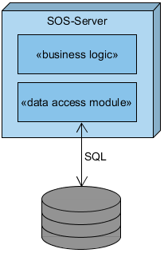
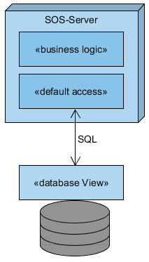
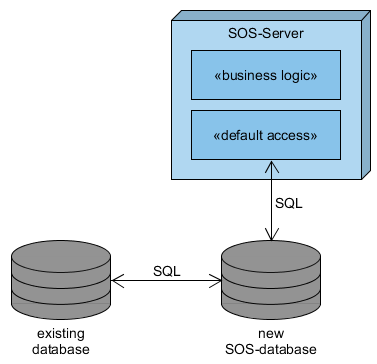
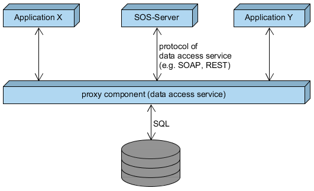

## How to Setup an SOS Server?

Within this section, concrete recommendations on how to setup a SOS server
are introduced. To offer sensor data in a standardized and interoperable way,
an implementation of a SOS according to the OGC specification has to be
deployed on a Web server. The implementation itself hereby has to consider
several key aspects. First of all, an appropriate data source tier is required
in order to persist, manage and retrieve sensor data. Second, a suitable
implementation of the core SOS functionalities must be provided. Both aspects
are intensified subsequently.

### Data Sources and Storing of Sensor Data

While in theory, an arbitrary data source could be used for persistence and
data management, a general recommendation is to employ a database (e.g.
PostgreSQL or Oracle). Advantages of a database include at least the following:

* **generic data model** for arbitrary sensor data: In contrast to other data sources like file based sources, a database model, realized through multiple related tables, represents a generic data schema with which heterogeneous sensor data can be stored in a homogeneous way.

* **improved access**: a Data Base Management System (DBMS) provides a performant and quality assured access point for data modification/retrieval (management). In opposite to other sources, this enables efficient CRUD operations, which reduces response time of SOS-requests.

* support for different concrete DBMS using similar SQL statements (even better: using a high-level database management library like Hibernate allows support for several concrete DBMS)

In conclusion, a database as data source enables efficient and robust
management of sensor data. In general, there are different setting scenarios
on how to employ a SOS implementation on top of a database. For once, it has
to be decided whether to use an already existing database with its own data
schema or create a new database conforming to the specific requirements of the
used SOS instance. Another aspect is whether the SOS instance shall directly
access the database or use an intermediate proxy component to handle database
access. The subsequent sub sections elaborate on each distinct setting scenario
and provide helpful hints about advantages and disadvantages.

#### Usage of existing Databases for direct Access

When setting up a SOS, existing databases can be used. However, considering
the data schema (how the relevant information is structured within the database),
each database might reveal differences compared to each other. Hence, it is a
decisive prerequisite to adapt the SOS server to correctly identify and interpret
the relevant data stored in a certain database. For this reason, multiple
strategies exist, comprising an adaption of the SOS server (see following sections)
or the creation of database views (see below as well) to prepare the database
information in a SOS-friendly way.

##### Adaption of the Database Access Module of the SOS Implementation

This approach requires a programmatic adaption of the SOS data access module.
The implementation logic is changed to reflect the data schema of the database.
However, this is a very specialized approach only applicable for implemented
schema and is hence not recommended.

##### Database Abstraction Layer

In contrast to the previous solution, this approach makes use of an additional
abstraction layer defining configuration files to match the SOS implementation
to the data schema of the database. For instance, such a database abstraction
layer is provided by the Hibernate framework ([Redhat, 2016](99_bibliography.md)), which offers
so-called mapping files to link the tables and columns of the database to the
relevant aspects of O&M. With the help of these mapping files, the SOS server
is able to flexibly adapt to a different database schema. If the mapping leads
to complex database queries to extract needed information, this approach might
result in performance issues.

")

##### Defining Database Views

The definition of database Views maintains both the database schema and the
SOS server implementation. No adaptions are necessary, as the created views
resemble the information structure as expected by the SOS. In contrast to
standard Views, which are dynamically generated per database query, it is
recommended to use so-called materialized Views. Those are created and persisted
by the database and thus do not have to be re-generated for each new query.
However, materialized Views have to be updated regularly to store the most
current information. Several techniques are applicable (e.g. using a time
interval or a database trigger).

#### Creation of Separate Databases for SOS Server for Direct Access

When setting up a SOS server, a different approach is to setup a separate
(new) database to store the relevant data. Following this approach includes
several advantages, such as:

* definition of an optimized data model/schema, allowing the individual SOS instance to access the data with best performance
* no need for adaption/configuration of the data access module of the SOS server is required

As a prerequisite, the separate database has to be fed with the relevant sensor
data. To transfer/integrate new data into the database, several strategies exist,
including the import from another database via SQL scripts (see below) or
relying on the transactional operations of the SOS server (see below as well).

##### Data Import Using SQL Scripts

Should the data be transferred from a second database, suitable SQL scripts
can be defined and executed. The scripts have to take the different database
schema into account to properly migrate the data from one database to the other.

##### Data Import Using Transactional SOS Operations

As introduced in the [corresponding section](05_web-services.md), an SOS offers transactional operations to insert
new sensor data to the underlying database. The data to be inserted is sent
within a transactional request and is then automatically stored within the
database using the data schema of the SOS instance.

If relevant data is stored within other formats (e.g. CSV files), an additional
component called SOS-Feeder can be utilized to parse the content and integrate
it into the database via transactional SOS operations. Hereby, the feeders tasks
can be triggered manually (an authorized person starts the import manually) or
automatically (e.g. the _SOS Feeder_ performs regular checks for new files).

")

#### Using an Intermediate Proxy

In the previous scenarios, the database was directly accessed by the SOS server.
As an alternative, an intermediate proxy component can be employed to encapsulate
the database access. Due to this architecture, the SOS server is made independent
from the actual database model/schema, as the interface between SOS server and
proxy remains stable. Should the data model/schema change, then only the proxy
component has to be adapted accordingly. However, the additional proxy component
creates additional communication, which might lead to performance issues. For
instance, the proxy might offer several de- and encodings of the sensor data
(e.g. SOAP or REST), which might require an additional de- or encoding step in
the processing chain.

In order to reduce communication with the database, a SOS server may cache
frequently queried data. For instance, the GetCapabilities operation (see
[corresponding section](05_web-services.md)) provides a general overview of
available sensor data. If the corresponding metadata was cached by the SOS server,
it would not have to retrieve that data from the database for each request.
Instead it would rely on the cached information to answer the request. Of course,
the cached information should be updated regularly to reflect the most current
state of stored information. Concluding, a caching approach allows better
performance with regard to response time of SOS operations, but it has to
be ensured that the cached information is up-to-date.

To summarize the various strategies on how to setup a SOS, the subsequent
table presents a final overview of advantages and disadvantages of each approach.

  
Click to expand the (excessive) table

<table>
  <thead>
    <tr>
      <th rowspan="2"></th>
      <th colspan="3">using existing databases</th>
      <th colspan="2">creation of new separate SOS database</th>
      <th rowspan="2">intermediate proxy</th>
    </tr>
    <tr>
      <!-- spanned<td></td>-->
      <th>implementation of database access module</th>
      <th>database abstraction layer</th>
      <th>database View (materialized)</th>
      <th>data import from existing databases via SQL scripts</th>
      <th>data import using transactional SOS operations</th>
      <!-- spanned<td></td>-->
    </tr>
  </thead>
  <tbody>
    <tr>
      <th>possibility to use existing database</th>
      <td>yes</td>
      <td>yes</td>
      <td>yes</td>
      <td>no</td>
      <td>no</td>
      <td>yes</td>
    </tr>
    <tr>
      <th>adaption of existing database</th>
      <td>not needed</td>
      <td>not needed</td>
      <td>existing database structure remains, but additional Views have to defined</td>
      <td>not needed</td>
      <td>not needed</td>
      <td>not needed</td>
    </tr>
    <tr>
      <th>additional configuration / adaption when structure of database changes</th>
      <td>programmatic changes</td>
      <td>adaption of configuration (mapping files)</td>
      <td>adaption of created Views</td>
      <td>database changes are unlikely, since database is only used for SOS</td>
      <td>database changes are unlikely, since database is only used for SOS</td>
      <td>not needed</td>
    </tr>
    <tr>
      <th>programmatic changes of SOS server</th>
      <td>needed to match the data schema of the database</td>
      <td>only re-configuration needed, no re-implementation</td>
      <td>not needed</td>
      <td>not needed</td>
      <td>not needed</td>
      <td>proxy has to be adapted, SOS server remains untouched</td>
    </tr>
    <tr>
      <th>possibility to update the SOS server implementation</th>
      <td>complex, since specific database access module needs adaption to the new SOS server version</td>
      <td>maybe adaption of configuration / mapping files to match new SOS internal data model</td>
      <td>maybe adaption of Views to match new SOS internal data model</td>
      <td>maybe adaption of SQL scripts to match new SOS internal data model</td>
      <td>not needed, as SOS internal data structure is encapsulated by standardized SOS operations</td>
      <td>complex as module for proxy communication needs adaption to new SOS version</td>
    </tr>
    <tr>
      <th>performance</th>
      <td>depends on database model/schema; How fast can relevant data be extracted?</td>
      <td>depends on database model/schema; How fast can relevant data be extracted?</td>
      <td>high as (materialized) Views can be designed to support optimal query performance</td>
      <td>high, since optimized database model/schema is used</td>
      <td>high, since optimized database model/schema is used</td>
      <td>epends on performance of data access service; Additional performance loss caused by additional communication process</td>
    </tr>
  </tbody>
</table>

