## Mapping your own database to the 52°North Sensor Web database model

As introduced before, two very typical approaches for serving your data with the 52°North Sensor Web Server comprise the creation of database views to emulate the 52°North data model or to use other external tools to copy your existing data into the 52°North Sensor Web database.
However, in order to provide you with the necessary knowledge to implement these workflows, it is important to understand how the data model of the 52°North Sensor Web Server is structures. Consequently, this exercise introduces first the core elements of the 52°North Sensor Web Data model.
Afterwards we will conduct an exercise in which you will work on an approach, how you map the content of your existing data to the elements of the 52°North Sensor Web data model.

### Task 1

Select a dataset that is common to your regular work which you would like to publish via the 52°North Sensor Web server. For this dataset, create empty tables (e.g. as Excel sheets or diagrams) of the 52°North Sensor Web data model. Write down the table name and indicate the columns that this table should have.

### Task 2

Fill the empty tables that you have created with data examples (e.g. the Excel sheet or diagram) from your data sets.

### Explanation of the 52°North Sensor Web Data Model

The following diagram outlines the general structure of the 52°North Sensor Web data model. Please note, there are some further tables in the data model which will not be discussed in this case. These tables are either not necessary for the normal operation of the SOS, or they only contain management information which does not require a conceptual mapping.

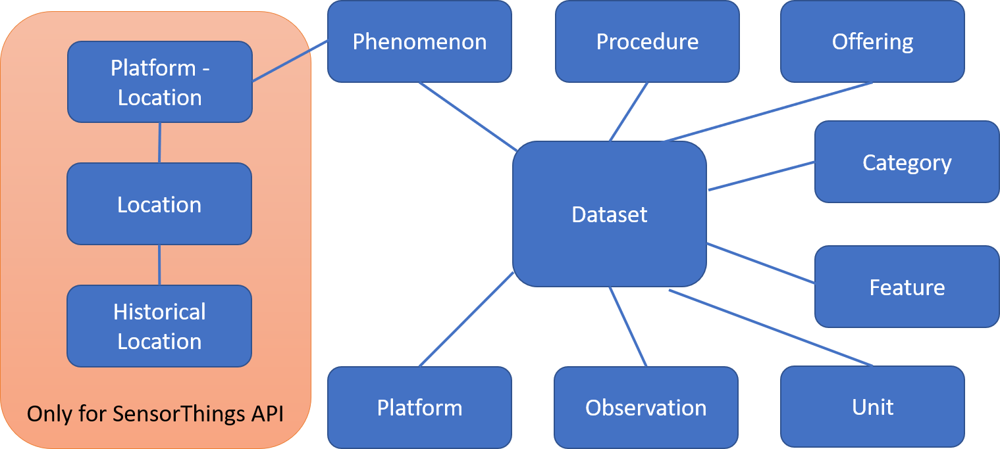

Before looking at the main contents of the tables, we first explain the meaning of these tables:
* Dataset: This is the central tables for organizing the database content. It organizes the observation data into datasets and defines common properties (e.g., observed parameter, unit of measurement, etc.) that are common to all observation belonging to a common dataset. Also, the Dataset table makes certain operations of the Sensor Web server more efficient, because it keeps track of the time stamp of the first and last value of a dataset.
* Observation: This tables contain the individual observations; mainly this includes the time stamps as well the values of the observation (the value that was measured).
* Unit: This table is used for storing the units of measurements used by the data sets.
* Category: In the 52°North Helgoland API it is possible to group data sets into Categories. These categories can be completely user-defined (e.g., organizations, projects, regions, thematical categories, etc.). This table is used for managing these categories (mainly mapping the category names to ids)
* Feature: The so-called Features are the geographical objects for which observations provide values. This can be cities, countries, measurement stations, etc.). Thus, this table contain mainly the names/ids of the Features as well as their geo-reference (e.g., coordinates).
* Offering: This table is specific to the SOS standard. It manages the groupings of observations which are called “Offerings”.
* Procedure: This table manages the procedures (e.g., sensors, human observers, models), which have generated the observations. Besides the names/ids of the procedures, this tables may contain comprehensive descriptions of the procedures (e.g., complete SensorML encoded sensor description documents)
* Phenomenon: This table manages the parameters which are observed by the sensors (the so-called observed properties)
* Platform: This table can be used to manage platforms on which sensors are mounted (e.g., research vessels, sensor stations, etc.)
   
Besides these core tables, there are the following further tables which are necessary for operating the OGC SensorThings API module:
* Location: This refers to the location of Things to which sensors are attached
* Historical location: This refers to past locations of Things. However, if sensors are not moved, this table can remain empty.
* Platform - Location: This table ensures that platforms are linked to their locations; as locations may change, this table is necessary so that also historical locations can be linked to the platform

After this general introduction, we will now have a closer look at the different tables. In order to ensure good readability, we will focus on the important fields which are critical when creating a mapping of your own data to the 52°North Sensor Web database.

### Dataset
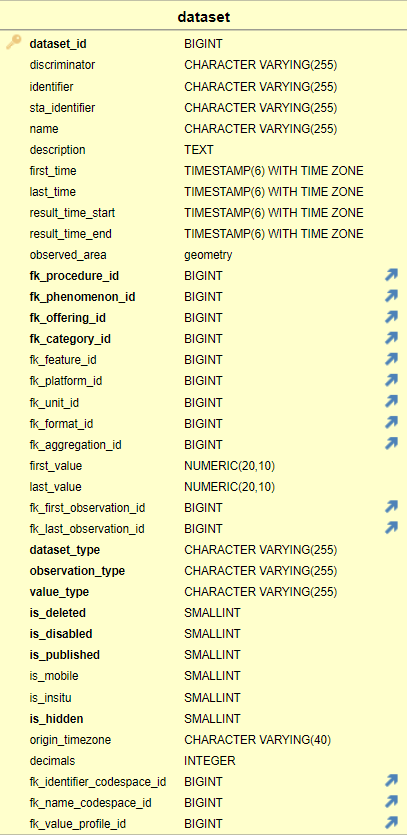

**Description**: Storage of the dataset, the core table of the whole database model.

| column | comment | NOT-NULL | default | SQL type |
| --- | --- | --- | --- | --- |
| dataset_id | PK column of the table | true | - | int8 |
| identifier | Unique identifier of the dataset which can be used for filtering, e.g. GetObservationById in the SOS and can be encoded in WaterML 2.0 oder TimeseriesML 1.0 outputs. | false | - | varchar(255) |
| name | The human readable name of the dataset. | false | - | varchar(255) |
| description | A short description of the dataset | false | - | text | 
| first_time | The timestamp of the temporally first observation that belongs to this dataset. | false | - | timestamp with time zone |
| last_time | The timestamp of the temporally last observation that belongs to this dataset. | false | - | timestamp with time zone |
| fk_procedure_id | Reference to the procedure that belongs that belongs to this dataset. | true | - | int8 |
| fk_phenomenon_id | Reference to the phenomenon that belongs that belongs to this dataset. | true | - | int8 |
| fk_offering_id | Reference to the offering that belongs that belongs to this dataset. | true | - | int8 |
| fk_category_id | Reference to the category that belongs that belongs to this dataset. | true | - | int8 |
| fk_feature_id | Reference to the feature that belongs that belongs to this dataset. | false | - | int8 |
| fk_platform_id | Reference to the platform that belongs that belongs to this dataset. | false | - | int8 |
| fk_unit_id | Reference to the unit of the observations that belongs to this dataset. | false | - | int8 | 
| first_value | The value of the temporally first observation that belongs to this dataset. | false | - | numeric(20, 10) |
| last_value | The value of the temporally last quantity observation that belongs to this dataset. | false | - | numeric(20, 10) |
| fk_first_observation_id | Reference to the temporally first observation in the observation table that belongs to this dataset. | false | - | int8 |
| fk_last_observation_id | Reference to the temporally last observation in the observation table that belongs to this dataset. | false | - | int8 |
| dataset_type | Indicator whether the dataset provides individualObservation (individual observations), timeseries (timeseries obervations) or trajectories (trajectory observations). | true | 'not_initialized' | varchar(255) |
| observation_type | Indicator whether the dataset observations are of type simple (a simple observation, e.g. a scalar value like the temperature) or profile (profile observations) | true | 'not_initialized' | varchar(255) |
| value_type | Indicator of the type of the single values. Valid values are quantity (scalar values), count (integer values), text (textual values), category (categorical values), bool (boolean values), reference (references, e.g. link to a source, photo, video) | true | 'not_initialized' | varchar(255) |
| is_deleted | Flag that indicates if this dataset is deleted | true | 0 | int2 |
| is_disabled | Flag that indicates if this dataset is disabled for insertion of new data | true | 0 | int2 |
| is_published | Flag that indicates if this dataset should be published | true | 1 | int2 |
| is_mobile | Flag that indicates if the procedure is mobile (1/true) or stationary (0/false). | false | 0 | int2 |
| is_insitu | Flag that indicates if the procedure is insitu (1/true) or remote (0/false). | false | 1 | int2 |
| is_hidden | Flag that indicates if this dataset should be hidden, e.g. for sub-datasets of a complex datasets | true | 0 | int2 |
| origin_timezone | Define the origin timezone of the dataset timestamps. Possible values are offset (+02:00), id (CET) or full name (Europe/Berlin). It no time zone is defined, UTC would be used as default. | false | - | varchar(40) |
| decimals | Number of decimals that should be present in the output of the observation values. If no value is set, all decimals would be present. | false | - | int4 |

### Observation
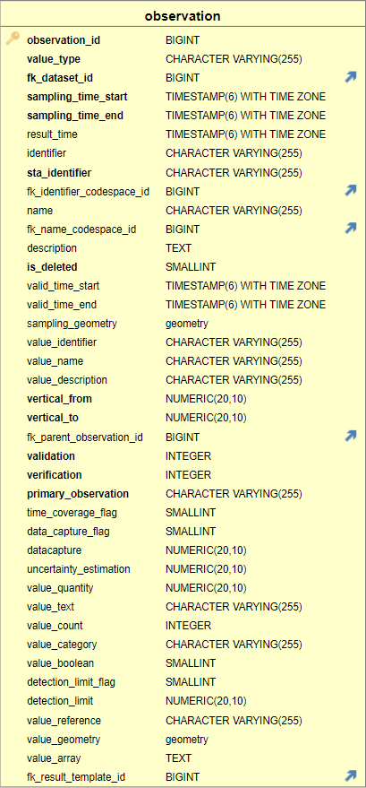

**Description**: Storage of the observation values with the timestamp and additional metadata. The metadata are height/depth values for profile observation and sampling geometries for trajectory observations. In each observation entry only one value_... column should be filled with a value!

| column | comment | NOT-NULL | default | SQL type |
| --- | --- | --- | --- | --- |
| observation_id | PK column of the table | true | - | int8 |
| value_type | Indicator used by Hibernate to map value specific entities. Valid values are quantity (scalar values in value_quantity), count (integer values in value_count), text (textual values in value_text), category (categorical values in value_category), bool (boolean values in value_boolean), reference (references in value_reference, e.g. link to a source, photo, video) | true | - | varchar(255) |
| fk_dataset_id | Reference to the dataset to which this observation belongs. | true | - | int8 |
| sampling_time_start | The timestamp when the observation period has started or the observation took place. In the the latter, sampling_time_start and sampling_time_end are equal. | true | - | timestamp with time zone |
| sampling_time_end | The timestamp when the measurement period has finished or the observation took place. In the the latter, sampling_time_start and sampling_time_end are equal. | true | - | timestamp with time zone |
| result_time | The timestamp when the observation was published. Might be identical with sampling_time_start and sampling_time_end. | true | - | timestamp with time zone |
| identifier | Unique identifier of the observation which can be for used filtering, e.g. GetObservationById in the SOS. Should be a URI, UUID. E.g. http://www.example.org/123, 123-321 | false | - | varchar(255) |
| name | The human readable name of the observation. | false | - | varchar(255) | 
| description | A short description of the observation | false | - | text |
| is_deleted | Flag that indicates if this observation is deleted | true | 0 | int2 |
| valid_time_start | The timestamp from when the obervation is valid, e.g. forcaste observations | false | NULL | timestamp with time zone |
| valid_time_end | The timestamp until when the obervation is valid, e.g. forcaste observations | false | NULL | timestamp with time zone |
| sampling_geometry | The geometry that represents the location where the observation was observed, e.g. mobile observations (trajectories) where this geometry is different from the feature geometry. | false | - | GEOMETRY | 
| value_identifier | Identifier of the value. E.g. used in OGC SWE encoded values like SweText | false | - | varchar(255) |
| value_name | Identifier of the name. E.g. used in OGC SWE encoded values like SweText | false | - | varchar(255) |
| value_description | Identifier of the description. E.g. used in OGC SWE encoded values like SweText | false | - | varchar(255) |
| vertical_from | The start level of a vertical observation, required for profile observations | true | 0 | numeric(20, 10) |
| vertical_to | The end level or the level of a vertical observation, required for profile observations | true | 0 | numeric(20, 10) |
| value_quantity | The quantity value of an observation (Measurement) | false | - | numeric(20, 10) | 
| detection_limit_flag | Flag that indicates if measured value lower/higher of the detection limit. | false | - | int2 |
| detection_limit | The detection limit | false | - | numeric(20, 10) |
| value_text | The textual value of an observation (TextObservation)) | false | - | varchar(255) |
| value_reference | The reference value (URI) of an observation (ReferenceObservation) | false | - | varchar(255) |
| value_count | The count/integer value of an observation (CountObservation) | false | - | int4 |
| value_boolean | The boolean value of an observation (Boolean/TruthObservation) | false | - | int2 |
| value_category | The categorical value of an observation (CategoryObervation) | false | - | varchar(255) |
| value_geometry | The geometry value of an observation (GeometryObservation) | false | - | GEOMETRY |
| value_array | The textual value of an observation (SweDataArrayObservation)) | false | - | text |
| value | The blob value of an observation | false | - | oid | 

### Unit
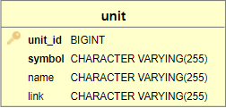

**Description**: Storage of the units of measurement of the observation values. These may be °C or m as the unit for depth/height information.

| column | comment | NOT-NULL | default | SQL type |
| --- | --- | --- | --- | --- |
| unit_id | PK column of the table | true | - | int8 |
| symbol | The symbol of the unit, e.g. °C or m. | true | - | varchar(255) |
| name | Human readable name of the unit, e.g degree celsius or meter | false | - | varchar(255) | 
| link | Link/reference to an external description of the unit, e.g. to a vocabulary.. | false | - | varchar(255) |

### Feature
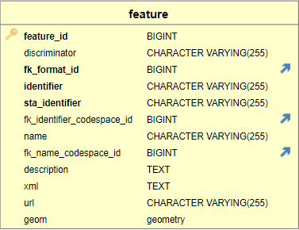

**Description**: Storage of the features (OfInterest). A feature represents the observed location, route, or area. As examples, the location of the weather station or the water level location, a ferry (Cuxhaven-Helgoland) or a lake of interest.

| column | comment | NOT-NULL | default | SQL type |
| --- | --- | --- | --- | --- |
| feature_id | PK column of the table | true | - | int8 |
| identifier | Unique identifier of the feature which is used for filtering. Should be a URI, UUID. E.g. http://www.example.org/123, 123-321 | true | - | varchar(255) | 
| name | The human readable name of the feature. | false | - | varchar(255) |
| description | A short description of the feature | false | - | text |
| url | Optional URL to an external resource that describes the feature, e.g. a WFS | false | - | varchar(255) |
| geom | The geometry/location of feature | false | - | GEOMETRY |

### Category
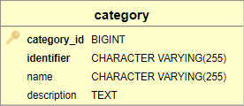

**Description**: Storage of the categories which should be used to group the data.

| column | meaning | NOT-NULL | default | SQL type |
| --- | --- | --- | --- | --- |
| category_id | PK column of the table | true | - | int8 |
| identifier | Unique identifier of the category which can be used for filtering. Should be a URI, UUID. E.g. http://www.example.org/123, 123-321 | true | - | varchar(255) |
| name | The human readable name of the category. | false | - | varchar(255) |
| description | A short description of the category. | false | - | text |

### Offering
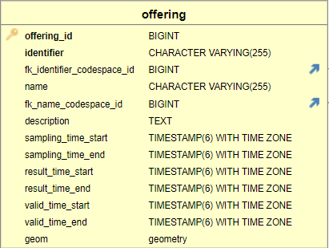

**Description**: Storage of the offerings which is required by the SOS. An offering is used in SOS to group records according to specific criteria. In the INSPIRE context, an offering is an "INSPRE spatial dataset," an identifiable collection of spatial data.

| column | comment | NOT-NULL | default | SQL type |
| --- | --- | --- | --- | --- |
| offering_id | PK column of the table | true | - | int8 |
| identifier | Unique identifier of the offering which can be used for filtering. Should be a URI, UUID. E.g. http://www.example.org/123, 123-321. | true | - | varchar(255) |
| name | The human readable name of the offering. | false | - | varchar(255) |
| description | A short description of the offering | false | - | text |
| sampling_time_start | The minimum samplingTimeStart of all observation that belong to this offering. If the column is empty, the information is calculated during the cache update and stored locally. Used for the capabilities of the SOS. | false | - | timestamp with time zone | 
| sampling_time_end | The maximum samplingTimeStart of all observation that belong to this offering. If the column is empty, the information is calculated during the cache update and stored locally. Used for the capabilities of the SOS. | false | - | timestamp with time zone |
| result_time_start | The minimum resultTimeStart of all observation that belong to this offering. If the column is empty, the information is calculated during the cache update and stored locally. Used for the capabilities of the SOS. | false | - | timestamp with time zone |
| result_time_end | The maximum resultTimeEnd of all observation that belong to this offering. If the column is empty, the information is calculated during the cache update and stored locally. Used for the capabilities of the SOS. | false | - | timestamp with time zone | 
| valid_time_start | The minimum validTimeStart of all observation that belong to this offering. If the column is empty, the information is calculated during the cache update and stored locally. Used for the capabilities of the SOS. | false | - | timestamp with time zone |
| valid_time_end | The maximum validTimeEnd of all observation that belong to this offering. If the column is empty, the information is calculated during the cache update and stored locally. Used for the capabilities of the SOS. | false | - | timestamp with time zone |
| geom | The envelope/geometry of all features or samplingGeometries of observations that belong to this offering. If the column is empty, the information is calculated during the cache update and stored locally. Used for the capabilities of the SOS. | false | - | GEOMETRY |

### Procedure
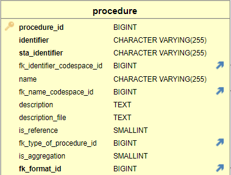

**Description**: Storage of the procedure/sensors. The procedure can be a sensor, process/method or a system that produces observations.

| column | comment | NOT-NULL | default | SQL type |
| --- | --- | --- | --- | --- |
| procedure_id | PK column of the table | true | - | int8 |
| identifier | Unique identifier of the procedure which can be used for filtering. Should be a URI, UUID. E.g. http://www.example.org/123, 123-321 | true | - | varchar(255) |
| name | The human readable name of the procedure. | false | - | varchar(255) | string | 
| description | A short description of the procedure | false | - | text |
| description_file | Location to or XML encoded description of the procedure. Can be used if procedure history is not supported. | false | - | text |
| is_reference | Flag that indicates if the procedure is a reference. | false | 0 | int2 |
| fk_type_of_procedure_id | Reference to a procedure this entry is a typeOf. | false | - | int8 |

### Phenomenon
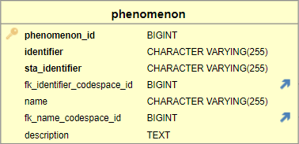

**Description**: Storage of the observed parameters of the sensors.

| column | comment | NOT-NULL | default | SQL type |
| --- | --- | --- | --- | --- |
| phenomenon_id | PK column of the table | true | - | int8 | 
| identifier | Unique identifier of the phenomenon which can be used for filtering. Should be a URI (reference to a vacabulary entry), UUID. E.g. http://www.example.org/123, 123-321 | true | - | varchar(255) |
| name | The human readable name of the phenomenon. | false | - | varchar(255) |
| description | A short description of the phenomenon | false | - | text |

### Platform
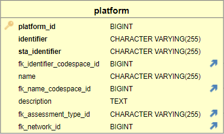

**Description**: Storage of the platforms. With a platform several procedures can be grouped or in the case of citizen science the platform can be the camera or mobile phone. An example of a platform is a vessel that has multiple sensors (Procedure). In most cases, the platform is the same as the feature or procedure, such as a weather station or a water level location.

| column | comment | NOT-NULL | default | SQL type |
| --- | --- | --- | --- | --- |
| platform_id | PK column of the table | true | - | int8 |
| identifier | Unique identifier of the platform which can be used for filtering. Should be a URI, UUID. E.g. http://www.example.org/123, 123-321 | true | - | varchar(255) |
| name | The human readable name of the platform. | false | - | varchar(255) |
| description | A short description of the platform | false | - | text | 

### SensorThings API-specific Tables
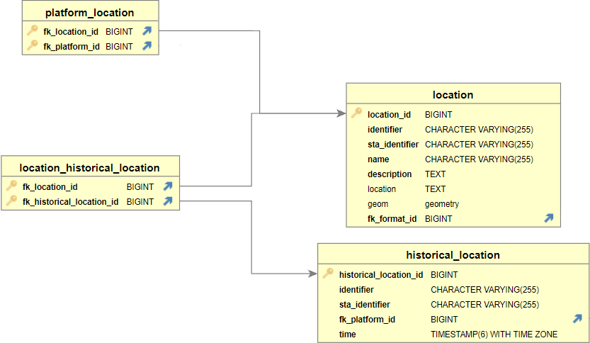

#### location
**Description**: Describes the location of a Thing (platform).
| column | comment | NOT-NULL | default | SQL type |
| --- | --- | --- | --- | --- |
| location_id | - | true | - | int8 |
| identifier | Unique identifier of the location. Should be a URI, UUID. E.g. http://www.example.org/123, 123-321. | true | - | varchar(255) |
| name | - | true | - | varchar(255) |
| description | - | true | - | text 
| geom | - | false | - | GEOMETRY |

#### platform_location
**Description**: Establishes a reference between plaforms (Things) and their location.
| column | comment | NOT-NULL | default | SQL type |
| --- | --- | --- | --- | --- |
| location_id | - | true | - | int8 |
| platform_id | - | true | - | int8 |

#### historical_location
**Description**: Describes the time period when a location was the location of a thing in the past.
| column | comment | NOT-NULL | default | SQL type |
| --- | --- | --- | --- | --- |
| historical_location_id | - | true | - | int8 |
| identifier | Unique identifier of the HistoricalLocation. Should be a URI, UUID. E.g. http://www.example.org/123, 123-321. | true | - | varchar(255) |
| time | - | true | - | timestamp with time zone | timestamp | 

#### location_historical_location
**Description**: Reference between locations and the information when they were the current locations.
| column | comment | NOT-NULL | default | SQL type |
| --- | --- | --- | --- | --- |
| fk_location_id | - | true | - | int8 | 
| fk_historical_location_id | - | true | - | int8 |

