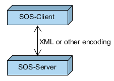
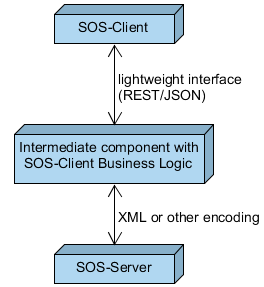
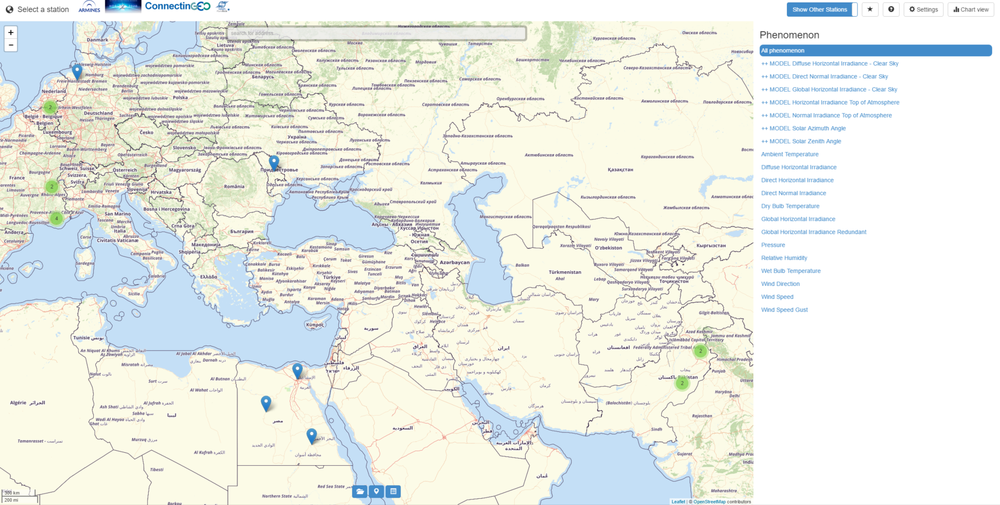
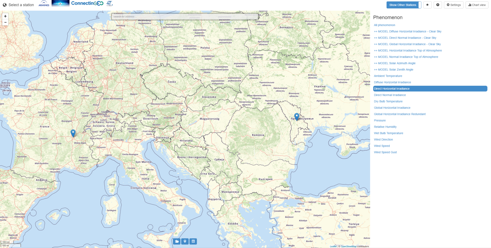
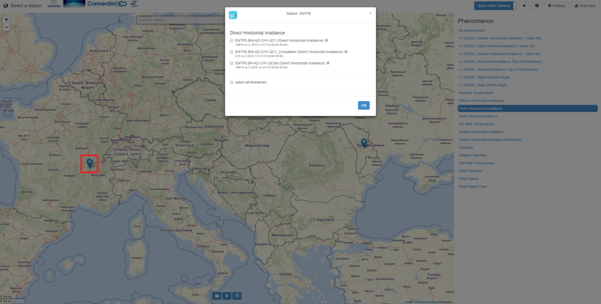
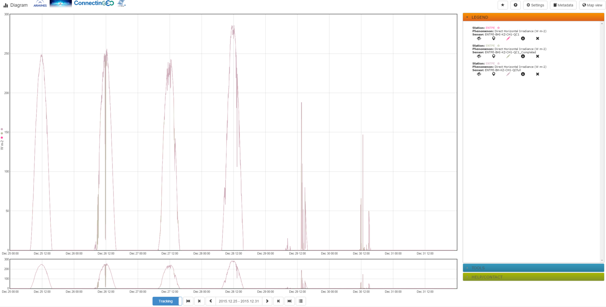

## Sensor Web Client Software

Another important aspect of SWE is to visualize and analyse observation data.
In this context relevant data is often denoted as time series data to indicate
the temporal variety of observed phenomena, which shall be perceived using
applicable graphs and diagrams. In addition, certain data might be visualized
on an interactive map enabling users to click on those objects and trigger
certain tasks. Within this section, information about sensor web clients are
provided, starting with an overview of different architectural concepts.
Afterwards, an exemplary SWE client is introduced, operating as a web browser
application.

### Architectural Concepts

#### Direct Interaction with SOS server

As an intuitive setting, SOS client and server could communicate directly.
Clients would use the dedicated operations of the SOS to retrieve relevant
sensor data. This implies that any logic for interactions as well as de- and
encoding of SOS-requests and corresponding responses have to be executed by
clients themselves. Hence this setting is only recommended when the SOS client
is running on high-performance hardware.

#### Intermediate Component Performing Business Logic

In contrast to direct communication, an additional intermediate component
can be employed to perform arbitrary intermediate business logic tasks. This
intermediate component runs on high-performance hardware and encapsulates the
communication with the SOS server. In addition, it may offer other
functionalities, such as storing cached sensor metadata, perform generalization
tasks (see below) or offer a lightweight interface (e.g. REST/JSON)
to clients. Following this architecture pattern includes the advantage that
complex business tasks such as decoding large XML datasets or caching of
metadata is shifted from clients to a server-side component. However, the
client side is not allowed to interactively add another SOS server and
visualize its data as this knowledge has to be added to the intermediate
component itself.

As request/response messages have to be frequently exchanged between a SOS
client and a SOS, a REST interface can be facilitated for lightweight message
exchange and reduction of message contents. With the help of a dedicated REST
API, a SOS server (or intermediate proxy component) may provide an easy access
to relevant observation data through a RESTful interface, where message
exchange is realized by a JSON binding. Via dedicated REST API calls, only
those elements, which are really necessary for client side visualization, can
be retrieved. The benefit is that the content of exchanged messages can be
minimized and, thus, message and network/bandwidth overload be reduced. This
enables clients with an on-demand query interface for time series data.

With regard to queryable observation data, a REST API should offer retrieval
of at least the following data:

* **Platforms/stations (sensor locations)**, where observations are made, in order to display them on a map or within a list for interactive selection. Can be used to filter observation data by procedure.

* **Geometries of features of interest** to display them on a map. This could indicate the observed area, to which observation data applies.

* **Phenomena/observableProperties** to enable users to filter observations by phenomena.

* **Observation data (time series data)**, e.g. to draw graphs/diagrams for a certain period in time.

As an example the REST API of 52°North offers the previously
introduced features. A description of the API can be consulted at

> [http://52north.github.io/series-rest-api/](http://52north.github.io/series-rest-api/)

### Exemplary SOS Web Client

An exemplary browser-based JavaScript client is accessible via

> [http://insitu.webservice-energy.org/jsClient-0.2.0/#map](http://insitu.webservice-energy.org/jsClient-0.2.0/#map)

It provides a visual interface to access measured and computed climate
data within the context of renewable energies. The client itself is an adopted
version of the 52°North sensor web client, whose GitHub repository is located
at

> [https://github.com/52North/helgoland](https://github.com/52North/helgoland)

The client uses the REST
API to retrieve observation data and display is accordingly. The below figure shows
the landing page, displaying a map with available stations on the left as
well as a list of available phenomena (observed properties) on the right.

On startup, the relevant data (stations as well as phenomena) is automatically
retrieved from the configured SOS instance
([http://insitu.webservice-energy.org/52n-sos-webapp](http://insitu.webservice-energy.org/52n-sos-webapp)).
Via the phenomena list, stations can be filtered. E.g. by clicking on the
phenomena _Direct Horizontal Irradiance_, the associated stations are determined
and the map view is refreshed showing only the remaining stations.

To visualize observation data, a station on the map has to be clicked,
which opens a dialog box to select the phenomena according to the figure below.
In this case, only the previously filtered _Direct Horizontal Irradiance_
is available. User may select the time series datasets they intend to retrieve
and visualize and click on the _OK_ button.

For instance, when selecting all three time series datasets, the client builds
and executes a request against the REST API to retrieve available data for all
selected datasets. To reduce the amount of data being requested, a standard
time interval (the last available week) is added to the request. After fetching
the data, the client creates a graph visualization, as shown in the following figure.

The graph shows the value distribution of the selected phenomena for seven
days, each day annotated at midnight and midday. Using this graph view as a
basis, analysis can be executed. For instance, as the _Direct Horizontal
Irradiance_ is associated with sunlight, it is not surprising that the highest
values occur at around midday and that during the night the values remain 0.
The client offers more interaction for further investigation. E.g. the displayed
time period can be changed (using the time options below) causing the client
to re-request the data according to the new time period. On the right side,
the dataset options, such as show metadata, show/hide or remove dataset, can
be performed. Concluding the lightweight client allows access to and
visualization of observation data stored in a SOS. It might serve for basic
analysis of time series data. Of course, additional high-level analysis tools
can be offered via a suitable GUI interface.

### Additional Considerations
In addition to the already described functional requirements of a SOS client,
other generic capabilities need to be discussed. For this reason, three topics
regarding data generalization as well as data archiving are addressed
subsequently.

#### Generalization

When visualizing time series data within diagrams and graphs, generalization
aspects have to be taken into account. Mostly, the number of available
measurements is much higher than the number of displayable datasets. For
instance, if a time series comprises hourly data and a client intends to
visualize the data of a whole year, then approximately 8500 values will be
displayed. Considering that most client displays allow diagram sizes of less
than 1000 pixels, only 1/8 of the requested data could be visualized. In
addition including all of the requested data might result in a large document
that has to be transferred via a Web connection. For this reason, the requested
data should be generalized in order to reduce the amount of transferred data.
Hereby it is important that the overall characteristics of the requested data
is preserved and the data is not falsified.

#### Permalink to Certain Visualization

If the user of a SOS client has selected certain time series and even
individualized its graphical representation, it is aspirational to make it
reproducible with a minimum effort. In consequence, a SOS client might offer
so-called permalinks for the current view, with which the selected datasets
as well as configurations of visual properties can be re-accessed at a later
point in time.

#### Data Download/Export

To archive the visualized time series data, SOS clients might offer a download
or export functionality. This should include archiving the actual measurement
data (e.g. as CSV file or Excel sheet) for usage in other computer programs.
In addition, the export of the current diagram view within reports
(e.g. PDF file) could be offered.
