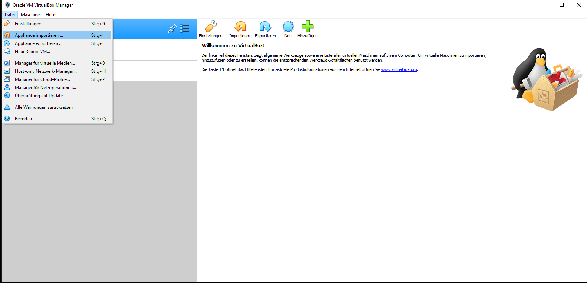

## Hands-On Sensor Web Open Source Software!

In order to get the most easy jump-start on Sensor Web software, we have
developed a set of [VirtualBox](https://www.virtualbox.org/){target=_blank}
 images. You will
require VirtualBox running on your machine in order to use the following examples.
Instructions for all supported platform are available at:

> [https://www.virtualbox.org/wiki/Downloads](https://www.virtualbox.org/wiki/Downloads){target=_blank}

### 52°North Sensor Web VirtualBoxes

This section provides a brief overview on the available VirtualBox images for
the Sensor Web Workshop at Fréjus 2021:

> [Debian](https://52north.org/delivery/SensorWeb/Workshops/Frejus_2021/Sensor%20Web%20Workshop%202021.ova){target=_blank}

> [Debian with preinstalled SOS/STA](https://52north.org/delivery/SensorWeb/Workshops/Frejus_2021/Sensor%20Web%20Workshop%202021 inst.ova){target=_blank}

#### Installation of the image

> ####### Activity
>
>1. Download `Debian` of the previously mentiond images to your preferred location, e.g `/home/demo/`
>1. Start *VirtualBox*
>1. Select *File*, *Import Appliance* (*Datai* and *Appliance importieren* in the screenshot)
>	* Select the *.ova* file from the dialog (e.g. from `/home/demo/`)
>	* Click *Import*
>5. Check the *Appliance Settings*
>	* Click *Import*

More details are in the official [VirtualBox documentations](https://www.virtualbox.org/manual/ch01.html#ovf-import-appliance){target=_blank}

#### Run the VirtualBox images

> ####### Activity
>
>1. Select the VirtualBox you would like to start
>	- Click *Start* on the panel
>	- Or *right click* and select *Start*
>1. The images starts
>1. Login withe the `Debian` password
>1. Open Firefox
>	* Click *Activities* (top left)
>   * Click *Firefox* symbol
>1. Firefox starts with the tutorial (in the browser of the image: `http://localhost:8080/tutorial/`)

##### Debian

> **Password**: demo

##### Tomcat

> **Username**: admin

> **Password**: tomcat

##### PostgreSQL/PostGIS

> **Username**: postgres

> **Password**: postgres

#### SOS (preinstalled)

> **Username**: admin

> **Password**: password

### Create PostgreSQL database

#### Open a terminal

> ####### Activity
>
>1. Login to Debian with `demo` password
>1. Open a terminal´
>	* Click *Activities* (top left)
>	* Type in *Type to search* `terminal`	
>	* Press enter and a terminal window opens	

#### Create the database

> ####### Activity
>
>1. Switch to *postgres* user
>	* Type `su - postgres` and *enter*	
>1. Conntect ot postgresql
>	* Type `psql` and *enter*
>1. Create the `sensorweb` database
>	* Type `CREATE DATABASE sensorweb´;` and *enter*
>1. Quit psql
>	* Type `\q` and *enter*
	
#### Create PostGIS extension

> ####### Activity
>
>1. Connect to the new `sensorweb` database 
>	*Type `psql -d  sensorweb  -U postgres` and *enter*
>1. Create the PostGIS extension
>	* Type `CREATE EXTENSION postgis;` and *enter*
>1. Quit psql
>	* Type `\q` and *enter*
>1. Quit as user *postgres*
>	* Type `exit` and *enter*
