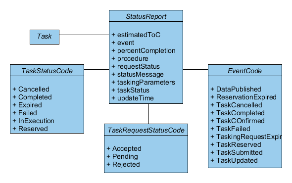

## Workflow Overview

In this section are examples given to send requests to the SOS. The first request
is the `InsertSensor` operation. This request inserts a new sensor into the SOS.
Next comes the `InsertObservation` operation. This request inserts a new observation
for a registered sensor to the SOS. With the operation `GetCapabilities` metadata about the
SOS instance itself can be requested. The operation `GetDataAvailability` responses
information about the available observations in the SOS. Last the  `GetObservation` operation
returns the requested observations.

## 52°North SOS Test Clients
It is recommended to use the **52°North SOS Test Client** to test your installation of the SOS by sending
prepared example requests or your own requests.

With the four fields "Service", "Version", "Binding and "Operation" the example requests can be filtered.
In the field "Load a example request" an example request can be choosen. If a request is loaded, it is shown 
at the bottom of the page. The example request can be manipulated or you can create your own requests. It is also
possible to follow this tutorial along and use the presented requests in the 52°North SOS Test Client.

## Enable transactional SOS operations
For security reasons, the transactional SOS operations are disabled by default and the _Transactional Security_ is
activated by default with allowed IPs _127.0.0.1_. To follow the given examples in this tutorial activate the
transactional SOS operations in the **Operations settings** (Admin >> Settings >> Operations).

## InsertSensor
The `InsertSensor` operation can be used to add to the SOS a detailed sensor description about a certain sensor,
encoded in a Sensor Model Language (SensorML) version 1.0.1 or 2.0 document.
To insert a certain sensor description the following request parameters are offered:

| Parameter Name| Description| Mandatory|
| -----| -----| -----|
| service| fixed value “SOS”| no|
| request| fixed value “InsertSensor”| yes|
| version| indicates the service version, e.g. “2.0.0”| yes|
| extension| specific extension, e.g. “language”| no|
| procedureDescriptionFormat| reference to a known procedure description format, such as “http://www.opengis.net/sensorML/1.0.1” or “http://www.opengis.net/sensorML/2.0”| yes|
| procedureDescription| the procedure/sensor description using the format specified in parameter procedureDescriptionFormat, e.g. a valid SensorML document| yes|
| observedProperty| reference to a dedicated observable property / phenomenon that is measured by the inserted sensor/procedure;| yes|
| metadata/sosInsertionMetadata/observationType| Reference to an observation type which is produced by the sensor/procedure| yes|
| metadata/sosInsertionMetadata/featureOfInterestType| Reference to the type of the feature of interest which is observed by the sensor/procedure| yes|

An exemplar `InsertSensor` request against a local installation of the SOS ([http://localhost:8080/52n-sos-webapp/service](http://localhost:8080/52n-sos-webapp/service))
using POX binding is illustrated in the below example. The sensor in this example is a thermometer measuring
the air temperature at the office of 52°North GmbH located in the city of Muenster.

~~~xml
<?xml version="1.0" encoding="UTF-8"?>
<swes:InsertSensor
    xmlns:swes="http://www.opengis.net/swes/2.0"
    xmlns:sos="http://www.opengis.net/sos/2.0"
    xmlns:swe="http://www.opengis.net/swe/2.0"
    xmlns:sml="http://www.opengis.net/sensorml/2.0"
    xmlns:gml="http://www.opengis.net/gml/3.2"
    xmlns:xlink="http://www.w3.org/1999/xlink"
    xmlns:xsi="http://www.w3.org/2001/XMLSchema-instance"
    xmlns:gco="http://www.isotc211.org/2005/gco"
    xmlns:gmd="http://www.isotc211.org/2005/gmd" service="SOS" version="2.0.0" xsi:schemaLocation="http://www.opengis.net/sos/2.0 http://schemas.opengis.net/sos/2.0/sosInsertSensor.xsd  http://www.opengis.net/swes/2.0 http://schemas.opengis.net/swes/2.0/swes.xsd">
	<!-- reference to a known procedure description format such as “http://www.opengis.net/sensorML/1.0.1” or “http://www.opengis.net/sensorML/2.0” -->
    <swes:procedureDescriptionFormat>http://www.opengis.net/sensorml/2.0</swes:procedureDescriptionFormat>
	<!-- procedure/ sensor description using the format specified in parameter procedureDescriptionFormat, e.g. a valid SensorML document -->
    <swes:procedureDescription>
        <sml:PhysicalSystem gml:id="Thermometer">
            <!-- unique identifier of the procedure/ sensor (used for references) -->
            <gml:identifier codeSpace="uniqueID">Thermometer_1285</gml:identifier>
            <sml:identification>
                <sml:IdentifierList>
                    <!-- long and short description of the procedure/ sensor -->
					<sml:identifier>
                        <sml:Term definition="urn:ogc:def:identifier:OGC:1.0:longName">
                            <sml:label>longName</sml:label>
                            <sml:value>Thermometer 1285 at the 52°North GmbH office building</sml:value>
                        </sml:Term>
                    </sml:identifier>
                    <sml:identifier>
                        <sml:Term definition="urn:ogc:def:identifier:OGC:1.0:shortName">
                            <sml:label>shortName</sml:label>
                            <sml:value>Thermometer 1285</sml:value>
                        </sml:Term>
                    </sml:identifier>
                </sml:IdentifierList>
            </sml:identification>
			<!-- offering of the procedure/ sensor -->
            <sml:capabilities name="offerings">
                <sml:CapabilityList>
                    <!-- Special capabilities used to specify offerings. -->
                    <!-- Parsed and removed during InsertSensor/UpdateSensorDescription, added during DescribeSensor. -->
                    <!-- Offering is generated if not specified. -->
                    <sml:capability name="offeringID">
                        <swe:Text definition="urn:ogc:def:identifier:OGC:offeringID">
                            <!-- name of the offering -->
							<swe:label>Thermometer 1285 Offering</swe:label>
                            <!-- unique identifier of the offering (used for references) -->
							<swe:value>Thermometer_1285_offering</swe:value>
                        </swe:Text>
                    </sml:capability>
                </sml:CapabilityList>
            </sml:capabilities>
            <sml:capabilities name="metadata">
                <sml:CapabilityList>
                    <!-- status indicates, whether sensor is insitu (true) or remote (false) -->
                    <sml:capability name="insitu">
                        <swe:Boolean definition="insitu">
                            <swe:value>true</swe:value>
                        </swe:Boolean>
                    </sml:capability>
                    <!-- status indicates, whether sensor is mobile (true) or fixed/stationary (false) -->
                    <sml:capability name="mobile">
                        <swe:Boolean definition="mobile">
                            <swe:value>false</swe:value>
                        </swe:Boolean>
                    </sml:capability>
                </sml:CapabilityList>
            </sml:capabilities>
			<!-- feature of interest of the procedure/ sensor -->
            <sml:featuresOfInterest>
                <sml:FeatureList definition="http://www.opengis.net/def/featureOfInterest/identifier">
                    <!-- name of the feature of interest -->
					<swe:label>Muenster</swe:label>
					<!-- unique identifier of the feature of interest (used for references) -->
                    <sml:feature xlink:href="Muenster"/>
                </sml:FeatureList>
            </sml:featuresOfInterest>
            <sml:inputs>
                <sml:InputList>
                    <!-- input of the procedure/ sensor (multiple inputs possible) -->
					<sml:input name="weather">
                        <sml:ObservableProperty definition="weather"/>
                    </sml:input>
                </sml:InputList>
            </sml:inputs>
            <sml:outputs>
                <sml:OutputList>
                    <!-- output of the procedure/ sensor (multiple output possible) -->
					<sml:output name="air_temperature">
                        <swe:Quantity definition="http://vocab.nerc.ac.uk/collection/P07/current/CFSN0023/">
                            <swe:uom code="degC"/>
                        </swe:Quantity>
                    </sml:output>
                </sml:OutputList>
            </sml:outputs>
			<!-- position of the procedure/ sensor -->
            <sml:position>
                <swe:Vector referenceFrame="urn:ogc:def:crs:EPSG::4326">
                    <swe:coordinate name="easting">
                        <swe:Quantity axisID="x">
                            <swe:uom code="degree"/>
                            <swe:value>7.651968812254194</swe:value>
                        </swe:Quantity>
                    </swe:coordinate>
                    <swe:coordinate name="northing">
                        <swe:Quantity axisID="y">
                            <swe:uom code="degree"/>
                            <swe:value>51.935101100104916</swe:value>
                        </swe:Quantity>
                    </swe:coordinate>
                    <swe:coordinate name="altitude">
                        <swe:Quantity axisID="z">
                            <swe:uom code="m"/>
                            <swe:value>52.0</swe:value>
                        </swe:Quantity>
                    </swe:coordinate>
                </swe:Vector>
            </sml:position>
        </sml:PhysicalSystem>
    </swes:procedureDescription>
	<!-- reference to a dedicated observable property/ phenomenon that is measured by the inserted procedure/ sensor (multiple values possible) -->
    <swes:observableProperty>air_temperature</swes:observableProperty>
    <swes:metadata>
        <sos:SosInsertionMetadata>
			<!-- reference to an observation type which is produced by the procedure/ sensor (multiple values possible) -->
            <sos:observationType>http://www.opengis.net/def/observationType/OGC-OM/2.0/OM_Measurement</sos:observationType>
			<!-- reference to the type of the feature of interest which is observed by the procedure/ sensor -->
            <sos:featureOfInterestType>http://www.opengis.net/def/samplingFeatureType/OGC-OM/2.0/SF_SamplingPoint</sos:featureOfInterestType>
        </sos:SosInsertionMetadata>
    </swes:metadata>
</swes:InsertSensor>
~~~

In response to a successful `InsertSensor` request, the SOS responds with a pointer
to the created sensor instance as well as a pointer to the created offering associated
to the inserted sensor/procedure.

~~~xml
<?xml version="1.0" encoding="UTF-8"?>
<swes:InsertSensorResponse xmlns:swes="http://www.opengis.net/swes/2.0" xmlns:xsi="http://www.w3.org/2001/XMLSchema-instance" xsi:schemaLocation="http://www.opengis.net/swes/2.0 http://schemas.opengis.net/swes/2.0/swesInsertSensor.xsd">
  <!-- reference to the created procedure/ sensor instance -->
  <swes:assignedProcedure>Thermometer_1285</swes:assignedProcedure>
  <!-- reference to the created offering associated to the inserted procedure/ sensor -->
  <swes:assignedOffering>Thermometer_1285_offering</swes:assignedOffering>
</swes:InsertSensorResponse>
~~~

## InsertObservation

missing text

## GetCapabilities

missing text

## GetDataAvailability`

missing text

## GetObservation

missing text

### Sensor Observation Service

The **OGC Sensor Observation Service (SOS)** is a Web Service that allows users
to request observations and associated metadata of sensors. Within the context
of the SWE framework, the SOS represents the core service to access sensor data
in an interoperable and standardized manner. The service specification
(version 2.0), which can be downloaded from

> [http://www.opengeospatial.org/standards/sos](http://www.opengeospatial.org/standards/sos),

defines several mandatory as well as some optional operations, as introduced in
the following. With regard to the core operations
(`GetCapabilities`, `DescribeSensor`, `GetObservation`), a description, the
service interface (request parameters) and an example is presented. For most
optional operations, only a description of the method as well as the request
parameters is included. Most of the subsequent information was extracted from
the SOS 2.0 standard specification ([OGC 2012](99_bibliography.html)). A valid SOS instance is available
via the URL

> [http://insitu.webservice-energy.org/52n-sos-webapp](http://insitu.webservice-energy.org/52n-sos-webapp).

It will be used throughout this section to present examples of the main operations.

#### GetCapabilities

Similar to other OGC services, the `GetCapabilities` operation responds with
metadata about the service instance itself. Amongst others, the Capabilities
document lists available _sensors/procedures_, _offerings_, _observedProperties_,
_featuresOfInterest_ as well as spatial and temporal bounding boxes of the
available _observations_. A `GetCapabilities` request may contain the following
parameters:

| Parameter Name| Description| Mandatory|
| -----| -----| -----|
| service| fixed value “SOS”| no|
| request| fixed value “GetCapabilities”| yes|
| version| indicates the service version, e.g. “2.0.0”| yes|
| extension| specific extension, e.g. “language”| no|
| acceptVersions| submit accepted versions, e.g. “2.0.0”| no|
| acceptFormats| preferred response formats| no|
| updateSequence| service metadata document version, value is “increased” whenever any change is made in complete service metadata document| no|
| sections| include only relevant sections within the response document and omit the rest| no|

A full response document contains several sections offering metadata. The most relevant sections are:

* **serviceIdentification**: metadata about the service itself, such as title, versions, languages

* **serviceProvider**: metadata about the provider/organization, such as contact information

* **operationsMetadata**: metadata about the offered operations, including which operations are offered (like GetCapabilites, DescribeSensor, GetObservation, …), available bindings (e.g. POX, KVP, SOAP, JSON) and a URL endpoint.

* **contents**: metadata about available observation offerings including their associated properties such as identifier, procedure, reponseFormats, temporal and spatial aspects, …

* **filterCapabilities**: metadata about the supported spatial and temporal filter functionalities
extension: container for extensions

Sending a capabilities request
(e.g. [http://insitu.webservice-energy.org/52n-sos-webapp/sos?service=SOS&REQUEST=GetCapabilities](http://insitu.webservice-energy.org/52n-sos-webapp/sos?service=SOS&REQUEST=GetCapabilities)),
results in a full capabilities document. As an excerpt, the following Listing
presents an exemplary observation offering from the content section of the
Capabilities document.

~~~ xml

<?xml version="1.0" encoding="UTF-8"?>
<sos:ObservationOffering xmlns:sos="http://www.opengis.net/sos/2.0" xmlns:fes="http://www.opengis.net/fes/2.0" xmlns:gml="http://www.opengis.net/gml/3.2" xmlns:swe="http://www.opengis.net/swe/2.0" xmlns:swes="http://www.opengis.net/swes/2.0" xmlns:xlink="http://www.w3.org/1999/xlink" xmlns:xsi="http://www.w3.org/2001/XMLSchema-instance" service="SOS" version="2.0.0" xsi:schemaLocation="http://www.opengis.net/sos/2.0 http://schemas.opengis.net/sos/2.0/sos.xsd">
   <!-- identifier and name of the offering -->
   <swes:identifier>ENTPE-BH-KZ-CH1-QCfull</swes:identifier>
   <swes:name codeSpace="eng">ENTPE-BH-KZ-CH1-QCfull</swes:name>
   <swes:procedure>ENTPE-BH-KZ-CH1-QCfull</swes:procedure>
   <!-- available description format for sensor descriptions; here SensorML 1.0.1 and 2.0 as well as WaterML 2.0 -->
   <swes:procedureDescriptionFormat>http://www.opengis.net/sensorML/1.0.1</swes:procedureDescriptionFormat>
   <swes:procedureDescriptionFormat>http://www.opengis.net/sensorml/2.0</swes:procedureDescriptionFormat>
   <swes:procedureDescriptionFormat>http://www.opengis.net/waterml/2.0/observationProcess</swes:procedureDescriptionFormat>
   <!-- observed phenomena -->
   <swes:observableProperty>Direct Horizontal Irradiance</swes:observableProperty>
   <!-- bounding box of observed area -->
   <sos:observedArea>
      <gml:Envelope srsName="http://www.opengis.net/def/crs/EPSG/0/4326">
         <gml:lowerCorner>45.7786 4.9225</gml:lowerCorner>
         <gml:upperCorner>45.7786 4.9225</gml:upperCorner>
      </gml:Envelope>
   </sos:observedArea>
   <!-- period in time for which the mesaurment applies -->
   <sos:phenomenonTime>
      <gml:TimePeriod gml:id="phenomenonTime_122">
         <gml:beginPosition>2006-01-01T00:00:00.000Z</gml:beginPosition>
         <gml:endPosition>2016-01-01T00:00:00.000Z</gml:endPosition>
      </gml:TimePeriod>
   </sos:phenomenonTime>
   <!-- period in time for when the mesaurment was performed -->
   <sos:resultTime>
      <gml:TimePeriod gml:id="resultTime_122">
         <gml:beginPosition>2006-01-01T00:01:00.000Z</gml:beginPosition>
         <gml:endPosition>2016-01-01T00:00:00.000Z</gml:endPosition>
      </gml:TimePeriod>
   </sos:resultTime>
   <!-- available response formats; here JSON, O&amp;M 2.0 WaterML 2.0 -->
   <sos:responseFormat>application/json</sos:responseFormat>
   <sos:responseFormat>http://dd.eionet.europa.eu/schemaset/id2011850eu-1.0</sos:responseFormat>
   <sos:responseFormat>http://www.opengis.net/om/2.0</sos:responseFormat>
   <sos:responseFormat>http://www.opengis.net/waterml-dr/2.0</sos:responseFormat>
   <sos:responseFormat>http://www.opengis.net/waterml/2.0</sos:responseFormat>
   <!-- observation type; here Measurement -->
   <sos:observationType>http://www.opengis.net/def/observationType/OGC-OM/2.0/OM_Measurement</sos:observationType>
   <!-- type of associated featureOfInterest -->
   <sos:featureOfInterestType>http://www.opengis.net/def/samplingFeatureType/OGC-OM/2.0/SF_SamplingPoint</sos:featureOfInterestType>
</sos:ObservationOffering>
~~~

#### DescribeSensor

The `DescribeSensor` operation can be used to retrieve a detailed sensor
description about a certain sensor, encoded in a Sensor Model Language
(SensorML) version 1.0.1 or 2.0 document. As sensor configuration and
calibration might change over time, several different instances of a sensor
description for the same sensor can be stored by a SOS, each being valid for
a certain amount of time. To request a certain sensor description the following
request parameters are offered:

| Parameter Name| Description| Mandatory|
| -----| -----| -----|
| service| fixed value “SOS”| no|
| request| fixed value “DescribeSensor”| yes|
| version| indicates the service version, e.g. “2.0.0”| yes|
| extension| specific extension, e.g. “language”| no|
| procedure| reference to the target sensor/procedure | yes|
| procedureDescriptionFormat| selects the target description format identifier| yes|
| validTime| Time instant or period for which the sensor description is retrieved| no|

For instance, an exemplar DescribeSensor request (using the binding POX) against
the URL [http://insitu.webservice-energy.org/52n-sos-webapp/service](http://insitu.webservice-energy.org/52n-sos-webapp/service)
might look like:

~~~ xml
<?xml version="1.0" encoding="UTF-8"?>
<swes:DescribeSensor xmlns:swes="http://www.opengis.net/swes/2.0" xmlns:gml="http://www.opengis.net/gml/3.2" xmlns:swe="http://www.opengis.net/swe/2.0" xmlns:xsi="http://www.w3.org/2001/XMLSchema-instance" service="SOS" version="2.0.0" xsi:schemaLocation="http://www.opengis.net/swes/2.0 http://schemas.opengis.net/swes/2.0/swes.xsd http://www.opengis.net/swe/2.0 http://schemas.opengis.net/sweCommon/2.0/swe.xsd">
   <!-- reference to sensor/procedure using its identifier -->
   <swes:procedure>ENTPE-BH-KZ-CH1-QCfull</swes:procedure>
   <!-- definition of sensor description format; here SensorML 1.0.1 -->
   <swes:procedureDescriptionFormat>http://www.opengis.net/sensorML/1.0.1</swes:procedureDescriptionFormat>
   <!-- optional validTime: if not set, latest sensor description is returned -->
   <swes:validTime>
      <gml:TimePeriod gml:id="validTime">
         <gml:beginPosition>2014-08-14T15:02:43.219</gml:beginPosition>
         <gml:endPosition>2014-08-14t15:02:47</gml:endPosition>
      </gml:TimePeriod>
   </swes:validTime>
</swes:DescribeSensor>
~~~

With regard to the request,the following Listing presents the basic response
structure. In particular, the SensorML description is included within
_DescribeSensorResponse/description/_ _SensorDescription/data/_. The content
is omitted here by intention.

~~~ xml
<?xml version="1.0" encoding="UTF-8"?>
<swes:DescribeSensorResponse xmlns:swes="http://www.opengis.net/swes/2.0" xmlns:sml="http://www.opengis.net/sensorML/1.0.1" xmlns:xsi="http://www.w3.org/2001/XMLSchema-instance">
   <swes:procedureDescriptionFormat>http://www.opengis.net/sensorML/1.0.1</swes:procedureDescriptionFormat>
   <swes:description>
      <swes:SensorDescription>
         <swes:data>
            <sml:Component>
               <!-- details omitted for brevity -->
            </sml:Component>
         </swes:data>
      </swes:SensorDescription>
   </swes:description>
</swes:DescribeSensorResponse>
~~~

#### GetObservation

The `GetObservation` operation represents the core operation of the SOS to
request observation data encoded in Observations & Measurements (O&M) standard
or any other suitable format (O&M is recommended though for interoperability).
In general a SOS might host a huge number of observations, each composed within
a certain offering. For this reason, several filter options can be submitted in
a GetObservation request, as listed in the below table. Note that although all
filter options are not mandatory, at least some filters should be set in order
to reduce the length of the response document.

| Parameter Name| Description| Mandatory|
| -----| -----| -----|
| service| fixed value “SOS”| no|
| request| fixed value “GetObservation”| yes|
| version| indicates the service version, e.g. “2.0.0”| yes|
| extension| specific extension, e.g. “language”| no|
| featureOfInterest| reference to a dedicated feature of interest; used to filter observations by feature of interest| no|
| observedProperty| reference to a dedicated observable property / phenomenon; used to filter observations by observable property| no|
| offering| reference to a dedicated offering which composes of observations from a certain procedure and observable property| no|
| procedure| reference to a dedicated procedure; used to filter observations by procedure| no|
| spatialFilter| Used to filter observation with regard to spatial properties| no|
| temporalFilter| Used to filter observation with regard to temporal properties| no|
| responseFormat| Used to specify the desired response format, the default format for SOS 2.0 is http://www.opengis.net/om/2.0 | no|

An exemplar GetObservation request against
[http://insitu.webservice-energy.org/52n-sos-webapp/service](http://insitu.webservice-energy.org/52n-sos-webapp/service)
using POX binding is illustrated in the below example.
It contains an example for each filter option.

~~~ xml
<?xml version="1.0" encoding="UTF-8"?>
<sos:GetObservation xmlns:sos="http://www.opengis.net/sos/2.0" xmlns:fes="http://www.opengis.net/fes/2.0" xmlns:gml="http://www.opengis.net/gml/3.2" xmlns:swe="http://www.opengis.net/swe/2.0" xmlns:swes="http://www.opengis.net/swes/2.0" xmlns:xlink="http://www.w3.org/1999/xlink" xmlns:xsi="http://www.w3.org/2001/XMLSchema-instance" service="SOS" version="2.0.0" xsi:schemaLocation="http://www.opengis.net/sos/2.0 http://schemas.opengis.net/sos/2.0/sos.xsd">
   <!-- optional sensor identifier, multiple values possible -->
   <sos:procedure>ENTPE-BH-KZ-CH1-QCfull</sos:procedure>
   <!-- optional offering identifier, multiple values possible -->
   <sos:offering>ENTPE-BH-KZ-CH1-QCfull</sos:offering>
   <!-- optional phenomena isentifier, multiple values possible -->
   <sos:observedProperty>Direct Horizontal Irradiance</sos:observedProperty>
   <!-- optional definition of a period in time, for which observation should be returned -->
   <sos:temporalFilter>
      <fes:During>
         <fes:ValueReference>phenomenonTime</fes:ValueReference>
         <gml:TimePeriod gml:id="tp_1">
            <gml:beginPosition>2014-11-19T14:00:00.000+01:00</gml:beginPosition>
            <gml:endPosition>2014-11-19T15:00:00.000+01:00</gml:endPosition>
         </gml:TimePeriod>
      </fes:During>
   </sos:temporalFilter>
   <!-- optional identifier of featureOfInterest, multiple values possible -->
   <sos:featureOfInterest>ENTPE</sos:featureOfInterest>
   <!-- optional definition of a spatial filter for which observations should be returned -->
   <sos:spatialFilter>
      <fes:BBOX>
         <fes:ValueReference>om:featureOfInterest/sams:SF_SpatialSamplingFeature/sams:shape</fes:ValueReference>
         <gml:Envelope srsName="http://www.opengis.net/def/crs/EPSG/0/4326">
            <gml:lowerCorner>0 0</gml:lowerCorner>
            <gml:upperCorner>60 60</gml:upperCorner>
         </gml:Envelope>
      </fes:BBOX>
   </sos:spatialFilter>
   <!-- optional definition of the response format; here O&amp;M 2.0 -->
   <sos:responseFormat>http://www.opengis.net/om/2.0</sos:responseFormat>
</sos:GetObservation>
~~~

As a result, the SOS responds with a `GetObservationResponse` document
comprising zero or multiple observationData entries, each storing an instance
of an observation (e.g. an O&M document, if the associated response format was
requested). The following listing provides an excerpt from the response to the
previously presented request.

~~~ xml
<?xml version="1.0" encoding="UTF-8"?>
<sos:GetObservationResponse xmlns:sos="http://www.opengis.net/sos/2.0" xmlns:xlink="http://www.w3.org/1999/xlink" xmlns:xsi="http://www.w3.org/2001/XMLSchema-instance" xsi:schemaLocation="http://www.opengis.net/om/2.0 http://schemas.opengis.net/om/2.0/observation.xsd http://www.opengis.net/sos/2.0 http://schemas.opengis.net/sos/2.0/sos.xsd">
   <!-- exemplar entry -->
   <sos:observationData>
      <!-- observation with uniwue identifier -->
      <om:OM_Observation xmlns:om="http://www.opengis.net/om/2.0" xmlns:gml="http://www.opengis.net/gml/3.2" gml:id="o_129567565">
         <!-- observation type; here Measurement -->
         <om:type xlink:href="http://www.opengis.net/def/observationType/OGC-OM/2.0/OM_Measurement" />
         <!-- period in time for which the mesaurment applies -->
         <om:phenomenonTime>
            <gml:TimePeriod gml:id="phenomenonTime_129567565">
               <gml:beginPosition>2014-11-19T13:39:00.000Z</gml:beginPosition>
               <gml:endPosition>2014-11-19T13:40:00.000Z</gml:endPosition>
            </gml:TimePeriod>
         </om:phenomenonTime>
         <!-- point in time when the measurement was observed -->
         <om:resultTime>
            <gml:TimeInstant gml:id="ti_9FC93B1C00320A5DC5A324BE1DBF4C6754E7F746">
               <gml:timePosition>2014-11-19T13:40:00.000Z</gml:timePosition>
            </gml:TimeInstant>
         </om:resultTime>
         <!-- reference to sensor/procedure using its identifier -->
         <om:procedure xlink:href="ENTPE-BH-KZ-CH1-QCfull" />
         <!-- reference to phenomena using its identifier -->
         <om:observedProperty xlink:href="Direct Horizontal Irradiance" />
         <!-- reference to featureOfInterest using its identifier -->
         <om:featureOfInterest xlink:href="ENTPE" xlink:title="ENTPE" />
         <!-- result of the observation -->
         <om:result xmlns:ns="http://www.opengis.net/gml/3.2" uom="W m-2" xsi:type="ns:MeasureType">119.0</om:result>
      </om:OM_Observation>
   </sos:observationData>
   <!-- other entries omitted for brevity -->
</sos:GetObservationResponse>
~~~

#### Operations of Enhanced Extension

The _Enhanced Extension_ of the SOS defines two additional optional operations,
as introduced subsequently. For each operation, its task as well as specified
request parameters are presented. The operations are:

##### GetFeatureOfInterest

This operation is used for requesting a set of features that are the target of
an observation, encoded in GML. As request parameters, the following can be used:

| Parameter Name| Description| Mandatory|
| -----| -----| -----|
| service| fixed value “SOS”| no|
| request| fixed value “DescribeSensor”| yes|
| version| indicates the service version, e.g. “2.0.0”| yes|
| extension| specific extension, e.g. “language”| no|
| featureOfInterest| reference to a dedicated feature of interest; used to filter the returned feature set by feature of interest| no|
| observedProperty| reference to a dedicated observable property / phenomenon; used to filter the returned feature set by observable property| no|
| procedure| reference to a dedicated procedure; used to filter the returned feature set by procedure| no|
| spatialFilter| Used to filter features with regard to spatial properties| no|

##### GetObservationById

This operation is used for requesting a certain observation by its unique
identifier. As response, the queried instance of OM_Observation is returned,
encoded as O&M.

| Parameter Name| Description| Mandatory|
| -----| -----| -----|
| service| fixed value “SOS”| no|
| request| fixed value “DescribeSensor”| yes|
| version| indicates the service version, e.g. “2.0.0”| yes|
| extension| specific extension, e.g. “language”| no|
| observation| reference to a dedicated observation identifier| yes|

#### Operations of Transactional Extension

The Transactional Extension of the SOS defines four additional optional
operations, as introduced subsequently. For each operation, its task as well
as specified request parameters are presented.

##### InsertSensor

This operation is used to insert a new sensor into the SOS. The available
request parameters are listed below. In response to a successful `InsertSensor`
request, the SOS responds with a pointer to the created sensor instance as well
as a pointer to the created offering associated to the inserted sensor/procedure.

| Parameter Name| Description| Mandatory|
| -----| -----| -----|
| service| fixed value “SOS”| no|
| request| fixed value “DescribeSensor”| yes|
| version| indicates the service version, e.g. “2.0.0”| yes|
| extension| specific extension, e.g. “language”| no|
| procedureDescriptionFormat| reference to a known procedure description format, such as “http://www.opengis.net/sensorML/1.0.1” or “http://www.opengis.net/sensorML/2.0”| yes|
| procedureDescription| the procedure/sensor description using the format specified in parameter procedureDescriptionFormat, e.g. a valid SensorML document| yes|
| observedProperty| reference to a dedicated observable property / phenomenon that is measured by the inserted sensor/procedure;| yes|
| metadata/sosInsertionMetadata/observationType| Reference to an observation type which is produced by the sensor/procedure| yes|
| metadata/sosInsertionMetadata/featureOfInterestType| Reference to the type of the feature of interest which is observed by the sensor/procedure| yes|

##### UpdateSensorDescription

This operation is used for updating the description of an existing sensor.
The available request parameters are listed in the following. In response to a
successful `UpdateSensorDescription` request, the SOS responds with a pointer
to the created sensor instance as well as a pointer to the created offering
associated to the inserted sensor/procedure:

| Parameter Name| Description| Mandatory|
| -----| -----| -----|
| service| fixed value “SOS”| no|
| request| fixed value “DescribeSensor”| yes|
| version| indicates the service version, e.g. “2.0.0”| yes|
| extension| specific extension, e.g. “language”| no|
| procedure| reference to a dedicated procedure, for which the description shall be updated| yes|
| procedureDescriptionFormat| reference to a known procedure description format, such as “http://www.opengis.net/sensorML/1.0.1” or “http://www.opengis.net/sensorML/2.0”| yes|
| description| contains the new sensor description according to the specified procedureDescriptionFormat within property data; optional property validTime might store the time instant or period for which the description is valid| yes|

##### DeleteSensor

This operation is used to delete an existing sensor from the SOS. The available
request parameters are listed below. In response, the SOS provides a pointer
to the deleted sensor instance. As a result, the associated observation offerings
shall no longer be listed within the SOS capabilities. Each SOS instance may
individually decide on further impacts of this request, e.g whether the procedure
and all of its observations shall be removed completely from the SOS, or whether
it is just prohibited to insert new data for that sensor.

| Parameter Name| Description| Mandatory|
| -----| -----| -----|
| service| fixed value “SOS”| no|
| request| fixed value “DescribeSensor”| yes|
| version| indicates the service version, e.g. “2.0.0”| yes|
| extension| specific extension, e.g. “language”| no|
| procedure| | reference to a dedicated procedure| yes|

##### InsertObservation

This operation is used to insert new observations for registered sensors to
the SOS. The available request parameters are listed in the following. A successful
insertion results in an instance of `InsertObservationResponse`.

| Parameter Name| Description| Mandatory|
| -----| -----| -----|
| service| fixed value “SOS”| no|
| request| fixed value “DescribeSensor”| yes|
| version| indicates the service version, e.g. “2.0.0”| yes|
| extension| specific extension, e.g. “language”| no|
| observation| the instance of OM_Observation that shall be inserted| yes|
| offering| reference to an existing offering to which the observation(s) shall be added | no|

#### Operations of Result Handling Extension

The Result Handling Extension of the SOS defines four additional optional
operations, as introduced subsequently. For each operation, its task as well
as specified request parameters are presented. The operations are:

##### InsertResultTemplate

This operation is used for inserting a result template into a SOS server
that describes the structure of the values of subsequently executed
`InsertResult` of `GetResult` requests. In addition it contains a complete
observation template comprising observation metadata such as procedure, observed
property and feature of interest related to the results. The available request
parameters are listed below. In response, the SOS provides a pointer to the
inserted result template instance.

| Parameter Name| Description| Mandatory|
| -----| -----| -----|
| service| fixed value “SOS”| no|
| request| fixed value “DescribeSensor”| yes|
| version| indicates the service version, e.g. “2.0.0”| yes|
| extension| specific extension, e.g. “language”| no|
| proposedTemplate| A description of the result template to insert. It comprises of the following for mandatory properties. `offering`: a pointer to the observation offering, to which results will be added; `observationTemplate`: a template for instances of OM_Observation associated to the results; `resultStructure`: specifies the structure of the results; `resultEncoding`: specifies the encoding of the results| yes|

##### InsertResult

This operation is used for uploading raw results values accordingly to the
structure and encoding defined in the `InsertResultTemplate` request. This is
useful, if the remaining metadata elements of an observation are equal
(according to the specified _observationTemplate_ within the `InsertResultTemplate`
request). The available request parameters are listed in in the following. A successful
insertion results in an instance of `InsertResultResponse`.

| Parameter Name| Description| Mandatory|
| -----| -----| -----|
| service| fixed value “SOS”| no|
| request| fixed value “DescribeSensor”| yes|
| version| indicates the service version, e.g. “2.0.0”| yes|
| extension| specific extension, e.g. “language”| no|
| template| reference to an existing resultTemplate, which defines structure and encoding of the result| yes|
| resultValues| the observation results stat shall be inserted| yes|

##### GetResultTemplate

This operation is used for getting the result structure and encoding for
specific parameter constellations. In particular this is a necessary preliminary
step to correctly interpret retrieved raw result values from a subsequent
`GetResult` request. The available request parameters are listed below. In response,
the SOS provides the structure and encoding of the queried result template within
the parameters _resultStructure_ and _resultEncoding_ of the associated
`GetResultTemplateResponse`.

| Parameter Name| Description| Mandatory|
| -----| -----| -----|
| service| fixed value “SOS”| no|
| request| fixed value “DescribeSensor”| yes|
| version| indicates the service version, e.g. “2.0.0”| yes|
| extension| specific extension, e.g. “language”| no|
| offering| reference to a dedicated offering, for which results will be retrieved by subsequent `GetResult` requests; Implicitly, this also identifies the procedure/sensor, as one offering always refers to one procedure| yes|
| observedProperty| Reference to a dedicated observed property| yes|

##### GetResult

This operation is used for retrieving raw result data for specific parameter
constellations. In contrast to a GetObservation response, the returned document
only contains the raw result without the remaining observation metadata
components. Similar to the GetObservation operation, several filters can be
submitted using request parameters listed in the following table.

| Parameter Name| Description| Mandatory|
| -----| -----| -----|
| service| fixed value “SOS”| no|
| request| fixed value “DescribeSensor”| yes|
| version| indicates the service version, e.g. “2.0.0”| yes|
| extension| specific extension, e.g. “language”| no|
| featureOfInterest| reference to a dedicated feature of interest; used to filter results by feature of interest| no|
| observedProperty| reference to a dedicated observable property / phenomenon; used to filter results by observable property| no|
| offering| reference to a dedicated offering which composes of results from a certain procedure and observable property| no|
| spatialFilter| Used to filter results with regard to spatial properties| no|
| temporalFilter| Used to filter results with regard to temporal properties| no|

### Sensor Planning Service

The OGC **Sensor Planning Service (SPS)** is a Web service to acquire
information about the capabilities of sensors and how to task them through
specified operations. Remarkably, the SPS does not allow retrieval of observations,
as this is done by a SOS. Instead it may be used to dynamically change the
parametrization of sensors to adjust them to a new observation scenario. The
standardized specification is available at

> [http://www.opengeospatial.org/standards/sps](http://www.opengeospatial.org/standards/sps)

Similar to the presentation of the SOS, the section introduces each specified
operation of an SPS version 2.0 by listing the operations purpose and request
parameters. All information has been extracted from the official SPS 2.0
standard ([Simonis & Echterhoff, 2016](99_bibliography.html)).

In general, the SPS is designed in a generic fashion to support arbitrary
types of sensors. As each sensor is different and requires syntactically
and/or semantically different input parameters to be tasked, several operations
are specified. Typically, a client first has to acquire meta-information about
the capabilities and available parameters (including their syntax) to know how
to task them. Having gathered these information, so-called tasks can be
registered/submitted to the sensor to actually perform the parametrization
adjustment. The following core operations are mandatory:

* **GetCapabilities** - metadata about service and sensor

* **DescribeTasking** - metadata about sensor parameter structure for subsequent task creations

* **Submit** - create and execute a new task by specifying relevant sensor parameters

* **GetStatus** - get status of a certain task

* **GetTask** - get status of a certain task (currently more or less equal to GetStatus)

* **DescribeResultAccess** - acquire information on how/where to retrieve result data (e.g. observation data from an associated SOS)

In addition, the following optional operations can be offered by an SPS:

* **DescribeSensor** - metadata about the sensor, similar to SOS operation

* **Reserve** - create a new task, but do not execute it immeadiately

* **Confirm** - execute a reserved task

* **GetFeasibility** - create and execute a new task or get alternative parameter constellations to improve the request

* **Update** - update a non-finished task

* **Cancel** - cancel/abort a scheduled (reserved/executing) task

* **UpdateSensorDescription** - update the description of the sensor, similar to SOS operation

#### GetCapabilities

The `GetCapabilites` operation returns general metadata about the SPS, such as
service identification and provider information. Specific to an SPS, additional
information about the procedure, the observed property and observed area as well
as supported encodings of tasking parameters and a minimum status time, for which
the SPS stores the state of a finalized task, are of high relevance. A
`GetCapabilities` request may include the following parameters:

| Parameter Name| Description| Mandatory|
| -----| -----| -----|
| service| fixed value “SPS”| no|
| request| fixed value “GetCapabilities”| yes|
| version| indicates the service version, e.g. “2.0.0”| yes|
| extension| specific extension, e.g. “language”| no|
| acceptVersions| submit accepted versions, e.g. “2.0.0”| no|
| acceptFormats| preferred response formats| no|
| updateSequence| service metadata document version, value is “increased” whenever any change is made in complete service metadata document| no|
| sections| include only relevant sections within the response document and omit the rest| no|

#### DescribeTasking

The `DescribeTasking` operation can be used to retrieve the description of data
structures for tasking parameters for subsequent tasking requests. Using the
returned tasking parameter description as a basis, clients know how to
formulate/encode associated parameters within Submit requests. The following
request parameters are offered:

| Parameter Name| Description| Mandatory|
| -----| -----| -----|
| service| fixed value “SPS”| no|
| request| fixed value “DescribeTasking”| yes|
| version| indicates the service version, e.g. “2.0.0”| yes|
| extension| specific extension, e.g. “language”| no|
| procedure| reference to the target sensor/procedure | yes|

#### Submit

Via the `Submit` operation, clients may reparametrize the sensor/procedure
according to the parameter structure, as retrieved from a `DescribeTasking`
request. As Submit request may contain invalid parameter constellations, the
SPS instance first performs a feasibility check before executing the task. The
available request parameters are:

| Parameter Name| Description| Mandatory|
| -----| -----| -----|
| service| fixed value “SPS”| no|
| request| fixed value “Submit”| yes|
| version| indicates the service version, e.g. “2.0.0”| yes|
| extension| specific extension, e.g. “language”| no|
| procedure| reference to the target sensor/procedure | yes|
| latestResponseTime| definition of a point in time, when the service shall respond at the latest| no|
| taskingParameters| definition of parameters according to sensor-related structure| yes|

In response, the service provides a so-called _status report_, providing information
on the request as well as task status and other meta-information. Moreover, the
response also contains a reference to a created task. The following figure shows all properties
of a status report. In particular, a request may have the status _Accepted_,
_Pending_ or _Rejected_. E.g. it might be rejected for a non-valid parameter definition.
If the SPS is busy with the execution of another task or is performing a
feasibility check, the request status is set to _Pending_. Should a client receive
a Submit response, where the request is still _Pending_, then subsequent calls of
the `GetStatus` operation should be used in order to retrieve the final result of
the request. In general, within the processing of a Submit request, the request
and task experience several transition state changes when they are initialized,
processed and finished.

#### GetStatus

As mentioned in the previous section, the `GetStatus` operation is used to
retrieve the latest status report for a certain task. Without definition of
the optional since parameter, the operation returns the last available status
report for the specified task. The request parameters are:

| Parameter Name| Description| Mandatory|
| -----| -----| -----|
| service| fixed value “SPS”| no|
| request| fixed value “GetStatus”| yes|
| version| indicates the service version, e.g. “2.0.0”| yes|
| extension| specific extension, e.g. “language”| no|
| task| reference to the target task | yes|
| since| definition of a point in time. The response will then contain a status report for each transition state change that happened since that point of time. In particular, this might result in an empty response, if no state change occurred.| no|

#### GetTask

Via the `GetTask` operation, clients can retrieve information about the specified
task. Currently, this operation is very similar to `GetStatus`, but is intended to
be an extension point for future developments. The response contains the requested
task including its last available status report. The request parameters are:

| Parameter Name| Description| Mandatory|
| -----| -----| -----|
| service| fixed value “SPS”| no|
| request| fixed value “GetTask”| yes|
| version| indicates the service version, e.g. “2.0.0”| yes|
| extension| specific extension, e.g. “language”| no|
| task| reference to the target task | yes|

#### DescribeResultAccess

Via this operation, clients are enabled to acquire information on where to
retrieve data that was produced by a certain task or where to retrieve sensor
observations from a specified sensor in general. The response may contain a link
to any information resource, such as simple files on an FTP server or any
remote location. Of particular interest is a reference to other OGC services
like an SOS or a Web Feature Service.

Within the request, clients may submit either a procedure or task identifier.
While the former is a generic query to find out, how all measured data from that
particular sensor is accessible (e.g. resulting in the base URL of a SOS), the
latter intends to acquire only the measurements associated with the task (e.g.
resulting in a fully parametrized SOS `GetObservation` request). In addition to
this reference location, further metadata about the type of reference (e.g.
title, role, format). The following table contains the request parameters:

| Parameter Name| Description| Mandatory|
| -----| -----| -----|
| service| fixed value “SPS”| no|
| request| fixed value “DescribeResultAccess”| yes|
| version| indicates the service version, e.g. “2.0.0”| yes|
| extension| specific extension, e.g. “language”| no|
| target| identifier of either a procedure or a task | yes|

#### DescribeSensor

Similar to the equivalently named SOS request (see above), the operation may be
used to get a Sensor description, preferably encoded in SensorML.

| Parameter Name| Description| Mandatory|
| -----| -----| -----|
| service| fixed value “SPS”| no|
| request| fixed value “DescribeSensor”| yes|
| version| indicates the service version, e.g. “2.0.0”| yes|
| extension| specific extension, e.g. “language”| no|
| procedure| reference to the target sensor/procedure | yes|
| procedureDescriptionFormat| selects the target description format identifier| yes|
| validTime| Time instant or period for which the sensor description is retrieved| no|

#### Reserve

Basically, this operation causes the same effect as a `Submit` request. A client
encodes a certain parameter constellation using the valid structure from a
`DescribeTasking` response and the SPS creates a new task (and performs
feasibility checks). However, in contrast to the `Submit` operation, the task is
only created and not executed immediately. Instead the task is just reserved and
addressable via its identifier. To execute the task, a client has to send a
subsequent `Confirm` request, as explained in below. Similarly, a reserved task
can also be canceled via the `Cancel` operation, as described below. In consequence,
the request parameters equal those of the Submit operation. The response of the
SPS again contains a status report providing task metadata (where the state of the
task is set to _Reserved_).

| Parameter Name| Description| Mandatory|
| -----| -----| -----|
| service| fixed value “SPS”| no|
| request| fixed value “Reserve”| yes|
| version| indicates the service version, e.g. “2.0.0”| yes|
| extension| specific extension, e.g. “language”| no|
| procedure| reference to the target sensor/procedure | yes|
| latestResponseTime| definition of a point in time, when the service shall respond at the latest| no|
| taskingParameters| definition of parameters according to sensor-related structure| yes|
| reservationExpiration| definition of a future point in time, when the reserved task shall expire and be automatically canceled| no|

#### Confirm

Via the `Confirm` operation, clients are enabled to start a reserved task, which
has not expired yet. Implicitly, this changes the tasks state from _Reserved_ to
_InExecution_. Within the response, the modified status report is attached. The
available request parameters are:

| Parameter Name| Description| Mandatory|
| -----| -----| -----|
| service| fixed value “SPS”| no|
| request| fixed value “Confirm”| yes|
| version| indicates the service version, e.g. “2.0.0”| yes|
| extension| specific extension, e.g. “language”| no|
| task| Identifier of the target reserved task | yes|

#### GetFeasibility

The `GetFeasibility` operation is meant to check the feasibility of a certain
parameter constellation. Clients may execute this operation previously to a
`Submit` operation, in order to verify their request. If the parameter
constellation is feasible, then a new task is created, similar to the `Submit`
operation. The response contains a status report with metadata about the task.
In addition the response might offer dedicated feasible _alternatives_, where
each _alternative_ suggests a similar parameter constellation to obtain similar
results. This might be of high relevance to optimize requests. Of course,
these _alternatives_ are only feasible at the time, when they were created. Due
to future changes, the feasibility might be lost. The subsequent table lists
the available request parameters:

| Parameter Name| Description| Mandatory|
| -----| -----| -----|
| service| fixed value “SPS”| no|
| request| fixed value “GetFeasibility”| yes|
| version| indicates the service version, e.g. “2.0.0”| yes|
| extension| specific extension, e.g. “language”| no|
| procedure| reference to the target sensor/procedure | yes|
| latestResponseTime| definition of a point in time, when the service shall respond at the latest| no|
| taskingParameters| definition of parameters according to sensor-related structure| yes|

#### 7.2.11 Update

This operation enables clients to update an already created task, which has
not yet finalized. The response contains a status report representing the metadata
of the modified task as well as the identifier of that task. In case, the request
is rejected (e.g. if an unmodifiable property was tried to be modified), then the
response will contains the “old” unmodified status report.

| Parameter Name| Description| Mandatory|
| -----| -----| -----|
| service| fixed value “SPS”| no|
| request| fixed value “Update”| yes|
| version| indicates the service version, e.g. “2.0.0”| yes|
| extension| specific extension, e.g. “language”| no|
| procedure| reference to the target sensor/procedure | yes|
| latestResponseTime| definition of a point in time, when the service shall respond at the latest| no|
| taskingParameters| definition of parameters according to sensor-related structure| yes|
| targetTask| identifier of the target unfinished task| yes|

#### Cancel

The `Cancel` operation is meant to cancel a scheduled task. A task is scheduled,
when its state is _Reserved_ or _InExecution_. If the request fails, the task remains
untouched and a proper reason shall be part of the response document. The request
parameters are:

| Parameter Name| Description| Mandatory|
| -----| -----| -----|
| service| fixed value “SPS”| no|
| request| fixed value “Cancel”| yes|
| version| indicates the service version, e.g. “2.0.0”| yes|
| extension| specific extension, e.g. “language”| no|
| task| Identifier of the target scheduled task | yes|

#### UpdateSensorDescription

This operation is equal to the equivalent of the SOS (see above) and is meant
to update an existing sensor description of a certain sensor/procedure. Again it
is recommended to use SensorML as description format. The request parameters are:

| Parameter Name| Description| Mandatory|
| -----| -----| -----|
| service| fixed value “SPS”| no|
| request| fixed value “DescribeSensor”| yes|
| version| indicates the service version, e.g. “2.0.0”| yes|
| extension| specific extension, e.g. “language”| no|
| procedure| reference to a dedicated procedure, for which the description shall be updated| yes|
| procedureDescriptionFormat| reference to a known procedure description format, such as “http://www.opengis.net/sensorML/1.0.1” or “http://www.opengis.net/sensorML/2.0”| yes|
| description| contains the new sensor description according to the specified procedureDescriptionFormat within property data; optional property validTime might store the time instant or period for which the description is valid| yes|
