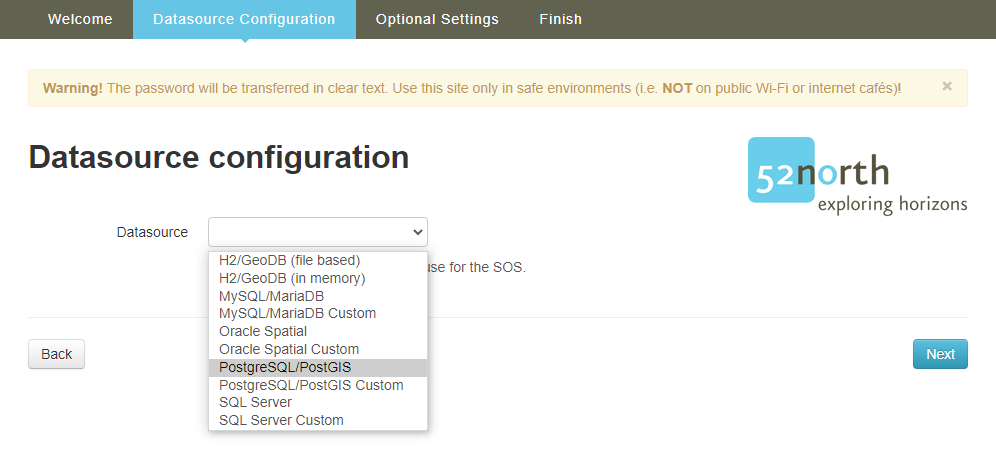
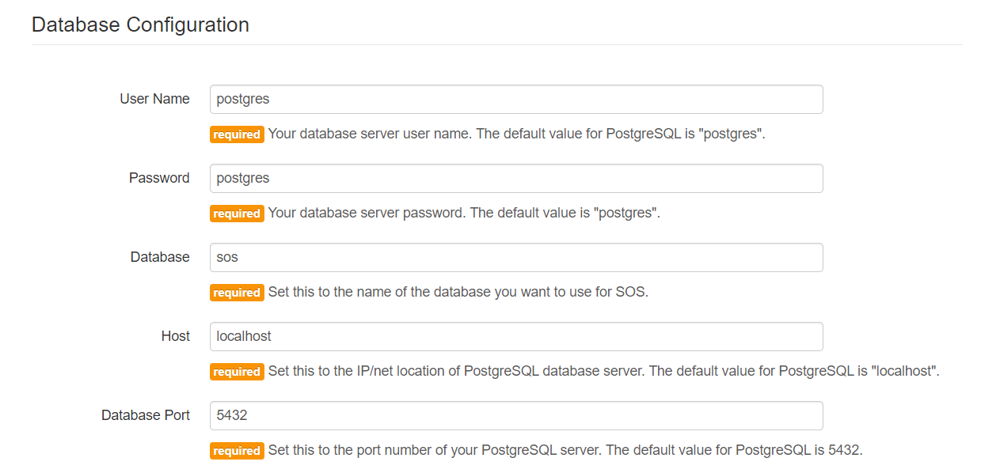
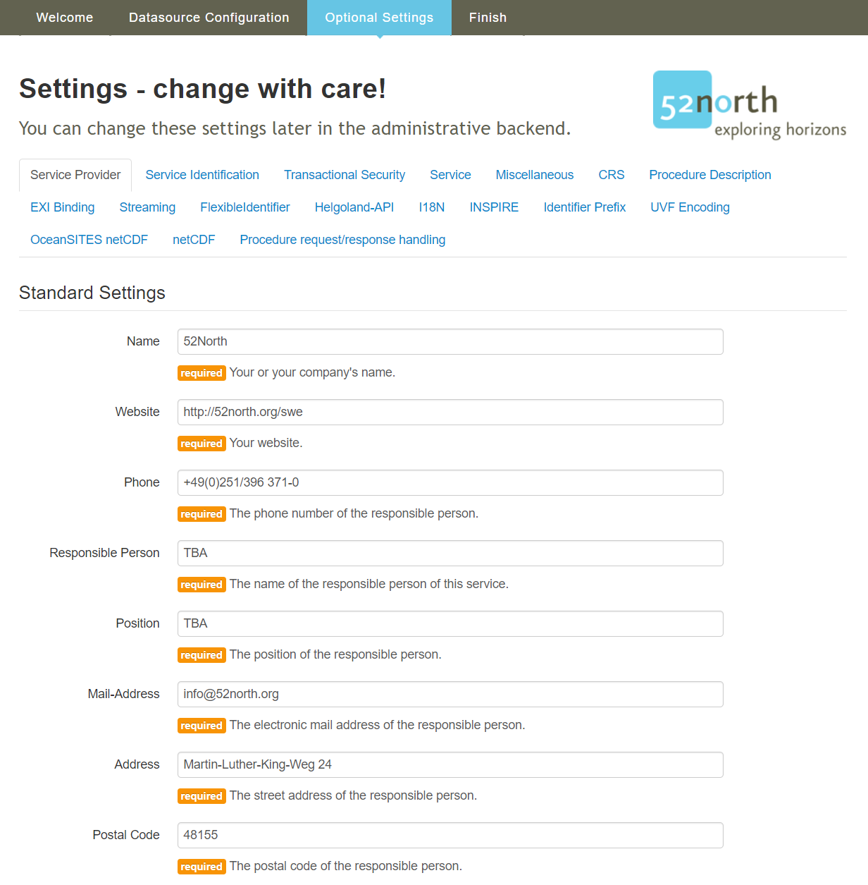

## Introduction

This tutorial shows you how to install a Sensor Observation Service (SOS). To be able to install the
__52°North SOS__ the following software has to be downloaded and installed:

- __Java Runtime Enviroment__ (JRE) 8.0 or higher
- __Application server__ compatible to Java Servlet-API 2.5 or higher
- Running __database managment system__

For Windows systems we provide a tutorial, how to setup the system for the installation of the SOS.
In the tutorial we use __Apache Tomcat__ as the application server
and __PostgreSQL/ PostGIS__ as the database management system: [Tutorial](89_installation_requirments_for_windows.md)

If you want to use different software, have an other operating system
or want to build the SOS from source you can find more information here:
[52°North SOS 5.x Documentation](https://wiki.52north.org/SensorWeb/SensorObservationServiceVDocumentation)

## Installing the Webapp

When your system matches the requirments above, download the package including the __war-file__: [52°North SOS latest version](https://github.com/52North/SOS/releases)

Unzip the package and browse to the folder `UNZIPPED_PACKAGE/bin/target` where the file `52n-sos-webapp.war`
is located. Copy the file `52n-sos-webapp.war` into the folder `TOMCAT_BASE/webapps`. Make sure your Tomcat
and PostgreSQL are running. After a moment the __war-file__ gets converted and in the folder should be a new
folder `52n-sos-webapp`. If this is the case than you can reach the webapp with this URL:
[http://localhost:8080/52n-sos-webapp/](http://localhost:8080/52n-sos-webapp/)

When you succesfully reach the service it should look like this:

You can start the installation process by clicking on the link in the red banner.

The installation process starts with the Welcome-page. If you have an exported configuration file of
a previous SOS installation you can upload this file here, else you can start the installation without
a configuration file.

In the next steps you configure your datasource. First you need to select the database managment system
which you are using as the datasource.

Next you need to set the parameters of your database, so the SOS can reach the database.

You can also configure advanced database settings.

Under Actions you can chose if you want to create new table, delete all extings tables or update all extings tables in your database. If you use the database for the first time you do not want to chance
the settings and leave only `Create tables` marked.

Next you can add information about the service provider. All these settings can be changed later
in the administrative backend.

You can also upload a service provider file which overrides the above settings.

You finish your installation by setting a username and a password for the SOS.

You now have succesfully installed the __52°North SOS__.