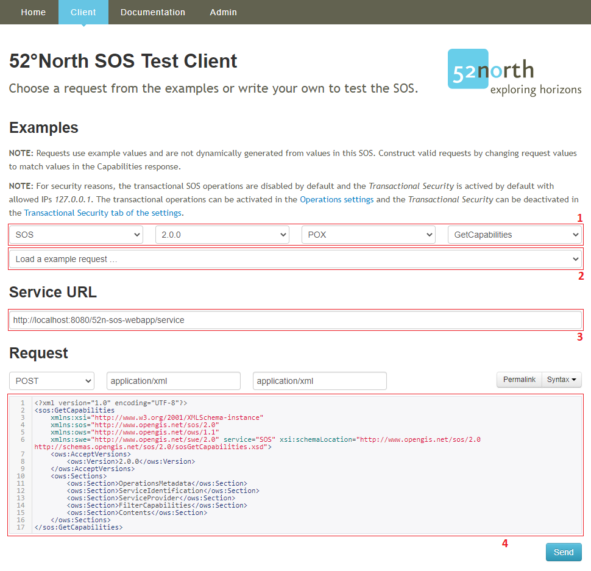

## Workflow Overview

In this section are examples given to send requests to the SOS. The first request
is the `InsertSensor` operation. This request inserts a new sensor into the SOS.
Next comes the `InsertObservation` operation. This request inserts a new observation
for a registered sensor to the SOS. With the operation `GetCapabilities` metadata about the
SOS instance itself can be requested. The operation `GetDataAvailability` responses
information about the available observations in the SOS. Last the `GetObservation` operation
returns the requested observations.

### Enable transactional SOS operations
For security reasons, the transactional SOS operations are disabled by default and the _Transactional Security_ is
activated by default with allowed IPs _127.0.0.1_. To follow the given examples in this tutorial activate the
transactional SOS operations in the **Operations settings** (Admin >> Settings >> Operations).

### 52°North SOS Test Client
It is recommended to use the **52°North SOS Test Client** to test your installation of the SOS by sending
prepared example requests or your own requests.

1. Here the example requests can be filtered by service, version, binding and operation.
2. Here an example request can be choosen.
3. This is the URL of the SOS.
4. In this field the choosen request gets loaded. The request can be manipulated or you can add your own request
in this field.

It is also possible to follow this tutorial along and use the presented requests in the **52°North SOS Test Client**.

### Workflow

The workflow would be

 * [InsertSensor](#insertsensor)
 * [InsertObservation](#insertobservation)
 * [GetCapabilities](#getcapabilities)
 * [GetDataAvailability](#getdataavailability)
 * [GetObservation](#getobservation)

#### InsertSensor
The `InsertSensor` operation can be used to add to the SOS a detailed sensor description about a certain sensor,
encoded in a *OGC Sensor Model Language (SensorML)* version 1.0.1 or 2.0 document.
To insert a certain sensor description the following request parameters are offered:

| Parameter Name| Description| Mandatory|
| -----| -----| -----|
| service| fixed value “SOS”| no|
| request| fixed value “InsertSensor”| yes|
| version| indicates the service version, e.g. “2.0.0”| yes|
| extension| specific extension, e.g. “language”| no|
| procedureDescriptionFormat| reference to a known procedure description format, such as “http://www.opengis.net/sensorML/1.0.1” or “http://www.opengis.net/sensorML/2.0”| yes|
| procedureDescription| the procedure/sensor description using the format specified in parameter procedureDescriptionFormat, e.g. a valid SensorML document| yes|
| observedProperty| reference to a dedicated observable property / phenomenon that is measured by the inserted sensor/procedure;| yes|
| metadata/sosInsertionMetadata/observationType| Reference to an observation type which is produced by the sensor/procedure| yes|
| metadata/sosInsertionMetadata/featureOfInterestType| Reference to the type of the feature of interest which is observed by the sensor/procedure| yes|

An exemplar `InsertSensor` request against a local installation of the SOS ([http://localhost:8080/52n-sos-webapp/service](http://localhost:8080/52n-sos-webapp/service))
using POX binding is illustrated in the below example. The sensor in this example is a thermometer measuring
the air temperature at the office of 52°North GmbH located in the city of Muenster.

~~~xml
<?xml version="1.0" encoding="UTF-8"?>
<swes:InsertSensor
    xmlns:swes="http://www.opengis.net/swes/2.0"
    xmlns:sos="http://www.opengis.net/sos/2.0"
    xmlns:swe="http://www.opengis.net/swe/2.0"
    xmlns:sml="http://www.opengis.net/sensorml/2.0"
    xmlns:gml="http://www.opengis.net/gml/3.2"
    xmlns:xlink="http://www.w3.org/1999/xlink"
    xmlns:xsi="http://www.w3.org/2001/XMLSchema-instance"
    xmlns:gco="http://www.isotc211.org/2005/gco"
    xmlns:gmd="http://www.isotc211.org/2005/gmd" service="SOS" version="2.0.0" xsi:schemaLocation="http://www.opengis.net/sos/2.0 http://schemas.opengis.net/sos/2.0/sosInsertSensor.xsd  http://www.opengis.net/swes/2.0 http://schemas.opengis.net/swes/2.0/swes.xsd">
	<!-- reference to a known procedure description format such as “http://www.opengis.net/sensorML/1.0.1” or “http://www.opengis.net/sensorML/2.0” -->
    <swes:procedureDescriptionFormat>http://www.opengis.net/sensorml/2.0</swes:procedureDescriptionFormat>
	<!-- procedure/ sensor description using the format specified in parameter procedureDescriptionFormat, e.g. a valid SensorML document -->
    <swes:procedureDescription>
        <sml:PhysicalSystem gml:id="Thermometer">
            <!-- unique identifier of the procedure/ sensor (used for references) -->
            <gml:identifier codeSpace="uniqueID">Thermometer_1285</gml:identifier>
            <sml:identification>
                <sml:IdentifierList>
                    <!-- long and short description of the procedure/ sensor -->
					<sml:identifier>
                        <sml:Term definition="urn:ogc:def:identifier:OGC:1.0:longName">
                            <sml:label>longName</sml:label>
                            <sml:value>Thermometer 1285 at the 52°North GmbH office building</sml:value>
                        </sml:Term>
                    </sml:identifier>
                    <sml:identifier>
                        <sml:Term definition="urn:ogc:def:identifier:OGC:1.0:shortName">
                            <sml:label>shortName</sml:label>
                            <sml:value>Thermometer 1285</sml:value>
                        </sml:Term>
                    </sml:identifier>
                </sml:IdentifierList>
            </sml:identification>
			<!-- offering of the procedure/ sensor -->
            <sml:capabilities name="offerings">
                <sml:CapabilityList>
                    <!-- Special capabilities used to specify offerings. -->
                    <!-- Parsed and removed during InsertSensor/UpdateSensorDescription, added during DescribeSensor. -->
                    <!-- Offering is generated if not specified. -->
                    <sml:capability name="offeringID">
                        <swe:Text definition="urn:ogc:def:identifier:OGC:offeringID">
                            <!-- name of the offering -->
							<swe:label>Thermometer 1285 Offering</swe:label>
                            <!-- unique identifier of the offering (used for references) -->
							<swe:value>Thermometer_1285_offering</swe:value>
                        </swe:Text>
                    </sml:capability>
                </sml:CapabilityList>
            </sml:capabilities>
            <sml:capabilities name="metadata">
                <sml:CapabilityList>
                    <!-- status indicates, whether sensor is insitu (true) or remote (false) -->
                    <sml:capability name="insitu">
                        <swe:Boolean definition="insitu">
                            <swe:value>true</swe:value>
                        </swe:Boolean>
                    </sml:capability>
                    <!-- status indicates, whether sensor is mobile (true) or fixed/stationary (false) -->
                    <sml:capability name="mobile">
                        <swe:Boolean definition="mobile">
                            <swe:value>false</swe:value>
                        </swe:Boolean>
                    </sml:capability>
                </sml:CapabilityList>
            </sml:capabilities>
			<!-- feature of interest of the procedure/ sensor -->
            <sml:featuresOfInterest>
                <sml:FeatureList definition="http://www.opengis.net/def/featureOfInterest/identifier">
                    <!-- name of the feature of interest -->
					<swe:label>Muenster</swe:label>
					<!-- unique identifier of the feature of interest (used for references) -->
                    <sml:feature xlink:href="Muenster"/>
                </sml:FeatureList>
            </sml:featuresOfInterest>
            <sml:inputs>
                <sml:InputList>
                    <!-- input of the procedure/ sensor (multiple inputs possible) -->
					<sml:input name="weather">
                        <sml:ObservableProperty definition="weather"/>
                    </sml:input>
                </sml:InputList>
            </sml:inputs>
            <sml:outputs>
                <sml:OutputList>
                    <!-- output of the procedure/ sensor (multiple output possible) -->
					<sml:output name="air_temperature">
                        <swe:Quantity definition="http://vocab.nerc.ac.uk/collection/P07/current/CFSN0023/">
                            <swe:uom code="degC"/>
                        </swe:Quantity>
                    </sml:output>
                </sml:OutputList>
            </sml:outputs>
			<!-- position of the procedure/ sensor -->
            <sml:position>
                <swe:Vector referenceFrame="urn:ogc:def:crs:EPSG::4326">
                    <swe:coordinate name="easting">
                        <swe:Quantity axisID="x">
                            <swe:uom code="degree"/>
                            <swe:value>7.651968812254194</swe:value>
                        </swe:Quantity>
                    </swe:coordinate>
                    <swe:coordinate name="northing">
                        <swe:Quantity axisID="y">
                            <swe:uom code="degree"/>
                            <swe:value>51.935101100104916</swe:value>
                        </swe:Quantity>
                    </swe:coordinate>
                    <swe:coordinate name="altitude">
                        <swe:Quantity axisID="z">
                            <swe:uom code="m"/>
                            <swe:value>52.0</swe:value>
                        </swe:Quantity>
                    </swe:coordinate>
                </swe:Vector>
            </sml:position>
        </sml:PhysicalSystem>
    </swes:procedureDescription>
	<!-- reference to a dedicated observable property/ phenomenon that is measured by the inserted procedure/ sensor (multiple values possible) -->
    <swes:observableProperty>air_temperature</swes:observableProperty>
    <swes:metadata>
        <sos:SosInsertionMetadata>
			<!-- reference to an observation type which is produced by the procedure/ sensor (multiple values possible) -->
            <sos:observationType>http://www.opengis.net/def/observationType/OGC-OM/2.0/OM_Measurement</sos:observationType>
			<!-- reference to the type of the feature of interest which is observed by the procedure/ sensor -->
            <sos:featureOfInterestType>http://www.opengis.net/def/samplingFeatureType/OGC-OM/2.0/SF_SamplingPoint</sos:featureOfInterestType>
        </sos:SosInsertionMetadata>
    </swes:metadata>
</swes:InsertSensor>
~~~

In response to a successful `InsertSensor` request, the SOS responds with a pointer
to the created sensor instance (`<swes:assignedProcedure>`) as well as a pointer to the created offering associated
to the inserted sensor/procedure (`<swes:assignedOffering>`). This references are needed for the next step to insert
an observation.

~~~xml
<?xml version="1.0" encoding="UTF-8"?>
<swes:InsertSensorResponse xmlns:swes="http://www.opengis.net/swes/2.0" xmlns:xsi="http://www.w3.org/2001/XMLSchema-instance" xsi:schemaLocation="http://www.opengis.net/swes/2.0 http://schemas.opengis.net/swes/2.0/swesInsertSensor.xsd">
  <!-- reference to the created procedure/ sensor instance -->
  <swes:assignedProcedure>Thermometer_1285</swes:assignedProcedure>
  <!-- reference to the created offering associated to the inserted procedure/ sensor -->
  <swes:assignedOffering>Thermometer_1285_offering</swes:assignedOffering>
</swes:InsertSensorResponse>
~~~

#### InsertObservation

The `InsertObservation` operation is used to insert new observations for registered sensors to the SOS. The available request parameters
are listed in the following:

| Parameter Name| Description| Mandatory|
| -----| -----| -----|
| service| fixed value “SOS”| no|
| request| fixed value “DescribeSensor”| yes|
| version| indicates the service version, e.g. “2.0.0”| yes|
| extension| specific extension, e.g. “language”| no|
| observation| the instance of OM_Observation that shall be inserted| yes|
| offering| reference to an existing offering to which the observation(s) shall be added | no|

This example of an `InsertObservation` request  uses the reference to the procedure/ sensor and the reference
to the offering of the `InsertSensor` response. The example is an observation at the previous inserted
procedure/sensor. The sensor measured in Muenster an air temperature of 18.2°C at 09:37:12 o'clock local time
on the 6. August 2021.

~~~xml
<?xml version="1.0" encoding="UTF-8"?>
<sos:InsertObservation
    xmlns:sos="http://www.opengis.net/sos/2.0"
    xmlns:swes="http://www.opengis.net/swes/2.0"
    xmlns:swe="http://www.opengis.net/swe/2.0"
    xmlns:sml="http://www.opengis.net/sensorML/1.0.1"
    xmlns:gml="http://www.opengis.net/gml/3.2"
    xmlns:xlink="http://www.w3.org/1999/xlink"
    xmlns:om="http://www.opengis.net/om/2.0"
    xmlns:sams="http://www.opengis.net/samplingSpatial/2.0"
    xmlns:sf="http://www.opengis.net/sampling/2.0"
    xmlns:xsi="http://www.w3.org/2001/XMLSchema-instance" service="SOS" version="2.0.0" xsi:schemaLocation="http://www.opengis.net/sos/2.0 http://schemas.opengis.net/sos/2.0/sos.xsd          http://www.opengis.net/samplingSpatial/2.0 http://schemas.opengis.net/samplingSpatial/2.0/spatialSamplingFeature.xsd">
    <!-- reference to an offering (multiple offerings possible) -->
    <sos:offering>Thermometer_1285_offering</sos:offering>
    <sos:observation>
        <om:OM_Observation gml:id="o1">
            <!-- reference to the type of the observation -->
			<om:type xlink:href="http://www.opengis.net/def/observationType/OGC-OM/2.0/OM_Measurement"/>
			<!-- period in time for which the observation applies -->
            <om:phenomenonTime>
                <gml:TimeInstant gml:id="phenomenonTime">
                    <gml:timePosition>2021-08-06T09:37:12.000+02:00</gml:timePosition>
                </gml:TimeInstant>
            </om:phenomenonTime>
			<!-- point in time when the observation was published (here: reference to phenomenonTime) -->
            <om:resultTime xlink:href="#phenomenonTime"/>
			<!-- reference to the procedure/ sensor -->
            <om:procedure xlink:href="Thermometer_1285"/>
			<!-- reference to the observed property/ phenomenon -->
            <om:observedProperty xlink:href="air_temperature"/>
			<!-- feature of interest of the observation -->
            <om:featureOfInterest>
                <sams:SF_SpatialSamplingFeature gml:id="ssf_muenster">
                    <!-- unique identifier of the featur of interest -->
					<gml:identifier codeSpace="">Muenster</gml:identifier>
					<!-- name of the feature of interest -->
                    <gml:name>Muenster</gml:name>
					<!-- reference to the geometry type of the feature of interest -->
                    <sf:type xlink:href="http://www.opengis.net/def/samplingFeatureType/OGC-OM/2.0/SF_SamplingPoint"/>
					<!-- reference to the sampled feature (here: no sampled feature) -->
                    <sf:sampledFeature xlink:href="http://www.opengis.net/def/nil/OGC/0/unknown"/>
					<!-- geometry of the feature of interest -->
                    <sams:shape>
                        <gml:Point gml:id="p_muenster">
                            <gml:pos srsName="http://www.opengis.net/def/crs/EPSG/0/4326">51.935101100104916 7.651968812254194</gml:pos>
                        </gml:Point>
                    </sams:shape>
                </sams:SF_SpatialSamplingFeature>
            </om:featureOfInterest>
			<!-- result of the observation -->
            <om:result xsi:type="gml:MeasureType" uom="degC">18.2</om:result>
        </om:OM_Observation>
    </sos:observation>
</sos:InsertObservation>
~~~

A successful insertion results in an instance of an _insert observation response_ (`<sos:InsertObservationResponse>`).

~~~xml
<?xml version="1.0" encoding="UTF-8"?>
<sos:InsertObservationResponse xmlns:sos="http://www.opengis.net/sos/2.0" xmlns:xsi="http://www.w3.org/2001/XMLSchema-instance" xsi:schemaLocation="http://www.opengis.net/sos/2.0 http://schemas.opengis.net/sos/2.0/sosInsertObservation.xsd"/>
~~~

#### GetCapabilities

Similar to other OGC services, the `GetCapabilities` operation responds with
metadata about the service instance itself. Amongst others, the Capabilities
document lists available _sensors/ procedures_, _offerings_, _observed properties/ phenomenon_,
_features of interest_ as well as spatial and temporal bounding boxes of the
available _observations_. A `GetCapabilities` request may contain the following
parameters:

| Parameter Name| Description| Mandatory|
| -----| -----| -----|
| service| fixed value “SOS”| no|
| request| fixed value “GetCapabilities”| yes|
| version| indicates the service version, e.g. “2.0.0”| yes|
| extension| specific extension, e.g. “language”| no|
| acceptVersions| submit accepted versions, e.g. “2.0.0”| no|
| acceptFormats| preferred response formats| no|
| updateSequence| service metadata document version, value is “increased” whenever any change is made in complete service metadata document| no|
| sections| include only relevant sections within the response document and omit the rest| no|

For example this `GetCapabilities` request contains an _accepted version_ (`<ows:AcceptedVersion>`) and filters for
the relevant _sections_ (`<ows:Sections>`).

~~~xml
<?xml version="1.0" encoding="UTF-8"?>
<sos:GetCapabilities
    xmlns:xsi="http://www.w3.org/2001/XMLSchema-instance"
    xmlns:sos="http://www.opengis.net/sos/2.0"
    xmlns:ows="http://www.opengis.net/ows/1.1"
    xmlns:swe="http://www.opengis.net/swe/2.0" service="SOS" xsi:schemaLocation="http://www.opengis.net/sos/2.0 http://schemas.opengis.net/sos/2.0/sosGetCapabilities.xsd">
    <!-- submit the accepted version -->
	<ows:AcceptVersions>
        <ows:Version>2.0.0</ows:Version>
    </ows:AcceptVersions>
	<!-- response document includes this sections and omits all others -->
	<ows:Sections>
        <ows:Section>OperationsMetadata</ows:Section>
        <ows:Section>ServiceIdentification</ows:Section>
        <ows:Section>ServiceProvider</ows:Section>
        <ows:Section>FilterCapabilities</ows:Section>
        <ows:Section>Contents</ows:Section>
    </ows:Sections>
</sos:GetCapabilities>
~~~

The response document of the example request contains the most relevant sections. These are the
_service identification_ which provides metadata about the service itself (`<ows:ServiceIdentification>`),
the _service provider_ which offers metadata about the provider/ organization (`<ows:ServiceProvider>`),
the _operations metadata_ which contains metadata about the offered operations (`<ows:OperationsMetadata>`),
the _filter capabilities_ which includes metadata about the supported filter functionalities
(`<sos:filterCapabilities>`) and the _contents_ which contains metadata about available observation offerings
(`<sos:contents>`). The following response of the exemplar `GetCapabilities` request is not completely shown.
Some parts are omitted to enable better readabiltiy.

~~~xml
<?xml version="1.0" encoding="UTF-8"?>
<sos:Capabilities xmlns:sos="http://www.opengis.net/sos/2.0" xmlns:xsi="http://www.w3.org/2001/XMLSchema-instance" xmlns:ows="http://www.opengis.net/ows/1.1" xmlns:xlink="http://www.w3.org/1999/xlink" xmlns:fes="http://www.opengis.net/fes/2.0" xmlns:swes="http://www.opengis.net/swes/2.0" xmlns:gml="http://www.opengis.net/gml/3.2" version="2.0.0" updateSequence="2021-08-11T11:03:46.885+02:00" xsi:schemaLocation="http://www.opengis.net/sos/2.0 http://schemas.opengis.net/sos/2.0/sosGetCapabilities.xsd">
  <!-- metadata about the service itself, such as title, version, language -->
  <ows:ServiceIdentification>
    <ows:Title xml:lang="eng">52N SOS</ows:Title>
    <ows:Abstract xml:lang="eng">52North Sensor Observation Service - Data Access for the Sensor Web</ows:Abstract>
    <ows:ServiceType>OGC:SOS</ows:ServiceType>
    <ows:ServiceTypeVersion>1.0.0</ows:ServiceTypeVersion>
    <ows:ServiceTypeVersion>2.0.0</ows:ServiceTypeVersion>
    <ows:Profile>http://www.opengis.net/extension/SOSDO/1.0/observationDeletion</ows:Profile>
    <ows:Profile>http://www.opengis.net/extension/SOSDO/2.0/observationDeletion</ows:Profile>
    <!-- ... -->
    <ows:Fees>NONE</ows:Fees>
    <ows:AccessConstraints>NONE</ows:AccessConstraints>
  </ows:ServiceIdentification>
  <!-- metadata about the provider/ organization, such as contact information -->
  <ows:ServiceProvider>
    <ows:ProviderName>52North</ows:ProviderName>
    <ows:ProviderSite xlink:href="TBA" xlink:title="TBA"/>
    <ows:ServiceContact>
      <ows:IndividualName>TBA</ows:IndividualName>
      <ows:PositionName>TBA</ows:PositionName>
      <ows:ContactInfo>
        <ows:Phone>
          <ows:Voice>+49(0)251/396 371-0</ows:Voice>
          <ows:Facsimile>TBA</ows:Facsimile>
        </ows:Phone>
        <ows:Address>
          <ows:DeliveryPoint>Martin-Luther-King-Weg 24</ows:DeliveryPoint>
          <ows:City>Münster</ows:City>
          <ows:AdministrativeArea>North Rhine-Westphalia</ows:AdministrativeArea>
          <ows:PostalCode>48155</ows:PostalCode>
          <ows:Country>Germany</ows:Country>
          <ows:ElectronicMailAddress>info@52north.org</ows:ElectronicMailAddress>
        </ows:Address>
        <ows:OnlineResource xlink:href="http://52north.org/swe"/>
        <ows:HoursOfService>TBA</ows:HoursOfService>
        <ows:ContactInstructions>TBA</ows:ContactInstructions>
      </ows:ContactInfo>
      <ows:Role codeSpace="TBA">TBA</ows:Role>
    </ows:ServiceContact>
  </ows:ServiceProvider>
  <!-- metadata about the offered operations, including which operations are offered (like GetCapabilites, DescribeSensor, GetObservation, …), available bindings (e.g. POX, KVP, SOAP, JSON) and a URL endpoint -->
  <ows:OperationsMetadata>
    <!-- ... -->
    <ows:Operation name="DescribeSensor">
      <ows:DCP>
        <ows:HTTP>
          <ows:Get xlink:href="http://localhost:8080/52n-sos-webapp/service">
            <ows:Constraint name="Content-Type">
              <ows:AllowedValues>
                <ows:Value>application/x-kvp</ows:Value>
              </ows:AllowedValues>
            </ows:Constraint>
          </ows:Get>
          <ows:Post xlink:href="http://localhost:8080/52n-sos-webapp/service">
            <ows:Constraint name="Content-Type">
              <ows:AllowedValues>
                <ows:Value>application/exi</ows:Value>
                <ows:Value>application/json</ows:Value>
                <ows:Value>application/soap+xml</ows:Value>
                <ows:Value>application/xml</ows:Value>
                <ows:Value>text/xml</ows:Value>
              </ows:AllowedValues>
            </ows:Constraint>
          </ows:Post>
        </ows:HTTP>
      </ows:DCP>
      <ows:Parameter name="procedure">
        <ows:AllowedValues>
          <ows:Value>Thermometer_1285</ows:Value>
        </ows:AllowedValues>
      </ows:Parameter>
      <ows:Parameter name="procedureDescriptionFormat">
        <ows:AllowedValues>
          <ows:Value>http://inspire.ec.europa.eu/schemas/ompr/3.0</ows:Value>
          <ows:Value>http://www.opengis.net/def/timeseries/observationProcess</ows:Value>
          <ows:Value>http://www.opengis.net/sensorML/1.0.1</ows:Value>
          <ows:Value>http://www.opengis.net/sensorml/2.0</ows:Value>
          <ows:Value>http://www.opengis.net/waterml/2.0/observationProcess</ows:Value>
        </ows:AllowedValues>
      </ows:Parameter>
      <ows:Parameter name="validTime">
        <ows:AnyValue/>
      </ows:Parameter>
    </ows:Operation>
	<ows:Operation name="GetCapabilities">
      <ows:DCP>
        <ows:HTTP>
          <ows:Get xlink:href="http://localhost:8080/52n-sos-webapp/service">
            <ows:Constraint name="Content-Type">
              <ows:AllowedValues>
                <ows:Value>application/x-kvp</ows:Value>
              </ows:AllowedValues>
            </ows:Constraint>
          </ows:Get>
          <ows:Post xlink:href="http://localhost:8080/52n-sos-webapp/service">
            <ows:Constraint name="Content-Type">
              <ows:AllowedValues>
                <ows:Value>application/exi</ows:Value>
                <ows:Value>application/json</ows:Value>
                <ows:Value>application/soap+xml</ows:Value>
                <ows:Value>application/xml</ows:Value>
                <ows:Value>text/xml</ows:Value>
              </ows:AllowedValues>
            </ows:Constraint>
          </ows:Post>
        </ows:HTTP>
      </ows:DCP>
      <ows:Parameter name="AcceptFormats">
        <ows:AllowedValues>
          <ows:Value>application/xml</ows:Value>
        </ows:AllowedValues>
      </ows:Parameter>
      <ows:Parameter name="AcceptVersions">
        <ows:AllowedValues>
          <ows:Value>1.0.0</ows:Value>
          <ows:Value>2.0.0</ows:Value>
        </ows:AllowedValues>
      </ows:Parameter>
      <ows:Parameter name="Sections">
        <ows:AllowedValues>
          <ows:Value>All</ows:Value>
          <ows:Value>Contents</ows:Value>
          <ows:Value>FilterCapabilities</ows:Value>
          <ows:Value>InsertionCapabilities</ows:Value>
          <ows:Value>OperationsMetadata</ows:Value>
          <ows:Value>ServiceIdentification</ows:Value>
          <ows:Value>ServiceProvider</ows:Value>
        </ows:AllowedValues>
      </ows:Parameter>
      <ows:Parameter name="updateSequence">
        <ows:NoValues/>
      </ows:Parameter>
    </ows:Operation>
	<!-- ... -->
  </ows:OperationsMetadata>
  <!-- metadata about the supported spatial and temporal filter functionalities extension: container for extensions -->
  <sos:filterCapabilities>
    <fes:Filter_Capabilities>
      <fes:Conformance>
        <fes:Constraint name="ImplementsAdHocQuery">
          <ows:NoValues/>
          <ows:DefaultValue>false</ows:DefaultValue>
        </fes:Constraint>
        <fes:Constraint name="ImplementsExtendedOperators">
          <ows:NoValues/>
          <ows:DefaultValue>false</ows:DefaultValue>
        </fes:Constraint>
        <!-- ... -->
      </fes:Conformance>
      <fes:Spatial_Capabilities>
        <fes:GeometryOperands>
          <fes:GeometryOperand xmlns:ns="http://www.opengis.net/gml/3.2" name="ns:Envelope"/>
        </fes:GeometryOperands>
        <fes:SpatialOperators>
          <fes:SpatialOperator name="BBOX">
            <fes:GeometryOperands>
              <fes:GeometryOperand xmlns:ns="http://www.opengis.net/gml/3.2" name="ns:Envelope"/>
            </fes:GeometryOperands>
          </fes:SpatialOperator>
        </fes:SpatialOperators>
      </fes:Spatial_Capabilities>
      <fes:Temporal_Capabilities>
        <fes:TemporalOperands>
          <fes:TemporalOperand xmlns:ns="http://www.opengis.net/gml/3.2" name="ns:TimeInstant"/>
          <fes:TemporalOperand xmlns:ns="http://www.opengis.net/gml/3.2" name="ns:TimePeriod"/>
        </fes:TemporalOperands>
        <fes:TemporalOperators>
          <fes:TemporalOperator name="Before">
            <fes:TemporalOperands>
              <fes:TemporalOperand xmlns:ns="http://www.opengis.net/gml/3.2" name="ns:TimeInstant"/>
              <fes:TemporalOperand xmlns:ns="http://www.opengis.net/gml/3.2" name="ns:TimePeriod"/>
            </fes:TemporalOperands>
          </fes:TemporalOperator>
          <fes:TemporalOperator name="After">
            <fes:TemporalOperands>
              <fes:TemporalOperand xmlns:ns="http://www.opengis.net/gml/3.2" name="ns:TimeInstant"/>
              <fes:TemporalOperand xmlns:ns="http://www.opengis.net/gml/3.2" name="ns:TimePeriod"/>
            </fes:TemporalOperands>
          </fes:TemporalOperator>
          <!-- ... -->
        </fes:TemporalOperators>
      </fes:Temporal_Capabilities>
    </fes:Filter_Capabilities>
  </sos:filterCapabilities>
  <!-- metadata about available observation offerings including their associated properties such as identifier, procedure, reponseFormats, temporal and spatial aspects, ... -->
  <sos:contents>
    <sos:Contents>
      <swes:offering>
        <sos:ObservationOffering xmlns:ns="http://www.opengis.net/sos/2.0">
          <!-- unique identifier of the offering -->
		  <swes:identifier>Thermometer_1285_offering</swes:identifier>
		  <!-- name of the offering -->
          <swes:name codeSpace="http://www.opengis.net/def/nil/OGC/0/unknown">Thermometer 1285 Offering</swes:name>
		  <!-- unique identifier of the procedure/ sensor -->
          <swes:procedure>Thermometer_1285</swes:procedure>
		  <!-- available formats for the sensor descriptions -->
          <swes:procedureDescriptionFormat>http://inspire.ec.europa.eu/schemas/ompr/3.0</swes:procedureDescriptionFormat>
          <swes:procedureDescriptionFormat>http://www.opengis.net/def/timeseries/observationProcess</swes:procedureDescriptionFormat>
          <swes:procedureDescriptionFormat>http://www.opengis.net/sensorML/1.0.1</swes:procedureDescriptionFormat>
          <swes:procedureDescriptionFormat>http://www.opengis.net/sensorml/2.0</swes:procedureDescriptionFormat>
          <swes:procedureDescriptionFormat>http://www.opengis.net/waterml/2.0/observationProcess</swes:procedureDescriptionFormat>
		  <!-- unique identifier of the observed property/ phenomena -->
          <swes:observableProperty>air_temperature</swes:observableProperty>
          <swes:relatedFeature>
            <swes:FeatureRelationship>
              <swes:target xlink:href="Muenster"/>
            </swes:FeatureRelationship>
          </swes:relatedFeature>
		  <!-- bounding box of the observed area -->
          <sos:observedArea>
            <gml:Envelope srsName="http://www.opengis.net/def/crs/EPSG/0/4326">
              <gml:lowerCorner>51.935101100104916 7.651968812254194</gml:lowerCorner>
              <gml:upperCorner>51.935101100104916 7.651968812254194</gml:upperCorner>
            </gml:Envelope>
          </sos:observedArea>
		  <!-- period in time for which the observations apply -->
          <sos:phenomenonTime>
            <gml:TimePeriod gml:id="phenomenonTime_1">
              <gml:beginPosition>2021-08-06T07:37:12.000Z</gml:beginPosition>
              <gml:endPosition>2021-08-06T07:37:12.000Z</gml:endPosition>
            </gml:TimePeriod>
          </sos:phenomenonTime>
		  <!-- period in time when the observations were published -->
          <sos:resultTime>
            <gml:TimePeriod gml:id="resultTime_1">
              <gml:beginPosition>2021-08-06T07:37:12.000Z</gml:beginPosition>
              <gml:endPosition>2021-08-06T07:37:12.000Z</gml:endPosition>
            </gml:TimePeriod>
          </sos:resultTime>
		  <!-- available response formats -->
          <sos:responseFormat>application/json</sos:responseFormat>
          <sos:responseFormat>application/netcdf</sos:responseFormat>
          <!-- .... -->
		  <!-- reference to the observation type -->
          <sos:observationType>http://www.opengis.net/def/observationType/OGC-OM/2.0/OM_Measurement</sos:observationType>
		  <!-- reference to the type of the associated featur of interest -->
          <sos:featureOfInterestType>http://www.opengis.net/def/samplingFeatureType/OGC-OM/2.0/SF_SamplingPoint</sos:featureOfInterestType>
        </sos:ObservationOffering>
      </swes:offering>
    </sos:Contents>
  </sos:contents>
</sos:Capabilities>
~~~

#### GetDataAvailability

The `GetDataAvailability` operations is not part of the SOS standard, but recommended by the technical guidance for
impelmenting download services using the OGC Sensor Observation Service and ISO 19143 filter encoding 
([https://inspire.ec.europa.eu/id/document/tg/download-sos](https://inspire.ec.europa.eu/id/document/tg/download-sos))
as well as by the OGC SOS 2.0 hydrology profile best practice
([https://docs.opengeospatial.org/bp/14-004r1/14-004r1.html](https://docs.opengeospatial.org/bp/14-004r1/14-004r1.html)).
The operation is implemented in the **52°North SOS** and responses information about the available observations. The
available observations can be filtered by the below listed parameters:

| Parameter Name| Description| Mandatory|
| -----| -----| -----|
| service| fixed value “SOS”| no|
| request| fixed value “GetDataAvailability”| yes|
| version| indicates the service version, e.g. “2.0.0”| yes|
| extension| specific extension, e.g. “language”| no|
| featureOfInterest| reference to a dedicated feature of interest; used to filter observations by feature of interest| no|
| observedProperty| reference to a dedicated observable property / phenomenon; used to filter observations by observable property| no|
| offering| reference to a dedicated offering which composes of observations from a certain procedure and observable property| no|
| procedure| reference to a dedicated procedure; used to filter observations by procedure| no|

The following `GetDataAvailability` request contains examples for each filter option.

~~~xml
<?xml version="1.0" encoding="UTF-8"?>
<gda:GetDataAvailability
    xmlns:gda="http://www.opengis.net/sosgda/1.0"
    xmlns:swes="http://www.opengis.net/swes/2.0"
    xmlns:fes="http://www.opengis.net/fes/2.0"
    xmlns:gml="http://www.opengis.net/gml/3.2"
    xmlns:swe="http://www.opengis.net/swe/2.0" service="SOS" version="2.0.0">
	<!-- response document includes data of this procedure and omits all others (optional, multiple values possible) -->
    <gda:procedure>Thermometer_1285</gda:procedure>
	<!-- response document includes data of this observed property and omits all others (optional, multiple values possible) -->
    <gda:observedProperty>air_temperature</gda:observedProperty>
	<!-- response document includes data of this feature of interest and omits all others (optional, multiple values possible) -->
    <gda:featureOfInterest>Muenster</gda:featureOfInterest>
	<!-- response document includes data of this offering and omits all others (optional, multiple values possible) -->
    <gda:offering>Thermometer_1285_offering</gda:offering>
</gda:GetDataAvailability>
~~~

The response document of the `GetDataAvailability` contains the _procedure/ sensor_, _observed property/ phenomenon_,
_feature of interest_, _phenomenon time_, _offering_ and _description formats_.

~~~xml
<?xml version="1.0" encoding="UTF-8"?>
<gda:GetDataAvailabilityResponse xmlns:gda="http://www.opengis.net/sosgda/2.0" xmlns:gml="http://www.opengis.net/gml/3.2" xmlns:swe="http://www.opengis.net/swe/2.0" xmlns:xlink="http://www.w3.org/1999/xlink" xmlns:xsi="http://www.w3.org/2001/XMLSchema-instance" xsi:schemaLocation="http://www.opengis.net/sosgda/2.0 http://waterml2.org/schemas/gda/2.0/gda.xsd">
  <gda:dataAvailabilityMember gml:id="dam_1">
    <!-- procedure/ sensor of the observation -->
	<gda:procedure xlink:href="Thermometer_1285" xlink:title="Thermometer 1285"/>
	<!-- observed property/ phenomenon of the observation -->
    <gda:observedProperty xlink:href="air_temperature" xlink:title="air_temperature"/>
	<!-- feature of interest of the observation -->
    <gda:featureOfInterest xlink:href="Muenster" xlink:title="Muenster"/>
	<!-- period in time for which the observation applies -->
    <gda:phenomenonTime>
      <gml:TimePeriod gml:id="tp_1">
        <gml:beginPosition>2021-08-06T07:37:12.000Z</gml:beginPosition>
        <gml:endPosition>2021-08-06T07:37:12.000Z</gml:endPosition>
      </gml:TimePeriod>
    </gda:phenomenonTime>
	<!-- offering of the observation -->
    <gda:offering xlink:href="Thermometer_1285_offering" xlink:title="Thermometer 1285 Offering"/>
	<!-- available description formats -->
    <gda:formatDescriptor>
      <gda:procedureDescriptionFormatDescriptor>
        <gda:procedureDescriptionFormat>http://www.opengis.net/sensorml/2.0</gda:procedureDescriptionFormat>
      </gda:procedureDescriptionFormatDescriptor>
      <gda:observationFormatDescriptor>
        <gda:responseFormat>text/xml; subtype="om/1.0.0"</gda:responseFormat>
        <gda:observationType>http://www.opengis.net/def/observationType/OGC-OM/2.0/OM_Measurement</gda:observationType>
      </gda:observationFormatDescriptor>
      <gda:observationFormatDescriptor>
        <gda:responseFormat>http://www.opengis.net/om/2.0</gda:responseFormat>
        <gda:observationType>http://www.opengis.net/def/observationType/OGC-OM/2.0/OM_Measurement</gda:observationType>
      </gda:observationFormatDescriptor>
      <gda:observationFormatDescriptor>
        <gda:responseFormat>application/json</gda:responseFormat>
        <gda:observationType>http://www.opengis.net/def/observationType/OGC-OM/2.0/OM_Measurement</gda:observationType>
      </gda:observationFormatDescriptor>
    </gda:formatDescriptor>
  </gda:dataAvailabilityMember>
</gda:GetDataAvailabilityResponse>
~~~

#### GetObservation

The `GetObservation` operation requests observation data encoded in Observations & Measurement (O&M)
standard or any other suitable format. In general a SOS might host a huge number of observations, each
composed within a certain offering. For this reason, several filter options can be submitted in a 
`GetObservation` request, as listed in the below table. Note that altought all filter options are not
mandatory, at least some filters should be set in order to reduce the length of the response document.

| Parameter Name| Description| Mandatory|
| -----| -----| -----|
| service| fixed value “SOS”| no|
| request| fixed value “GetObservation”| yes|
| version| indicates the service version, e.g. “2.0.0”| yes|
| extension| specific extension, e.g. “language”| no|
| featureOfInterest| reference to a dedicated feature of interest; used to filter observations by feature of interest| no|
| observedProperty| reference to a dedicated observable property / phenomenon; used to filter observations by observable property| no|
| offering| reference to a dedicated offering which composes of observations from a certain procedure and observable property| no|
| procedure| reference to a dedicated procedure; used to filter observations by procedure| no|
| spatialFilter| Used to filter observation with regard to spatial properties| no|
| temporalFilter| Used to filter observation with regard to temporal properties| no|
| responseFormat| Used to specify the desired response format, the default format for SOS 2.0 is http://www.opengis.net/om/2.0 | no|

The following `GetObservation` request contains an example for each filter option:

~~~xml
<?xml version="1.0" encoding="UTF-8"?>
<sos:GetObservation
    xmlns:sos="http://www.opengis.net/sos/2.0"
    xmlns:fes="http://www.opengis.net/fes/2.0"
    xmlns:gml="http://www.opengis.net/gml/3.2"
    xmlns:swe="http://www.opengis.net/swe/2.0"
    xmlns:xlink="http://www.w3.org/1999/xlink"
    xmlns:swes="http://www.opengis.net/swes/2.0"
    xmlns:sosrf="http://www.opengis.net/sosrf/1.0"
    xmlns:xsi="http://www.w3.org/2001/XMLSchema-instance" service="SOS" version="2.0.0" xsi:schemaLocation="http://www.opengis.net/sos/2.0 http://schemas.opengis.net/sos/2.0/sos.xsd">
	<!-- response document includes observation of this procedure and omits all others (optional, multiple values possible) -->
    <sos:procedure>Thermometer_1285</sos:procedure>
    <!-- response document includes observation of this offering and omits all others (optional, multiple values possible) -->
    <sos:offering>Thermometer_1285_offering</sos:offering>
    <!-- response document includes observation of this observed property and omits all others (optional, multiple values possible) -->
    <sos:observedProperty>air_temperature</sos:observedProperty>
    <!-- observations are filtered by time (optional) -->
    <sos:temporalFilter>
        <fes:During>
            <fes:ValueReference>phenomenonTime</fes:ValueReference>
            <gml:TimePeriod gml:id="tp_1">
                <gml:beginPosition>2021-08-06T09:00:00.000+02:00</gml:beginPosition>
                <gml:endPosition>2021-08-06T10:00:00.000+02:00</gml:endPosition>
            </gml:TimePeriod>
        </fes:During>
    </sos:temporalFilter>
    <!-- response document includes observation of this feature of interest and omits all others (optional, multiple values possible) -->
    <sos:featureOfInterest>Muenster</sos:featureOfInterest>
    <!-- observations are filtered by location (optional) -->
    <sos:spatialFilter>
        <fes:BBOX>
            <fes:ValueReference>om:featureOfInterest/sams:SF_SpatialSamplingFeature/sams:shape</fes:ValueReference>
            <gml:Envelope srsName="http://www.opengis.net/def/crs/EPSG/0/4326">
                <gml:lowerCorner>7.5 51.5</gml:lowerCorner>
                <gml:upperCorner>8.5 52.5</gml:upperCorner>
            </gml:Envelope>
        </fes:BBOX>
    </sos:spatialFilter>
    <!-- accepted response format (optional) -->
    <sos:responseFormat>http://www.opengis.net/om/2.0</sos:responseFormat>
</sos:GetObservation>
~~~

The response document to the `GetObservation` request can hold multiple observations. In this case it
only includes the observation which was inserted earlier.

~~~xml
<?xml version="1.0" encoding="UTF-8"?>
<sos:GetObservationResponse xmlns:sos="http://www.opengis.net/sos/2.0" xmlns:xlink="http://www.w3.org/1999/xlink" xmlns:swes="http://www.opengis.net/swes/2.0" xmlns:xsi="http://www.w3.org/2001/XMLSchema-instance" xsi:schemaLocation="http://www.opengis.net/om/2.0 http://schemas.opengis.net/om/2.0/observation.xsd http://www.opengis.net/sos/2.0 http://schemas.opengis.net/sos/2.0/sos.xsd">
  <sos:observationData>
    <om:OM_Observation xmlns:om="http://www.opengis.net/om/2.0" xmlns:gml="http://www.opengis.net/gml/3.2" gml:id="o_31">
      <!-- reference to the observation type -->
	  <om:type xlink:href="http://www.opengis.net/def/observationType/OGC-OM/2.0/OM_Measurement"/>
      <!-- period in time for which the observation applies -->
	  <om:phenomenonTime>
        <gml:TimeInstant xmlns:gml="http://www.opengis.net/gml/3.2" gml:id="phenomenonTime_31">
          <gml:timePosition>2021-08-06T07:37:12.000Z</gml:timePosition>
        </gml:TimeInstant>
      </om:phenomenonTime>
	  <!-- point in time when the observation was published (here: reference to phenomenonTime) -->
      <om:resultTime xlink:href="#phenomenonTime_31"/>
	  <!-- procedure/ sensor of the observation -->
      <om:procedure xlink:href="Thermometer_1285" xlink:title="Thermometer 1285"/>
	  <!-- observed property/ phenomenon of the observation -->
      <om:observedProperty xlink:href="air_temperature" xlink:title="air_temperature"/>
	  <!-- feature of interest of the observation -->
      <om:featureOfInterest xmlns:xlink="http://www.w3.org/1999/xlink" xlink:href="Muenster" xlink:title="Muenster"/>
	  <!-- result of the observation -->
      <om:result xmlns:ns="http://www.opengis.net/gml/3.2" xmlns:xsi="http://www.w3.org/2001/XMLSchema-instance" uom="degC" xsi:type="ns:MeasureType">18.2</om:result>
    </om:OM_Observation>
  </sos:observationData>
</sos:GetObservationResponse>
~~~
