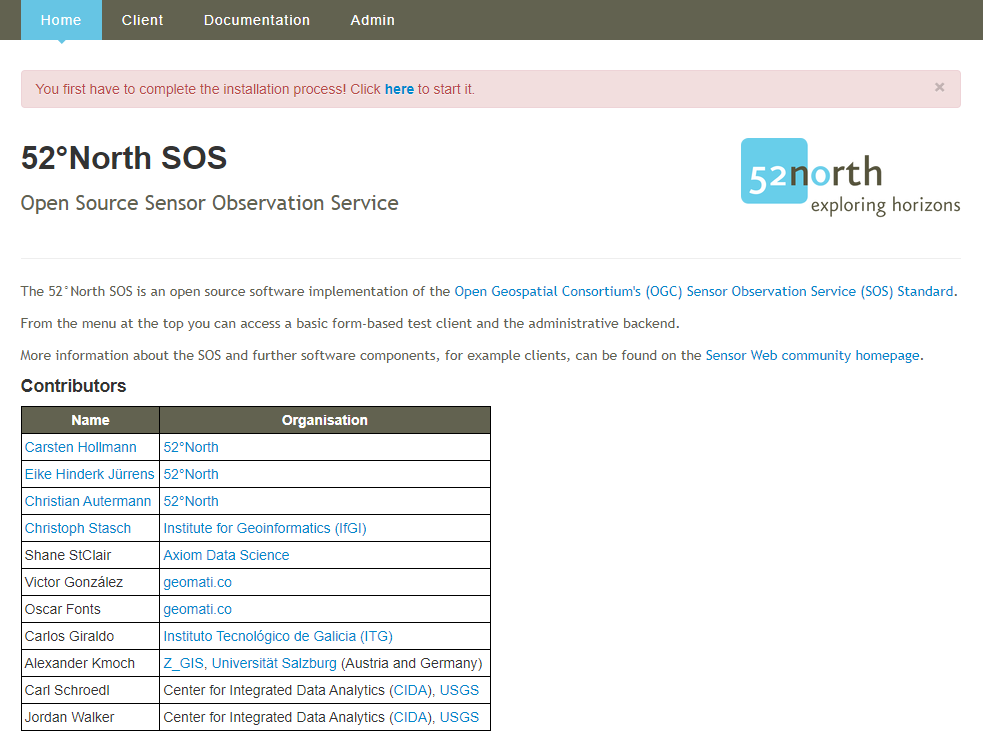

## Introduction

This tutorials shows you how to install your first Sensor Observation Service (SOS). To be able to install the
__52°North SOS__ the following software have to be downloaded and installed:

- __Java Runtime Enviroment__ (JRE) 8.0 or higher
- __Application server__ compatible to Java Servlet-API 2.5 or higher
- Running __database managment system__

In this tutorial we use __Apache Tomcat__ as the applicaition server and __PostgreSQL/ PostGIS__ as the
database managment system. If you want to use different software or build the SOS from source you can find here
more information:

- [52°North SOS 5.x Documentation](https://wiki.52north.org/SensorWeb/SensorObservationServiceVDocumentation)

## Installing Java

First you need to download and install a Java Runtime Enviroment (JRE) or Java Development Kit (JDK) with the
version 8.0 or higher: [Download](https://www.oracle.com/java/technologies/javase-downloads.html)

During the installation follow the instructions of the installer.

## Installing Tomcat

After you installed Java you need to download and install a Apache Tomcat version 8 or higher:
[Download](https://tomcat.apache.org/download-90.cgi)

- __Do not use Tomcat version 8.0.8__ because there is a known bug in these releases whereby toe SOS installtion fails.
- __Do not use Tomcat version 10__ because Tomcat has changed from javax to jakarta and the SOS installation does not
yet work

During the installation follow the instructions of the installer.

After the installation Tomcat is added to the Windows autostart. You can deactived the autostart function of the
application in the Taskmanager. If you want to start the application manually you can do this by navigating into
the installation folder `Apache Software Foundation/Tomcat 9.0/bin` and executing `Tomcat9w.exe`. Mind that the
names are different for other versions of Tomcat.

This window will show up when `Tomcat9w.exe` is executed.

1. Here you can start and stop the Tomcat server

If your Tomcat server is running you can check if it was succesfully set up by entering this URL in your
internet browser except you choosed a different port for the installation:

- [http://localhost:8080/](http://localhost:8080/)

If the Tomcat server is running you should see this page:

## Installing PostgreSQL/ PostGIS

Now you need to download and install PostgreSQL version 9 or higher: [Download](https://www.postgresql.org/download/)

The installer includes the PostgreSQL server, pgAdmin which is a graphical tool for managing and developing
your databases, and StackBuilder which is a package manager that can be used to download and install additional
PostgreSQL tools and drivers. Follow the instructions of the installer.

In the next stept you use the StackBuilder application to add the PostGIS extension to PostgreSQL.

After that you need to create a new database which has the PostGIS template. You can use pgAdmin to create the
database. With the command `create extension postgis;` you can add the PostGIS extension.

## Installing the Webapp

Download the package including the WAR-file: [52°North SOS latest version](https://github.com/52North/SOS/releases)

The 52°North SOS includes the Sensor Web Server REST-API and the Sensor Web Viewer Helgoland.

Unzip the package and browse to the folder `UNZIPPED_PACKAGE/bin/target` where the file `52n-sos-webapp.war`
is located. Copy the file `52n-sos-webapp.war` into the folder `TOMCAT_BASE/webapps`. Make sure your Tomcat
and PostgreSQL are running. After a few seconds the war-file gets converted and in the folder should be a new
folder `52n-sos-webapp`. If this is the case than you can reach the webapp with this URL:

- [http://localhost:8080/52n-sos-webapp/](http://localhost:8080/52n-sos-webapp/)

When you succesfully reach the service it shoult look like this:

You can start the installation process by clicking on the link in the red banner. Follow the instructions along
and you will succesfully install your first SOS.

