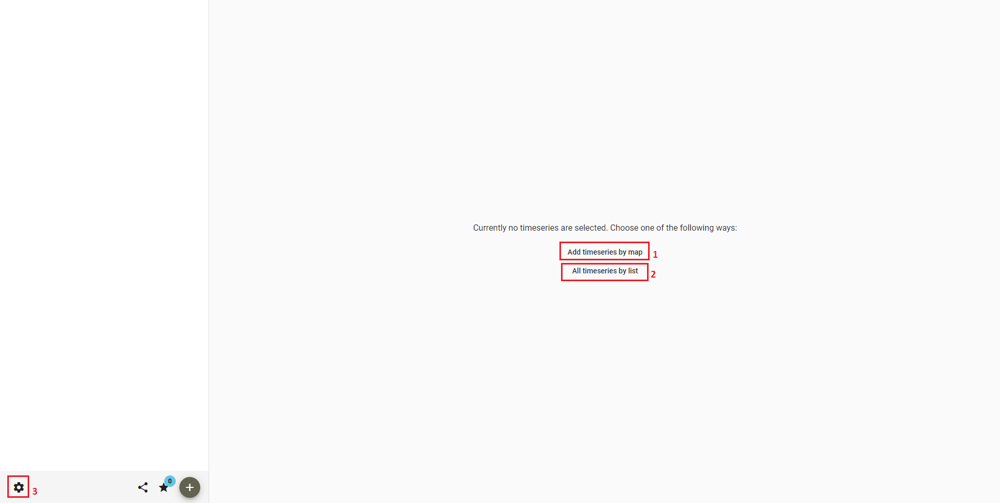
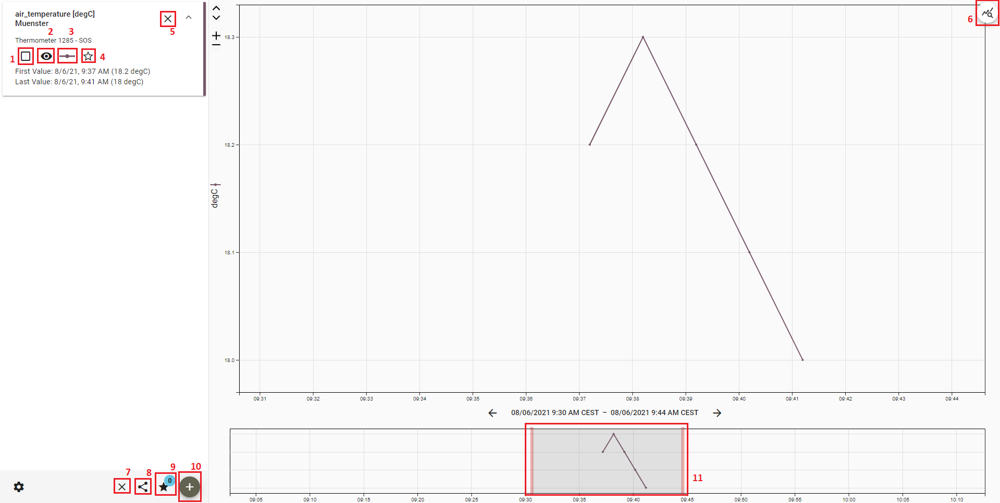

## 52°North Helgoland Client

The **52°North Helgoland Client** is a lightweight web application that enables the exploration, visualization
and analysis of sensor web data in various fields of use, e.g. hydrology, meteorology, environmental monitoring,
traffic management. This tutorial shows you how to use the Helgoland Client.

### Workflow

The workflow would be:

* [Open Helgoland Client](#open-helgoland-client)
* [Explore Sensor Web Data on Map](#explore-sensor-web-data-on-map)
* [Select Time Series Data](#select-time-series-data)
* [Visualize Time Series Data](#visualize-time-series-data)

### Open Helgoland Client

### Explore Sensor Web Data on Map

### Select Time Series Data

### Visualize Time Series Data

