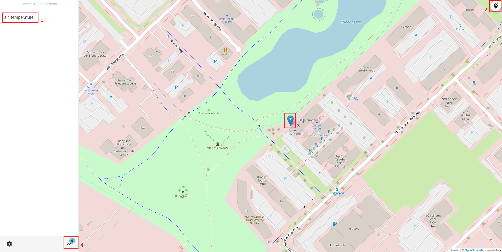

## 52°North Helgoland Client

The **52°North Helgoland Client** is a lightweight web application that enables the exploration, visualization
and analysis of sensor web data in various fields of use, e.g. hydrology, meteorology, environmental monitoring,
traffic management. This tutorial shows you how to use the Helgoland Client. In this tutorial we use as an
example the **52°North SOS** which was installed in the [SOS Installation War File](9_1_sos_installation_war_file.md)
tutorial and we use the data which was added to the SOS in the [SOS Example Request](9_3_sos_example_request.md)
tutorial. But you can also follow along the tutorial with different data.

### Workflow

The workflow would be:

* [Open Helgoland Client](#open-helgoland-client)
* [Explore Sensor Web Data on Map](#explore-sensor-web-data-on-map)
* [Select Time Series Data](#select-time-series-data)
* [Visualize Time Series Data](#visualize-time-series-data)

### Open Helgoland Client

The **52°North Helgoland Client** is part of the **52°North SOS** installation. You can access
the Helgoland Client from the SOS menu.

> ####### Activity 1
>
> 1. Hover your mouse over `Client`
> 1. Click `Sensor Web Thin Client (Helgoland)` in the drop down menu

### Explore Sensor Web Data on Map

When you open the Helgoland Client you come to the `Diagram` tab. Because you opened the
Helgoland Client for the first time you have no data selected to be shown in the diagram.

1. Here you can adjust the language (currently supported languages are English, German and Portuguese)
1. Here you can start the process of chosing timeseries data to be presented in the diagram

> ####### Activity 2
>
> 1. Select your language
> 1. Click on `Please select a timeseries first`

After you clicked on the button you come to the `Map` tab. At the moment you do not see the map
because you first need to select a provider. In this tutorial the previous installed SOS is chosen.

> ####### Activity 3
>
> 1. Click on your data provider

Now you can explore all the measurment stations, which are provided by the service. In this example
it is only on station, which measures the air temperature.

If you chosed a station, which timeseries data you want to present in a diagram, you can select it
by clicking on it.

> ####### Activity 4
>
> 1. Click on your choosen station

### Select Time Series Data

After you clicked on a station a popup opens. In this you can select timeseries data and confirm
your decision.

> ####### Activity 5
>
> 1. Select timeseries data
> 1. Click on `Show adjustments in diagram`

### Visualize Time Series Data

The diagram now displays your chosen timeseries data. You can now visualize the data or go back
to the map to add more timeseries data.

1. By clicking on the star you can add the timeseries data to your favorites. You can see your
selected favorites under the `Favorites` tab.
1. The arrow shows and hides the information below the arrow. It also shows and hides the option
to export your `Data as CSV (Zip-Archive)`.
1. Here you can enable or disable the visibility of the data in the diagram.
1. Here you can open a window with a map of the measurement station.
1. By clicking on the pencil you can chance the color of the displayed data in the diagram.
1. Here you can delete the timeseries data from the diagram.
1. By moving the red window or the edges of the window you can adjust the displayed period of time.
1. This button clears all data from the diagram.

> ####### Activity 6
>
> 1. Try the different options and find the best way to visualize your data

Now you successfully  learnt how to use the **52°North Helgoland Client** and can explore, visualize
and analyse your sensor web data.