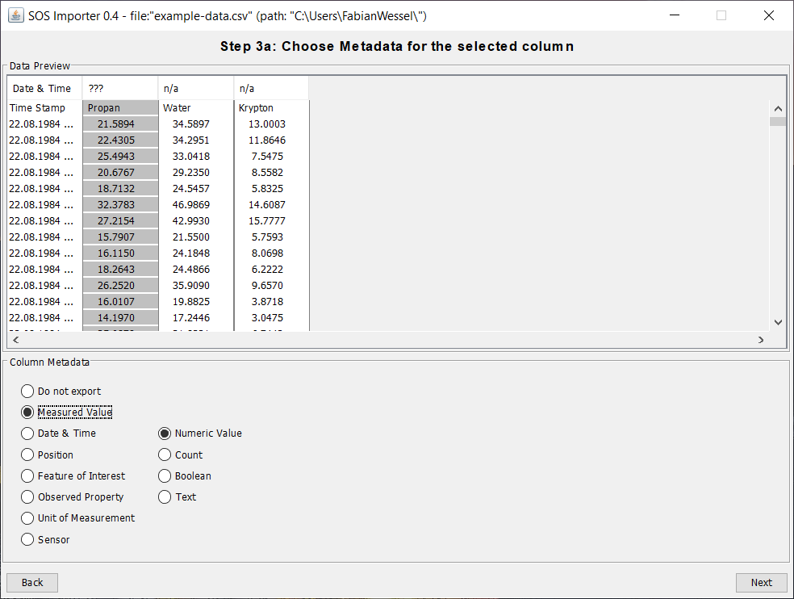
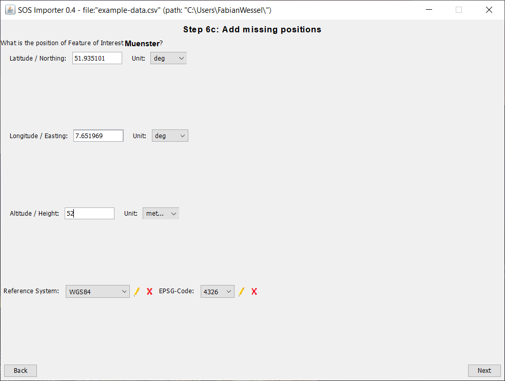
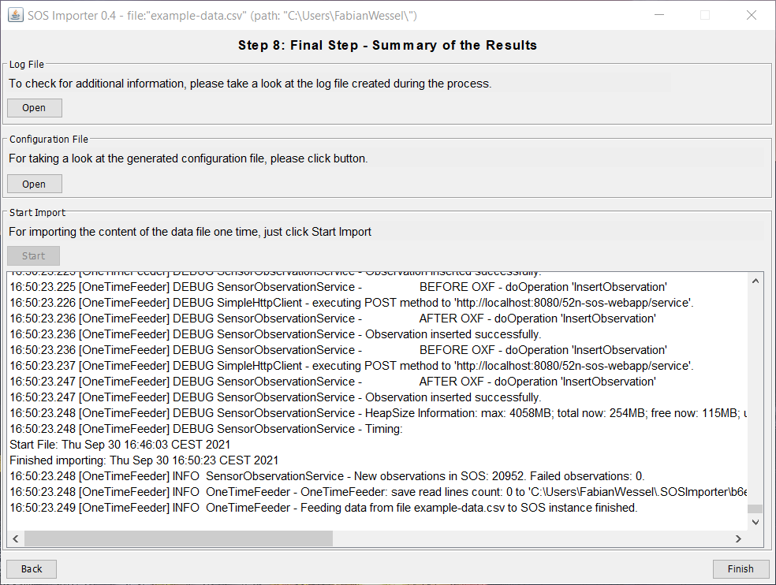

## 52°North SOS Importer

The **52°North SOS Importer** is a tool for importing observations from CSV files into a running SOS instance.
Those CSV files can either be locally available or remotely (FTP support). The application makes
use of the wizard design pattern which guides the user through different steps. This tutorial shows,
how to load a locally available CSV file into a running SOS instance.

### Workflow

The workflow would be:

* [Start SOS Importer Wizard](#start-sos-importer-wizard)
* [Choose CSV File](#choose-csv-file)
* [Define CSV File Metadata](#define-csv-file-metadata)
* [Choose Metadata for the selected Column](#choose-metadata-for-the-selected-column)
* [Complete Time Data](#complete-time-data)
* [Add missing Metadata](#add-missing-metadata)
* [Add missing Positions](#add-missing-positions)
* [Final Configuration](#final-configuration)
* [Final Step](#final-step)

### Start SOS Importer Wizard

> ####### Activity 1
>
> 1. Download the SOS Importer Wizard
> 1. Download the SOS Importer Feeder
> 1. Download the `example-data.csv`
> 1. Make sure you have a running SOS instance
> 1. Execute the SOS Importer Wizard

### Choose CSV File

> ####### Activity 2
>
> 1. Change the language to your language (supported languages are English and German)
> 1. Select in the dropdown-menu `One-Time-Feed from a local CSV file`
> 1. Select the `example-data.csv`
> 1. Select `UTF-8` as the input file encoding
> 1. Continue by clicking on `Next`

### Define CSV File Metadata

> ####### Activity 3
>
> 1. Choose as column separator `,`
> 1. Choose a text qualifier `"`
> 1. Ingore data until line 1 to leave out the column headings
> 1. Chose as decimal separator `.`
> 1. Continue by clicking on `Next`

### Choose Metadata for the selected Column

> ####### Activity 4
>
> 1. Select the metadata `Date & Time`
> 1. Select the format `dd.MM.yyyy HH:mm`
> 1. Continue by clicking on `Next`

> ####### Activity 5
>
> 1. Select the metadata `Measured Value`
> 1. Select the type `Numeric Value`
> 1. Continue by clicking on `Next`
> 1. Repeat this activity for the columns 3 and 4

### Complete Time Data

> ####### Activity 6
>
> 1. Define the timezone for the marked date and time by entering the UTC offset
> 1. Continue by clicking on `Next`

### Add missing Metadata

> ####### Activity 7
>
> 1. Select `Set identifier manually`
> 1. Add a Name for the **Feature of Interest**
> 1. Add an URI for the **Feature of Interest**
> 1. Continue by clicking on `Next`
> 1. Repeat this activity for the columns 3 and 4

> ####### Activity 8
>
> 1. Select `Set identifier manually`
> 1. Add a Name for the **Observed Property**
> 1. Add an URI for the **Observed Property**
> 1. Continue by clicking on `Next`
> 1. Repeat this activity for the columns 3 and 4

> ####### Activity 9
>
> 1. Select `Set identifier manually`
> 1. Add a Name for the **Unit of Measurement**
> 1. Add an URI for the **Unit of Measurement**
> 1. Continue by clicking on `Next`
> 1. Repeat this activity for the columns 3 and 4

> ####### Activity 10
>
> 1. Select `Set identifier manually`
> 1. Add a Name for the **Sensor**
> 1. Add an URI for the **Sensor**
> 1. Continue by clicking on `Next`
> 1. Repeat this activity for the columns 3 and 4

### Add missing Positions

> ####### Activity 11
>
> 1. Add a Latitude for the **Feature of Interest**
> 1. Add a Longitude for the **Feature of Interest**
> 1. Add a Altitude for the **Feature of Interest**
> 1. Select `WGS84` as reference system
> 1. Continue by clicking on `Next`

### Final Configuration

> ####### Activity 12
>
> 1. Enter the URL of the SOS (here: `http://localhost:8080/52n-sos-webapp/service`)
> 1. Choose a folder where the configuration file should be saved
> 1. Enter a name for the configuration file
> 1. Activate the generation of the offering from the sensor name
> 1. Choose the specifictation version `2.0.0` and the binding `POX`
> 1. Select the import strategy `Single Observation`
> 1. Continue by clicking on `Next`

### Final Step

> ####### Activity 13
>
> 1. Start the import of the csv-file by clicking on `Start`

> ####### Activity 14
>
> 1. Close the SOS Import Wizard by clicking on `Finish`
