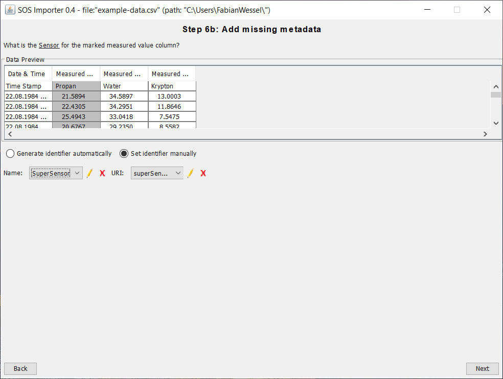

## 52°North SOS Importer

The **52°North SOS Importer** is a tool for importing observations from CSV files into a running SOS instance.
Those CSV files can either be locally available or remotely (FTP support). The application makes
use of the wizard design pattern which guides the user through different steps. This tutorial shows,
how to load a locally available CSV file into a running SOS instance.

### Workflow

The workflow would be:

* [Start SOS Importer Wizard](#start-sos-importer-wizard)
* [Choose CSV File](#choose-csv-file)
* [Define CSV File Metadata](#define-csv-file-metadata)
* [Choose Metadata for the selected Column](#choose-metadata-for-the-selected-column)
* [Complete Time Data](#complete-time-data)
* [Add missing Metadata](#add-missing-metadata)
* [Add missing Positions](#add-missing-positions)
* [Final Configuration](#final-configuration)
* [Final Step](#final-step)

### Start SOS Importer Wizard

### Choose CSV File

### Define CSV File Metadata

### Choose Metadata for the selected Column

### Complete Time Data

### Add missing Metadata

### Add missing Positions

### Final Configuration

### Final Step

