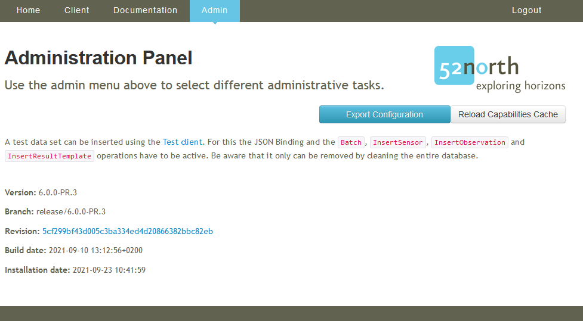
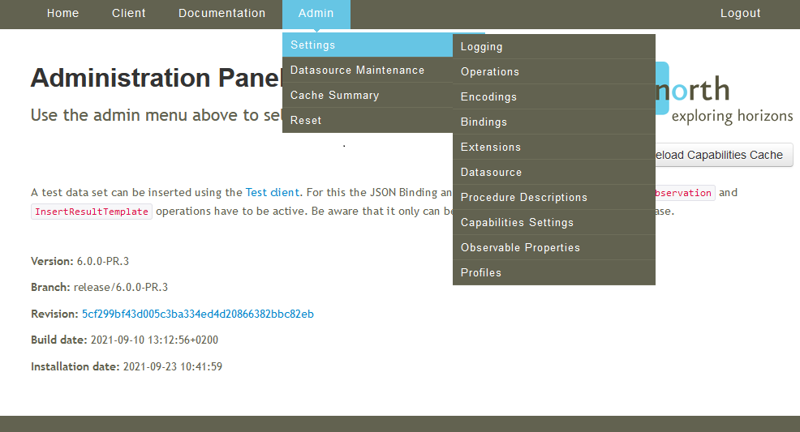
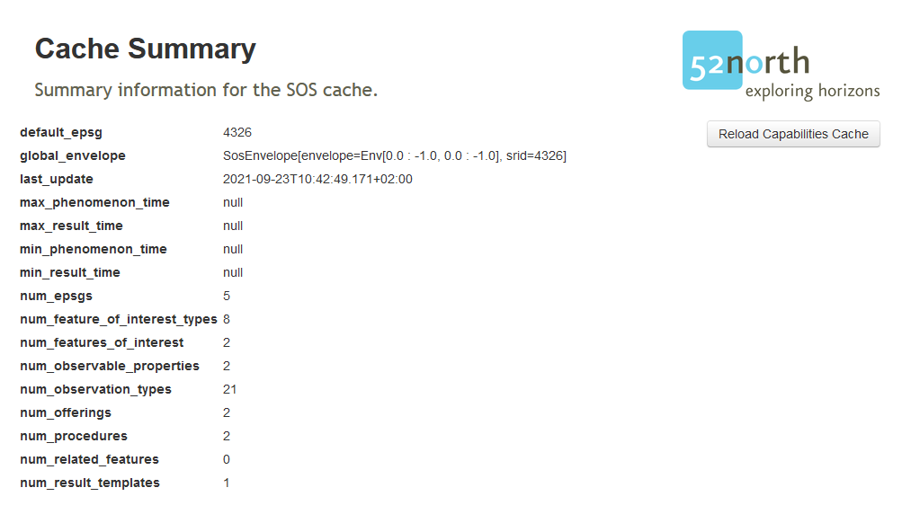
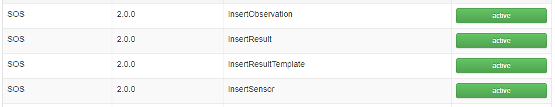
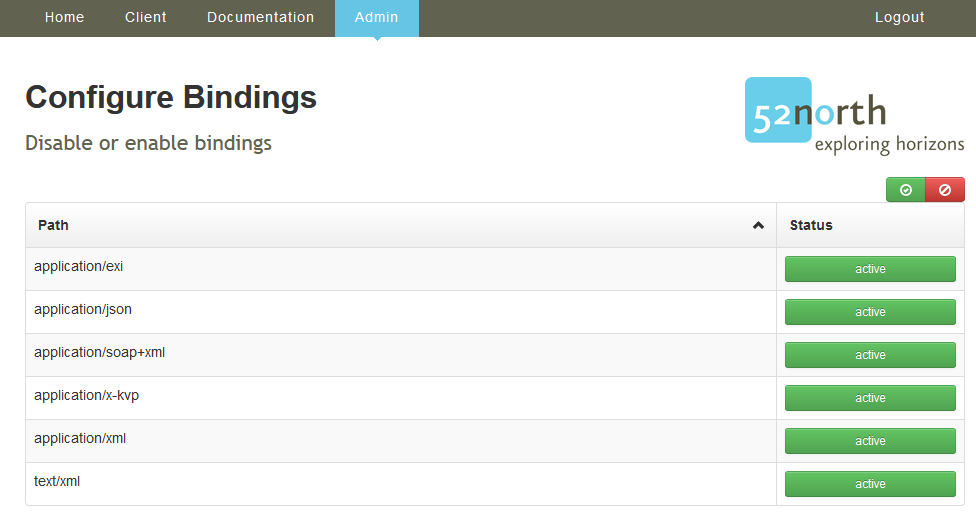

## Introduction

With the `Admin` interface you can change the settings, de-/activate operations, encodings and bindings or change the logging and check the latest log statements.

### Admin interface

The admin interface allows the administrator to change the settings or modify the behavior of the SOS.

> ####### Activity 1
>
> 1. Click `Admin`

Now you see the Admin start page with information about the Version and the build and installation date.

> ####### Activity 2
>
> 1. Click the blue `Export Configuration` button

A new browser tab opens with the configuration of the SOS formatted in JSON. This file can be saved and [loaded during the installation](/9_1_sos_installation_war_file/#upload-a-configuration-file){target=_blank} of the SOS.

If you hover over `Admin` then *move* to `Settings` an further list appears with additional configurations.

#### Settings

> ####### Activity 2
>
> 1. Hover over the `Admin` and *click* on `Settings`

Now you see the same settings which we have described in the [installation](9_1_sos_installation_war_file/#settings){target=_blank} process.

An additional tab exists in the admin settings, the `Credentials` tab to change the admin password.

#### Datasource Maintenance

With the *Datasource Maintenance* the administrator can

* remove the data from the database
* delete data which are marked as delete
* insert some sample data
* reset the datasource configuration
* insert predefined observableProperties and units.

> ####### Activity 3
>
> 1. Hover over the `Admin` and *click* on `Datasource Maintenance`

#### Cache Summery

A brief summery of the contained data.

> ####### Activity 4
>
> 1. Hover over the `Admin` and *click* on `Cache Summery`

You can see a short summary of the number of the entities contained in the SOS and the bbox and temporal extends of the data.

#### Logging

Configuration of the logging of the SOS

> ####### Activity 5
>
> We modify the days to keep and the file size
>
> 1. Hover over the `Admin` and `Settings` and *click* on `Logging`
> 1. Set *Days of log files to keep* to `5`
> 1. Set *Max file size* to `5MB`

#### Operations

This configuration page allows the de-/activating of the support operations.

> ####### Activity 6
>
> 1. Hover over the `Admin` and `Settings` and *click* on `Operations`

To follow the given examples in this next chapter we activate the
transactional SOS operations.

> ####### Activity 7
>
> We activate the following operations
>
> 1. Click the *red inaktive* button behind `InsertObservation`
> 1. Click the *red inaktive* button behind `InsertResult`
> 1. Click the *red inaktive* button behind `InsertResultTemplate`
> 1. Click the *red inaktive* button behind `InsertSensor`

#### Encodings

This configuration page allows the de-/activating of the support encodings.

> ####### Activity 8
>
> 1. Hover over the `Admin` and `Settings` and *click* on `Encodings`

#### Bindings

This configuration page allows the de-/activating of the support bindings.

> ####### Activity 9
>
> 1. Hover over the `Admin` and `Settings` and *click* on `Bindings`

> ####### Activity 10
>
> We deactivate the following bindings
>
> 1. Click the *green active* button behind `application/exi`
> 1. Click the *green active* button behind `application/soap+xml`

#### Profiles

Select the profile the SOS should comply with.

> ####### Activity 11
>
> 1. Hover over the `Admin` and `Settings` and *click* on `Profiles`

The profiles allows us to change the *default* behavior of the SOS. Especially, the default response format of the *GetObservation* requests.

Currently, the 52N SOS provides three profiles:

* *SOS_20_PROFILE* -> default SOS 2.0, Observations are returned in OGC O&M 2.0
* *hydrology* -> default SOS 2.0, Observations are returned in OGC WaterML 2.0
* *inspire* -> default SOS 2.0, Observations are returned in Inspire OMSO 3.0 (specialized O&M 2.0)

#### Further configurations

The following configuration are not part of the tutorial and are only mentioned briefly here.

* *Extensions* -> de-/activate extensions
* *Datasource* -> change the datasource settings (connections, user, password, ...)
* *Procedure Descriptions* -> modify procedure descriptions
* *Capabilities Settings* -> create static Capabilities or add Capabilities extensions
* *Observable Properties* -> change the observableProperties identifier
