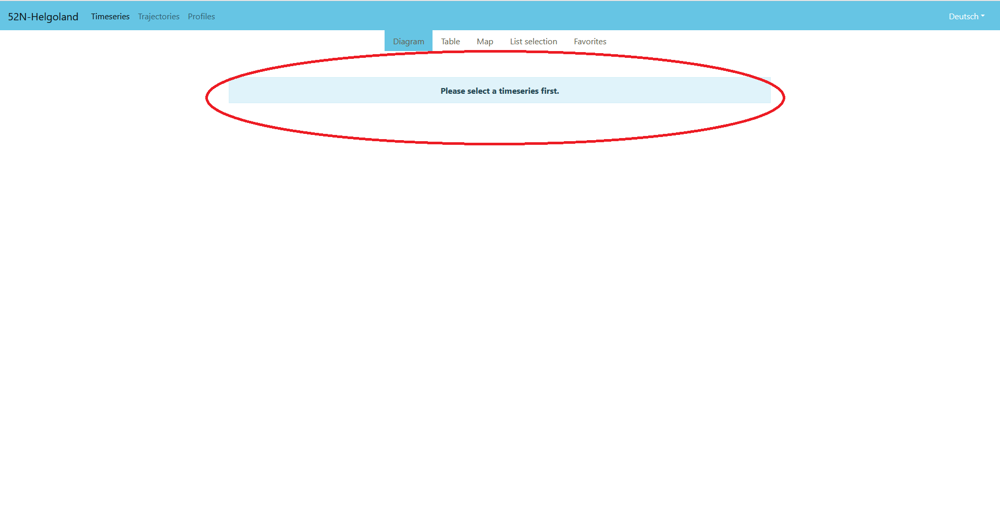
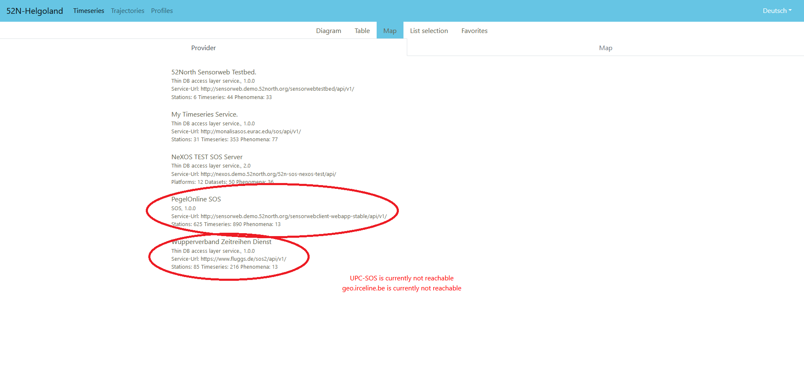
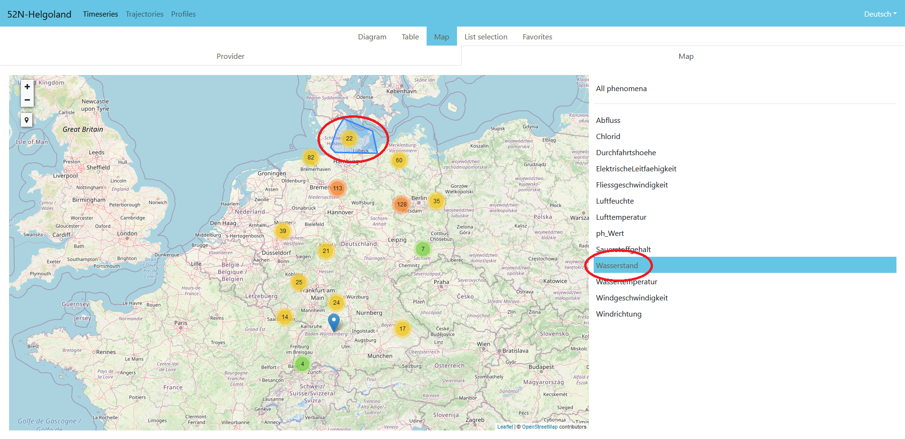
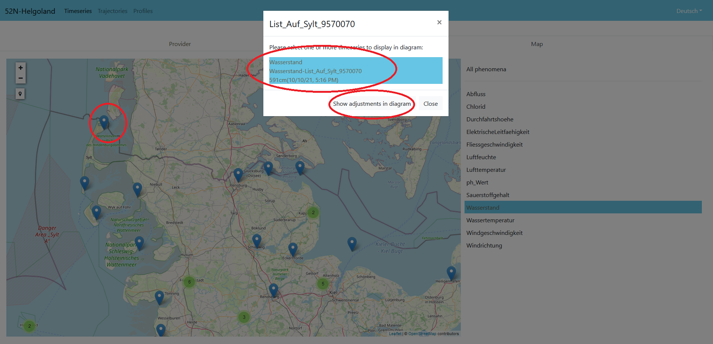
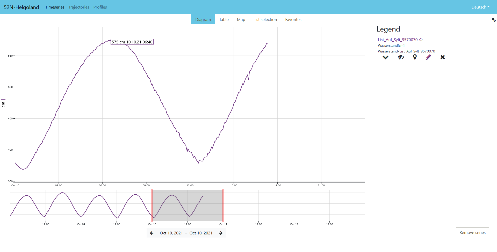

## Introduction Hand-On: Sensor Web Examples

Within this tutorial you will learn about the basics of Sensor Web technologies and get hands-on experiences with server as well as client implementations so that you will be able to design and develop your own Sensor Web infrastructures. But before starting with the technical details, this first hand-on shall give you an insight into two examples of Sensor Web deployments in practice.

In order to start, please open a Web browser and visit the following URL: [http://sensorweb.demo.52north.org/helgoland/](http://sensorweb.demo.52north.org/helgoland/)

After you open this URL, you will see a demo instance of the 52°North Sensor Web Viewer (Helgoland) which has been installed in order to access data from multiple Sensor Web servers.

### Step 1

In the first step, we need to proceed to the data selection. To get there, please click on "Please select a timeseries first.".

### Step 2

You will now see an overview of all configured Sensor Web servers. Especially the following two services should be tried out:

* PegelOnline SOS: An SOS server operated by the Federal German Waterways Administration. This SOS server delivers hydrometric data measured along all German national waterways during the last 30 days.
* Wupperverband Zeitreihen Dienst: This SOS server is operated by a regional water administration organisation. It contains a broad range of different hydrological parameters.

For the first step, please select "PegelOnline SOS"

### Step 3

Now you can see two things: On the right-hand side there is a list of all observed measurement parameters available from this SOS server. We select "Wasserstand" (= water level). After that, the map shows all stations which are measuring this parameter.

As there are lots of stations available, the stations are clustered on the map. To get a detailed view, we click on the northern-most cluster.

### Step 4

After clicking on the cluster, we get a detailed view of the stations. Then we click on the station marked with the red circle on the image below. After that a dedicated menu opens. This menu shows the time series available at this location "List auf Sylt" with their latest available measured value (in this case the latest value for the water level).

In order to proceed, we click on this entry so that it is highlighted in blue. After that we click on "Show adjustments in diagram" in order to open the time series in a diagram view.

### Step 5

In the next step we see the diagram view and are able to navigate through the time series.

### Further Steps

We may now add further time series. For this purpose, we can click on the "Map" tab on the top of the menu. There we can also select data from other providers which shall be combined with the previously selected time series.
