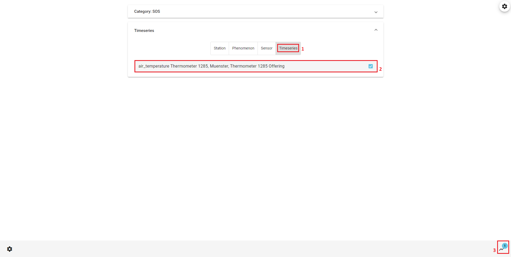

## 52°North Helgoland Client

The **52°North Helgoland Client** is a lightweight web application that enables the exploration, visualization
and analysis of sensor web data in various fields of use, e.g. hydrology, meteorology, environmental monitoring,
traffic management. This tutorial shows you how to use the Helgoland Client. In this tutorial we use as an
example the **52°North SOS** which was installed in the [SOS Installation War File](03_sos-installation.md)
tutorial and we use the data which was added to the SOS in the [SOS Example Request](05_sos-example-request.md)
tutorial. But you can also follow along the tutorial with different data.

### Workflow

The workflow would be:

* [Open Helgoland Client](#open-helgoland-client)
* [Explore Sensor Web Data on Map](#explore-sensor-web-data-on-map)
* [Select Timeseries by Map](#select-timeseries-by-map)
* [Visualize Timeseries in Diagram](#visualize-timeseries-in-diagram)

### Open Helgoland Client

The **52°North Helgoland Client** is part of the **52°North SOS** installation. This means that we have already successfully installed Helgoland with the SOS. You can access
the Helgoland Client from the SOS menu.

> ####### Activity 1
>
> 1. Hover your mouse over `Client`
> 1. Click `Sensor Web Thin Client (Helgoland)` in the drop down menu

### Explore Sensor Web Data on Map

When you open the Helgoland Client you come to the `Diagram` view. Because you opened the
Helgoland Client for the first time you have no data selected to be shown in the `Diagram`.

1. Here you can choose timeseries in the `Map` view to be shown in the `Diagram`
1. Here you can choose timeseries in the `List` view to be shown in the `Diagram`
1. Here you can change the view to a `Darkmode` or adjust the `Language` (currently supported languages
are English and German)

> ####### Activity 2
>
> 1. Select your language
> 1. Click on `Add timeseries by map`

Now you can explore all the measurement stations, which are provided by the service. In this example
it is only on station, which measures the air temperature. If you start the Helgoland Client for the
first time, you have to select a provider before you can see the `Map`.

1. Select a phenomenon to filter which stations are displayed in the `Map`
1. Here you can adjust the provider
1. This symbol marks a measurment station
1. Here you can navigate back to the `Diagram` view

If you have chosen a station, which timeseries data you want to present in the `Diagram`, you can select it
by clicking on it.

> ####### Activity 3
>
> 1. Select the station by clicking on the symbol in the `Map`

### Select Timeseries by Map

After you clicked on a station a popup opens. In this you can select timeseries.

1. By clicking on the timeseries you select it for the `Diagram`
1. Here you can navigate back to the `Diagram` view
1. Click here to close the popup to choose data from different stations

> ####### Activity 4
>
> 1. Select timeseries data
> 1. Click on `Diagram`

### Visualize Timeseries in Diagram

Now the `Diagram` displays your chosen timeseries. You can visualize the data or add more timeseries.

1. By clicking here you can highlight the timeseries
1. Here you can enable or disable the visibility of the data in the `Diagram`.
1. Here you can style the timeseries
1. By clicking on the star you can add the timeseries to your `Favorites`.
1. Here you can delete the timeseries from the `Diagram`.
1. Here you can configurate the `Diagram` settings
1. This button clears all data from the `Diagram`.
1. Here you can save a link to you clipboard to share your `Diagram`
1. Here you can see your saved `Favorites`
1. By clicking on the `Plus` you can add more timeseries to the `Diagram`
1. By moving the red window or the edges of the window you can adjust the displayed period of time.

> ####### Activity 5
>
> 1. Try the different options and find the best way to visualize your data

### Select Timeseries by List

Alternativ to the `Map` view you can use the `List` view to add new timeseries to the `Diagram`. In the
`List` view you can filter by four filter options (`Category`, `Station`, `Phenomenon` and `Sensor`).
Select a filter option and then select an item you want to filter by from the `List` below.

> ####### Activity 6
>
> 1. Choose a filter option
> 1. Select an item from the list below to filter by

When you have selected at least one filter you can click on `Timeseries`. There you can select timeseries
for the `Diagram`.

> ####### Activity 7
>
> 1. Click on `Timeseries`
> 1. Select a timeseries
> 1. Click on the diagram symbol to navigate back to the `Diagram`

Now you successfully  learnt how to use the **52°North Helgoland Client** and can explore, visualize
and analyse your sensor web data.
