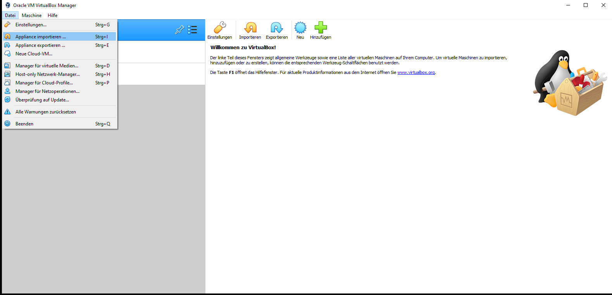

## Hands-On Sensor Web Open Source Software

In order to get the most easy jump-start on Sensor Web software, we have
developed a set of [VirtualBox](https://www.virtualbox.org/){target=_blank}
 images. You will
require VirtualBox running on your machine in order to use the following examples.
Instructions for all supported platform are available at:

> [https://www.virtualbox.org/wiki/Downloads](https://www.virtualbox.org/wiki/Downloads){target=_blank}

### 52°North Sensor Web VirtualBoxes

This section provides a brief overview on the available VirtualBox images for
the Sensor Web Workshop at Fréjus 2021:

> [Debian](https://52north.org/delivery/SensorWeb/Workshops/Frejus_2021/Sensor%20Web%20Workshop%202021.ova){target=_blank}
>
> [Debian with preinstalled SOS/STA](https://52north.org/delivery/SensorWeb/Workshops/Frejus_2021/Sensor%20Web%20Workshop%202021%20inst.ova){target=_blank}

#### Installation of the image

> ####### Activity 1
>
> 1. Download `Debian` of the previously mentioned images to your preferred location, e.g `/home/demo/`
> 1. Start *VirtualBox*
> 1. Select *File*, *Import Appliance* (*Data* and *Appliance importieren* in the screenshot)
>     * Select the *.ova* file from the dialog (e.g. from `/home/demo/`)
>     * Click *Import*
> 1. Check the *Appliance Settings*
>     * Adjust the system setting (CPU/RAM) to roughly half of the host system
>     * Change the `Guest OS Type` to `Debian (64-bit)`
>     * Click *Import*

More details are in the official [VirtualBox documentations](https://www.virtualbox.org/manual/ch01.html#ovf-import-appliance){target=_blank}

#### Run the VirtualBox images

> ####### Activity 2
>
>1. Select the VirtualBox you would like to start
>     * Click *Start* on the panel
>     * Or *right click* and select *Start*
>1. The images starts
>1. Login withe the `Debian` password
>1. Open Firefox
>     * Click *Activities* (top left)
>     * Click *Firefox* symbol
>1. Firefox starts with the tutorial (in the browser of the image: `http://localhost:8080/tutorial/`)

##### Debian

> **Password**: demo

##### Tomcat

> **Username**: admin
>
> **Password**: tomcat

##### PostgreSQL/PostGIS

> **Username**: postgres
>
> **Password**: postgres

#### SOS (preinstalled)

> **Username**: admin
>
> **Password**: password

### Create PostgreSQL database

#### Open a terminal

> ####### Activity 3
>
> 1. Login to Debian with `demo` password
> 1. Open a terminal´
>     * Click *Activities* (top left)
>     * Type in *Type to search* `terminal`
>     * Press enter and a terminal window opens

#### Create the database

> ####### Activity 4
>
> 1. Switch to *postgres* user
>     * Type `su - postgres` and *enter*
> 1. Connect ot postgresql
>     * Type `psql` and *enter*
> 1. Create the `sensorweb` database
>     * Type `CREATE DATABASE sensorweb;` and *enter*
> 1. Quit `psql`
>     * Type `\q` and *enter*

#### Create PostGIS extension

> ####### Activity 5
>
> 1. Connect to the new `sensorweb` database
>     * Type `psql -d  sensorweb  -U postgres` and *enter*
> 1. Create the PostGIS extension
>     * Type `CREATE EXTENSION postgis;` and *enter*
> 1. Quit `psql`
>     * Type `\q` and *enter*
> 1. Quit as user *postgres*
>     * Type `exit` and *enter*
