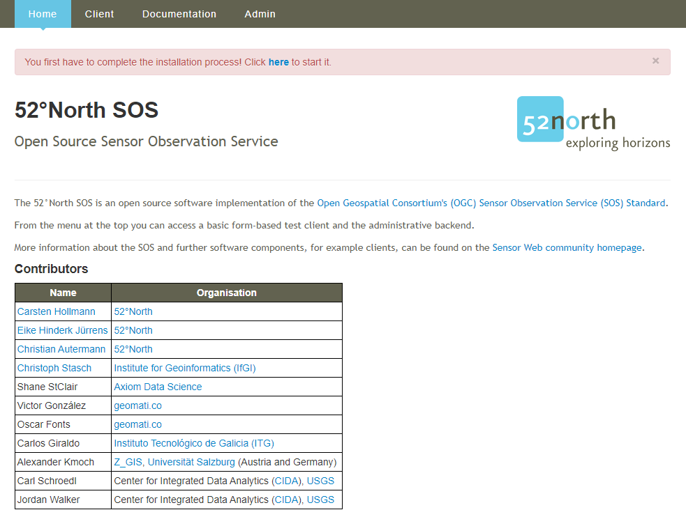
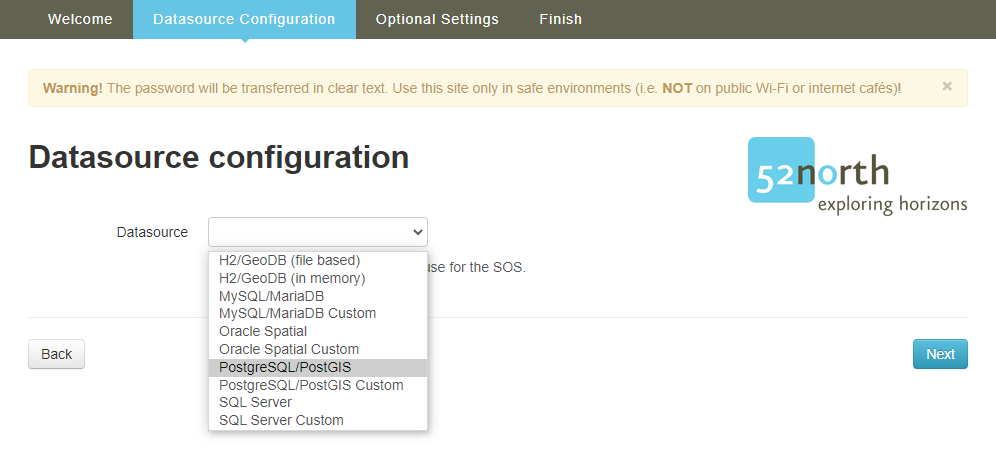
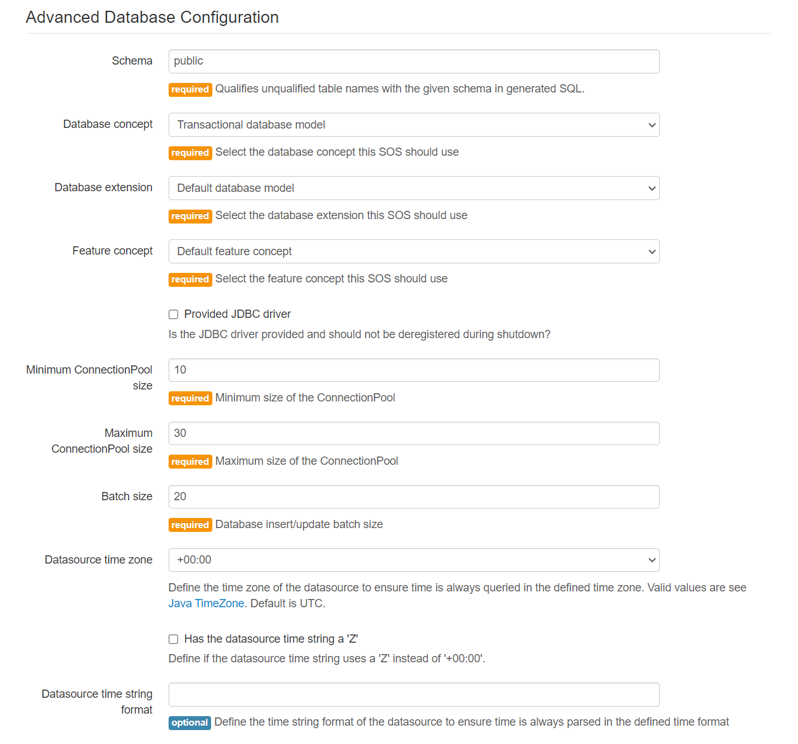
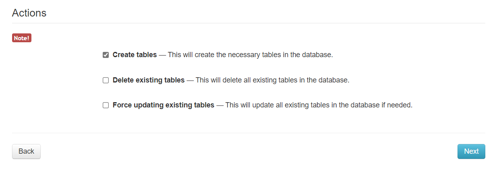
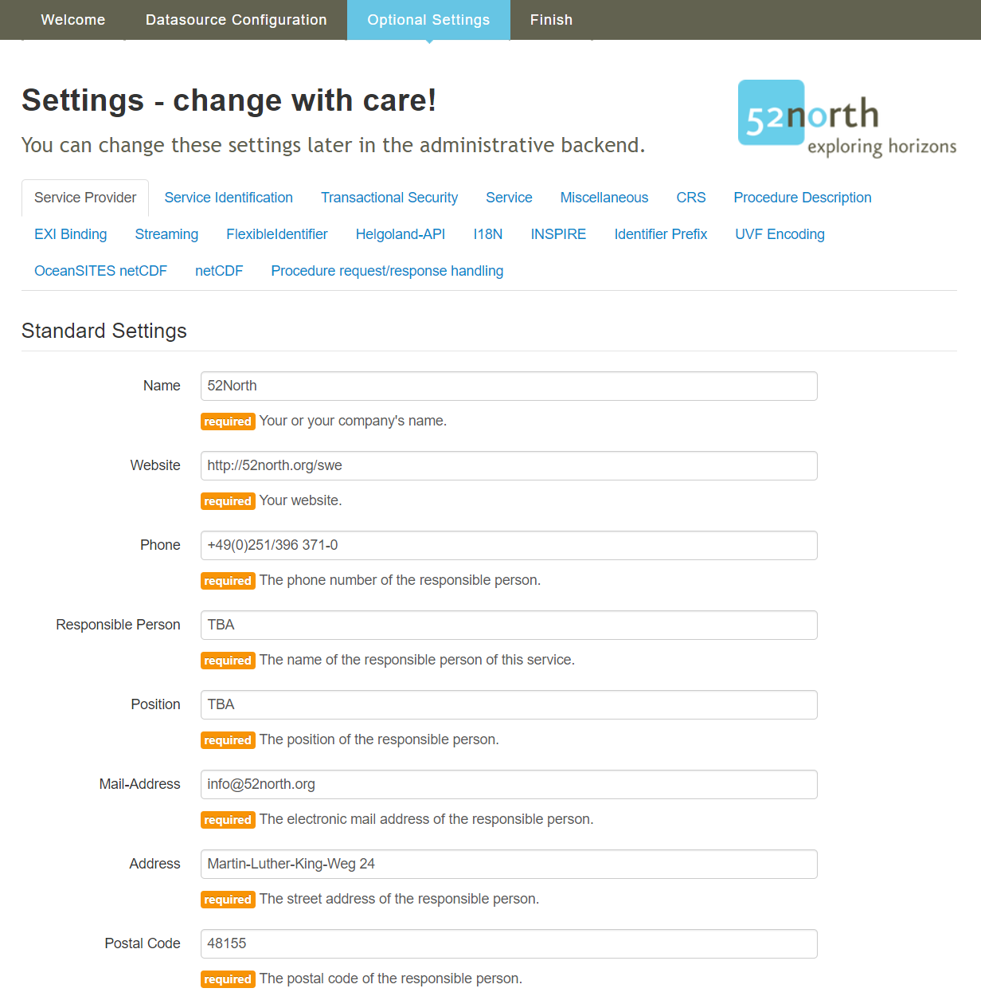
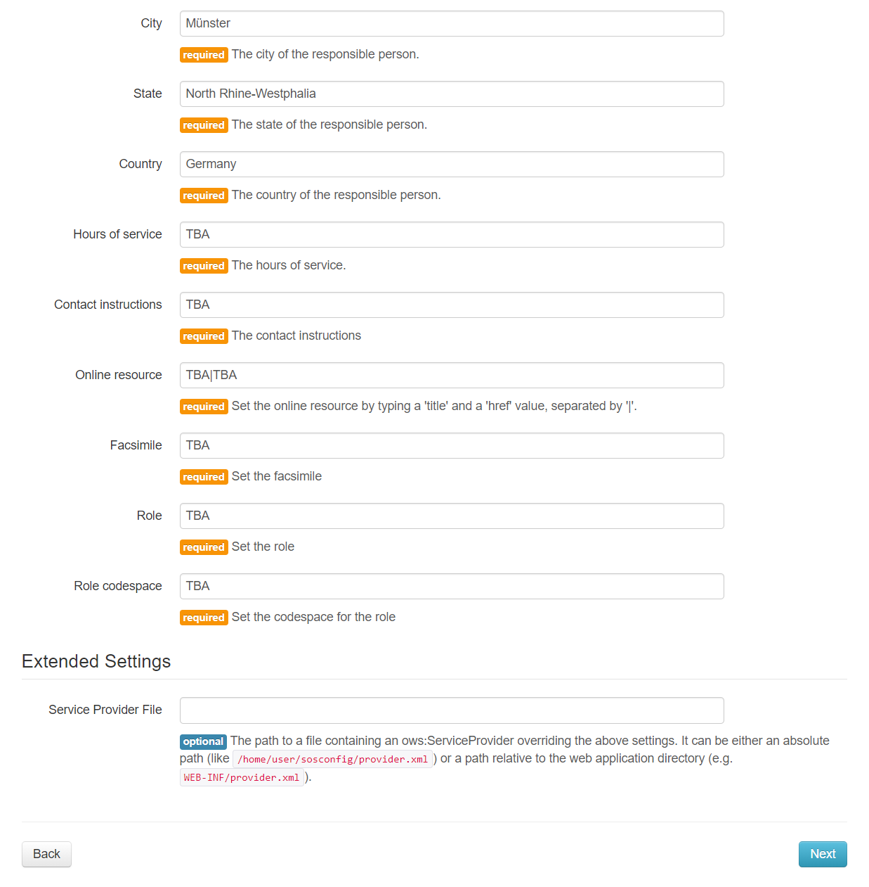
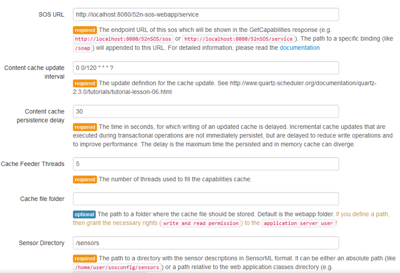
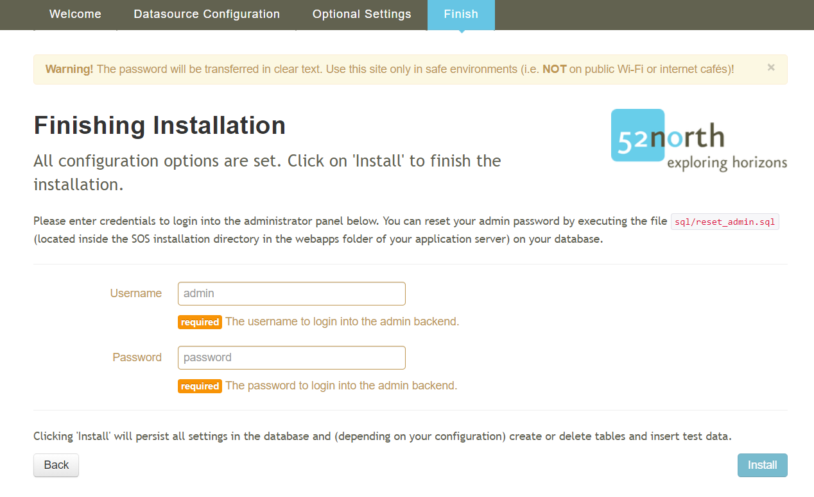
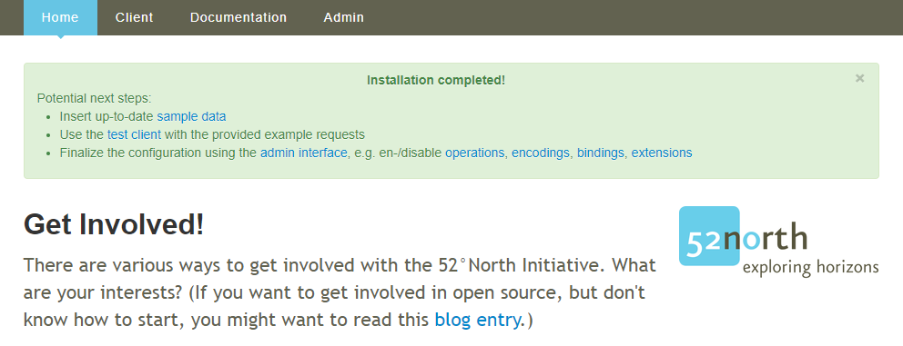

## Introduction

This tutorial shows you how to install a 52°North Sensor Observation Service (SOS). To be able to install the
__52°North SOS__ the following software has to be downloaded and installed:

- __Java Runtime Environment__ (JRE) 8.0 or higher
- __Application server__ compatible to Java Servlet-API 2.5 or higher
- Running __database management system__

For Windows systems we provide a tutorial, how to setup the system for the installation of the SOS.
In the tutorial we use __Apache Tomcat__ as the application server
and __PostgreSQL/PostGIS__ as the database management system: [Tutorial](../89_installation_requirements_for_windows.md)

If you want to use different software, have an other operating system
or want to build the SOS from source you can find more information here:
[52°North SOS Documentation](https://wiki.52north.org/SensorWeb/SensorObservationServiceVDocumentation){target=_blank}

For this tutorial we will start with a virtual box image, which contains the necessary external software. In the following sections you will learn how to install and configure the SOS server. Due to the extremely broad range of functionalities and extensions offered by the 52°North SOS server, the following steps are the typical tasks which have to be conducted in order to build a fully functional SOS server.

### Installing the Webapp

#### Download and Deploy

When your system matches the requirements above, download the  __war-file__: [52°North SOS workshop version](http://52north.org/delivery/SensorWeb/Workshops/Frejus_2021/52n-sos-webapp.war){target=_blank}

> ####### Activity 1
>  
> 1. Save the file to `/home/demo/`
> 1. Open a terminal [see](09_hands-on/#open-a-terminal){target=_blank}
> 1. Copy the file `52n-sos-webapp.war` into the folder `/opt/tomcat/webapps`
>
>    - Type `sudo cp /home/demo/52n-sos-webapp.war /opt/tomcat/webapps/`
>
> 1. Press *enter*
>

After a moment the __war-file__ gets converted and in the folder should be a new
folder `52n-sos-webapp`. If this is the case than you can reach the webapp with this URL:
[http://localhost:8080/52n-sos-webapp/](http://localhost:8080/52n-sos-webapp/){target=_blank}

If the download does not work, you find an already downloaded version in `/home/demo/workshop/webapps/`:

- Alternative `sudo cp /home/demo/workshop/webapps/52n-sos-webapp.war /opt/tomcat/webapps/`

#### Installation

> ####### Activity 2
>
> 1. Click the link or open a *browser* and enter the following URL:
>
>> [http://localhost:8080/52n-sos-webapp/](http://localhost:8080/52n-sos-webapp/){target=_blank}

When you successfully reach the service it should look like this:

You can start the installation process by clicking `here` on the link in the *red banner*.

##### Welcome Page

The installation process starts with the Welcome-page.

If you have been running an SOS server before, you could export the settings of that SOS server and import them here via the "Upload a previous configuration file" functionality. However, in this tutorial, we are setting up a new SOS server so that we do not use this functionality.

> ####### Activity 3
>
> 1. Click the blue `Start` button.

##### Datasource Selection

In the next steps you configure your datasource.

First you need to select the database management system which you are using as the datasource.

The 52N SOS supports the database management system:

- H2/GeoDB (*file based* and *in memory*)
- MySQL/MariaDB
- Oracle Spatial
- PostgreSQL/PostGIS
- SQL Server
  
The *Custom* datasource should be selected if you do not use the created database model but views or adjusted hibernate mapping files. In this case the *existing* database model would not be validated against the expected model! However, this approach is only recommended for experienced expert users. In this tutorial we will use the most commonly used default data model for PostgreSQL/PostGIS.

> ####### Activity 4
>
> 1. In this tutorial we select `PostgreSQL/PostGIS` as datasource.

Next you need to set the parameters of your database.

###### Database Configuration

In the *Database configuration* you define the connection parameters and credentials of the database. This includes the user name/password as well as the connection details for the database (database name, the host on which the database is running (localhost if it is on the same computer as the SOS), and the port of the database).

> ####### Activity 5
>
> As we have created the `sensorweb` database, we have to change the `Database` parameter
>
> 1. Change `Database` from `sos`to `sensorweb`

###### Advanced Database Configuration

The *Advanced Database configuration* provides additional settings for the database like the *schema* or *minimum and maximum connections*.

You can also define the database model selecting other `Database concept`s, `Database extension`s and `Feature concept`s.

The `Database concept` provides three different levels of database models:

- Simple database model (minimal tables and columns, `No transactional support!`)
- Transactional database model (default; this is the recommended model because it allows the insertion of data via the SOS write operations)
- eReporting database model (extended transactional model for eReporting; this is only necessary for environmental agencies that need to fulfil reporing obligations for the European Environment Agency)

The `Database extensions` provides two selections:

- Default database model (recommended)
- Extended model to support Samplings/MeasuringPrograms (advanced extension: this extension is used to manage which observations belong to which measurement program/project)

The `Feature concept` provides two selections:

- Default feature concept
- Extended feature concept (support for storing full WaterML 2.0 MonitoringPoint; only relevant for data providers from Hydrology)

The further settings are relevant for optimizing the database connection (e.g. number of available connections, batch size (how many observations shall be handled in one insertion command to the database at the same time)). Furthermore it is possible to set the time zone in whichc the database is operated.

In this tutorial we use the **default configuration**!

> ####### Activity 6
>  
> - In this case we do not make any changes because we recommend to use the default configuration

###### Actions

Under Actions you can chose if you want to create new table, delete all existing tables or update all existing tables in your database. If you use the database for the first time leave only `Create tables` marked. When the database model already exists `unselect` the `Create tables` option.

> ####### Activity 7
>
> 1. Press `Next` button

##### Settings

On the *Settings* installation page you can define several configuration parameter of the SOS.

This includes parameter for the SOS Capabilities (service provider and identification), CRS of the datasource, service parameter and specific parameter for some use cases.

All these settings can be changed later in the [administrative backend](09_02_sos_admin_interface.md).

Below we expain the relevant settings for setting up an operational SOS server. Please note, we explain those field which are relevant for typical SOS setups in practice. Further, more specific fields are for expert use case or are specific to single projects. These additional fields should not be changed during the setup procedure.

###### Service Provider

Here you can define the information about the `Service Provider` which is provided in the Capabilities returned by the SOS server.

In this menu please enter all the contact details of the person responsible of operating the SOS. We recommend to insert data into those fields which are also filled in the screenshots. Further information may be added, but is not necessary (e.g. textual instructions how to contact the support, hours of service of the support, fax number (facsimile), role of the contact person). For the fields which do not apply to your scenario, please fill in "TBA".

If you have a previous running SOS instance, you can also upload a service provider file which overrides the above settings.

###### Service Identification

The next menu is called "Service Identification". You can reach it by clicking on the corresponding tab in the header. Here you can define the information about the `Service Identification` such as:

- Title: A short title that you would like to give to your SOS server
- Abstract: A short textual description of the content that your SOS server offers

Further information does not need to be entered in this menu.

This information would be provided in the Capabilities.

###### Service

The next tab contains the `Service` settings. It allows the SOS oepration to set the following important information:

- SOS URL: The URL via which the SOS shall be available (for the tutorial, this shall be "localhost"; if the SOS is operated on an external server, this field should include the URL of this server)
- Content cache update interval: The SOS server maintains an internal cache to answer more efficiently to GetCapabilities request. This parameter sets how often this Cache shall be updated. The more often the data in the SOS changes, the shorter this update interval should be set.
- Strict SpatialFiltering: This option can be used to enforce the inclusion of coordinates in every observation; it is recommended if mobile sensors are used.
- List only parent offerings: For very large SOS servers, the number of data sets may become huge. To reduce the length of the Capabilities document, it is possible to organise the datasets in a hierarchy. With this parameter, it can be set that only the top level elements of this hierarchy shall be listed in a Capabilities file (only recommended for expert users who are implementing an advanced hierarchical data model).
- Sensor Directoy: The SOS is able to store sensor descriptions (SensorML) as files. With this parameter the folder for storing the sensor descriptions can be set.

###### Miscellaneous

The `Miscellaneous` settings provides the definition of

- Separator: Set which separators shall be used for indicating new data tokens, data blocks and decimal numbers
- Maximum number of returned observation values: If you enable the hydrology profile of the SOS, this parameter allows you to restrict how many observations shall be returned at most for one single request.
- HTTP Status: Allows to to set if the SOS shall always return the HTTP status code 200 - ok, or if an error code should be returned in case of exceptiona
- GetDataAvailability v2.0: The GetDataAvailability operation is not included in the SOS standard, but it is part of further best practices. With this parameter you can set that this operation shall be supported in its version 2.0
- Identifier for nothing/easting/altitude in SweCoordinates: The SOS can use different names of the axes of the coordinate system in its outputs. The names of the coordinate axes can be defined in this menu.

###### Transactional Security

The `Transactional Security` settings provides the definition of

- En-/Disable the simple transactinal security
- Configure the allowed IPs or the Authorization token

This menu is very important when operating an SOS server in the Web. If the SOS server is publically available, you should activate the "Transactional Security". With enabling the transactional security, you can make sure that no external users can insert or delete data in your SOS server. An efficient approach in this menu is to restrict the access to the transactional operation only to the local server or to known IPs within your loacl network. In addition, you can set access tokens which can be used for the authorisation of clients. The recommendation is to restrict the IP addresses which may write into the SOS server.

###### CRS

The `CRS` settings provides the definition of different settings related to coordinate reference systems used by the SOS.

- Axis order in the database (depending on how your database management system organises geo-coordinates, the order of the axes can be changed, e.g. first x coordinate than y coordinate)
- The default CRS for database and responses (the CRS that is used by default in the database and in the SOS responses)
- Supported CRS (setting which coordinate references shall be supported by the SOS server)

###### Procedure Description

The `Procedure Description` settings provides the definition of

- Enrich the SensorML description with additional information (from database): If you insert a sensor into the SOS, you submit a SensorML file. However, with the content of the database, there may be additional information added to the existing SensorML documents (e.g. details about available data delivered by the sensor).

###### EXI Binding

The `EXI Binding` settings provides the configuration of how EXI should be compressed. 

EXI stands for Efficient XML Interchange. This is a method for more efficient transmission of XML documents using a binary encoding. This reduces the data volume a lot but it is not commonly supported by clients. This setting should only be used if you have specific use cases requiring EXI and if you are sure that the client software supports EXI.

###### Streaming

The `Streaming` settings provides the definition dis-/enable the XML Streaming and define the chunk size for database queries

The conventional operation of the SOS is that it first requests data from the database and after all data has been fetched, the encoding of the XML response starts. This may take a longer time in case of large data volumes. This setting allows to change this strategy: If enables, the SOS fetches the data from the database in smaller chunks which can be encoded while the next chunk of data is retrieved in parallel. 

This option is recommended if the SOS has to deal with larger response files. Otherwise it should not be activated.

###### eReporting

The `eReporting` settings provides the definition of eReporting specific parameters. This option is only relevant for envrionmental agencies with reporting obligations of air quality to the European Environment Agency.

###### FlexibleIdentifier

The `FlexibleIdentifier` settings allows to define for which Objects the human readable name should be used in the response as identifier (if available). 

This extension allows to replace the identifiers stored in the database with other human readable names. Because this is normally not the case (the identifiers in the database should be human readable), this setting should not be used for regular SOS set-ups.

###### I18N

The `I18N` settings provides the definition of default language.

With I18N you can manage the support of multiple languages. This functionality would require further database tables that manage the translations of certain names (e.g. the name of the observed properties). For this tutorial we will focus on single-language operation.

###### INSPIRE

The `INSPIRE` settings provides the definition of

- Enable INSPIRE
- Definition of INSPIRE metadata (used in the Capabilities)

The European INSPIRE directive is relevant for public data providers that have to fulfil specific requirements towards the publication of geospatial data. Within this menu you can set, if the additional requirements of the INSPIRE Technical Guidance of the European Commission should be supported. This comprises:
- Conversion of Coordinate Reference Systems
- Indication of the supported languages
- Support of the GetDataAvailability operation

###### Identifier Prefix

The `Identifier Prefix` settings allows the definition of prefixes for the identifiers used by the SOS (mainly for data not inserted via SOS-T). For example, if you set the prefix to '52N', evey identifier returned by the SOS would include this prefix.

###### UVF Encoding

The `UVF Encoding` settings provides a switch to set if the UVF format shall be supported as an SOS output (typically this should be disabled as this is specific for a customer project)

###### OceanSITES netCDF

The `OceanSITES netCDF` settings allow to control if and how the OceanSITES specification shall be used for netCDF output of the SOS server. This option is only relevant for marine data providers.

###### netCDF

The `netCDF` settings provides additional options to set how netCDF output of the SOS should be supported. As netCDF is not a regular output encoding of the SOS standard, this should be used for specific use cases (e.g. in marine sciences).

###### Procedure request/response handling

The `Procedure request/response handling` settings manu allows to definition of specific aspects of the SOS response behaviour. Important settings include:

- Allow only requesting of procedure instances/aggregations: SensorML can be used for defining sensor types and instances. With this setting it is possible to define that the SOS server only returns concrete sensors and no type descriptions.
- Add outputs or encode child procedure in SensorML: Sensor systems may be organised in hierarchical manner (e.g. sensor system with many included sensor devices). With this parameter you can make sure, that the description of a complex sensor system includes inline also the descriptions of all embedded sensor devices.

> ####### Activity 8
>
>
> 1. Select the `Service Provider` tab
>
>     - Change the default definitions with values that correspond to you
>     - *Name* -> e.g. `SIST`
>     - *Website* -> e.g. `https://sist.cnrs.fr/`
>     - *Phone*
>     - *Mail-Address*
>     - *Address*
>     - *Postal Code*
>     - *City*
>     - *State*
>     - *Country* -> `France`
>     - ...
>
> 1. Select the `Service Identification` tab
>
>     - Change the default definitions as shown below. You may also use other titles, keyword, and abstract.
>     - *Title* -> `SIST SOS`
>     - *Keywords* -> `SIST,CNRS, Sensor Web Workshop, Frejus`
>     - *Abstract* -> `SIST Sensor Observation Service for Sensor Web Workshop`
>
> 1. Select the `Transactional Security` tab
>
>    - *Uncheck* `Transactional security active`
>    
>    This setting is important because we want later on use transactional operations to load data into the SOS.
>
> 1. Select the `Service` tab
>
>    - *Uncheck* `Block restrictionless requests`
>
>    This parameter allows to block requests without any filter parameters. Such requests could lead to huge responses and could be used for creating a copy of the whole SOS content. However, for our experiments in this tutorial we should allows all requests.
>
> 1. Select the `Miscellaneous` tab
>
>    - Change *Token separator* to `#`
>    - Change *Tuple separator* to `@`
>
> 1. Save changes with `Next`

##### Finish installation

You finish your installation by setting a username and a password for the SOS.

> ####### Activity 8
>
> 1. Type `admin` in the *Username" field
> 1. Type `password` in the *Password" field
> 1. Click `Install`

Dependending on the configuration the installation takes a while to create the database model, load the classes and harvest the metadata (if the database was not empty).

You now have successfully installed the __52°North SOS__.
