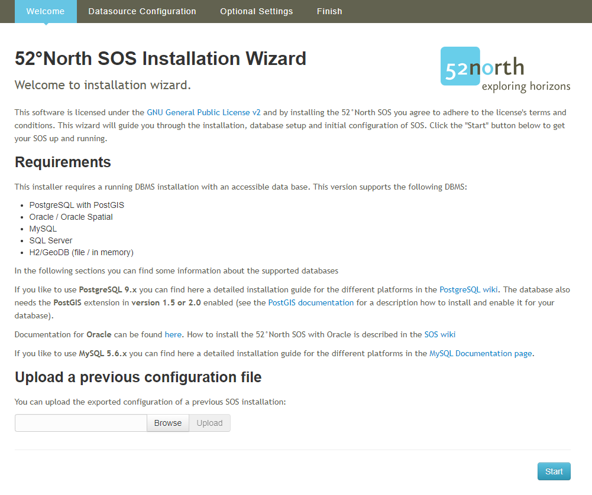

## Introduction

This tutorial shows you how to install a 52°North Sensor Observation Service (SOS). To be able to install the
__52°North SOS__ the following software has to be downloaded and installed:

- __Java Runtime Environment__ (JRE) 8.0 or higher
- __Application server__ compatible to Java Servlet-API 2.5 or higher
- Running __database management system__

For Windows systems we provide a tutorial, how to setup the system for the installation of the SOS.
In the tutorial we use __Apache Tomcat__ as the application server
and __PostgreSQL/PostGIS__ as the database management system: [Tutorial](../89_installation_requirements_for_windows.md)

If you want to use different software, have an other operating system
or want to build the SOS from source you can find more information here:
[52°North SOS Documentation](https://wiki.52north.org/SensorWeb/SensorObservationServiceVDocumentation){target=_blank}

For this tutorial we will start with a virtual box image, which contains the necessary external software. In the following sections you will learn how to install and configure the SOS server. Due to the extremely broad range of functionalities and extensions offered by the 52°North SOS server, the following steps are the typical tasks which have to be conducted in order to build a fully functional SOS server.

### Installing the Webapp

#### Download and Deploy

When your system matches the requirements above, download the  __war-file__: [52°North SOS workshop version](http://52north.org/delivery/SensorWeb/Workshops/Frejus_2021/52n-sos-webapp.war){target=_blank}

> ####### Activity 1
>  
> 1. Save the file to `/home/demo/`
> 1. Open a terminal [see](09_hands-on/#open-a-terminal){target=_blank}
> 1. Copy the file `52n-sos-webapp.war` into the folder `/opt/tomcat/webapps`
>
>    - Type `sudo cp /home/demo/52n-sos-webapp.war /opt/tomcat/webapps/`
>
> 1. Press *enter*
>

After a moment the __war-file__ gets converted and in the folder should be a new
folder `52n-sos-webapp`. If this is the case than you can reach the webapp with this URL:
[http://localhost:8080/52n-sos-webapp/](http://localhost:8080/52n-sos-webapp/){target=_blank}

If the download does not work, you find an already downloaded version in `/home/demo/webapps/`:

- Alternative `sudo cp /home/demo/webapps/52n-sos-webapp.war /opt/tomcat/webapps/`

#### Installation

> ####### Activity 2
>
> 1. Click the link or open a *browser* and enter the following URL:
>
>> [http://localhost:8080/52n-sos-webapp/](http://localhost:8080/52n-sos-webapp/){target=_blank}

When you successfully reach the service it should look like this:

You can start the installation process by clicking `here` on the link in the *red banner*.

##### Welcome Page

The installation process starts with the Welcome-page.

If you have been running an SOS server before, you could export the settings of that SOS server and import them here via the "Upload a previous configuration file" functionality. However, in this tutorial, we are setting up a new SOS server so that we do not use this functionality.

> ####### Activity 3
>
> 1. Click the blue `Start` button.

##### Datasource Selection

In the next steps you configure your datasource.

First you need to select the database management system which you are using as the datasource.

The 52N SOS supports the database management system:

- H2/GeoDB (*file based* and *in memory*)
- MySQL/MariaDB
- Oracle Spatial
- PostgreSQL/PostGIS
- SQL Server
  
The *Custom* datasource should be selected if you do not use the created database model but views or adjusted hibernate mapping files. In this case the *existing* database model would not be validated against the expected model! However, this approach is only recommended for experienced expert users. In this tutorial we will use the most commonly used default data model for PostgreSQL/PostGIS.

> ####### Activity 4
>
> 1. In this tutorial we select `PostgreSQL/PostGIS` as datasource.

Next you need to set the parameters of your database.

###### Database Configuration

In the *Database configuration* you define the connection parameters and credentials of the database. This includes the user name/password as well as the connection details for the database (database name, the host on which the database is running (localhost if it is on the same computer as the SOS), and the port of the database).

> ####### Activity 5
>
> As we have created the `sensorweb` database, we have to change the `Database` parameter
>
> 1. Change `Database` from `sos`to `sensorweb`

###### Advanced Database Configuration

The *Advanced Database configuration* provides additional settings for the database like the *schema* or *minimum and maximum connections*.

You can also define the database model selecting other `Database concept`s, `Database extension`s and `Feature concept`s.

The `Database concept` provides three different levels of database models:

- Simple database model (minimal tables and columns, `No transactional support!`)
- Transactional database model (default; this is the recommended model because it allows the insertion of data via the SOS write operations)
- eReporting database model (extended transactional model for eReporting; this is only necessary for environmental agencies that need to fulfil reporing obligations for the European Environment Agency)

The `Database extensions` provides two selections:

- Default database model (recommended)
- Extended model to support Samplings/MeasuringPrograms (advanced extension: this extension is used to manage which observations belong to which measurement program/project)

The `Feature concept` provides two selections:

- Default feature concept
- Extended feature concept (support for storing full WaterML 2.0 MonitoringPoint; only relevant for data providers from Hydrology)

The further settings are relevant for optimizing the database connection (e.g. number of available connections, batch size (how many observations shall be handled in one insertion command to the database at the same time)). Furthermore it is possible to set the time zone in whichc the database is operated.

In this tutorial we use the **default configuration**!

> ####### Activity 6
>  
> - In this case we do not make any changes because we recommend to use the default configuration

###### Actions

Under Actions you can chose if you want to create new table, delete all existing tables or update all existing tables in your database. If you use the database for the first time leave only `Create tables` marked. When the database model already exists `unselect` the `Create tables` option.

## TODO

> ####### Activity 7
>
> 1. Press `Next` button

##### Settings

On the *Settings* installation page you can define several configuration parameter of the SOS.

This includes parameter for the SOS Capabilities (service provider and identification), CRS of the datasource, service parameter and specific parameter for some use cases.

All these settings can be changed later in the [administrative backend](09_02_sos_admin_interface.md).

###### Service Provider

Here you can define the information about the `Service Provider` which is provided in the Capabilities.

You can also upload a service provider file which overrides the above settings.

###### Service Identification

Here you can define the information about the `Service Identification` like:

- Title
- Abstract

This information would be provided in the Capabilities.

###### Service

The `Service` settings provides the definition of

- SOS URL: The URL via which the SOS shall be available
- Strict SpatialFiltering: 
- Create/Update FOI geometry
- List only parent offerings
- Insert procedure/FOI via InsertResult
- ...

###### Miscellaneous

The `Miscellaneous` settings provides the definition of

- Separator
- Prefixes
- HTTP Status
- GetDataAVailability v2.0
- Identifier for nothing/easting/altitude in SweCoordinates

###### Transactional Security

The `Transactional Security` settings provides the definition of

- En-/Disable the simple transactinal security
- Configure the allowed IPs or the Authorization token

###### CRS

The `CRS` settings provides the definition of

- Axis order in the database
- The default CRS for database and responses
- Supported CRS

###### Procedure Description

The `Procedure Description` settings provides the definition of

- Enrich the SensorML description with additional information (from database)
- Define some parameter used for SensorML generation

###### EXI Binding

The `EXI Binding` settings provides the configuration of how EXI should be compressed

###### Streaming

The `Streaming` settings provides the definition dis-/enable the XML Streaming and define the chunk size for database queries

###### eReporting

The `eReporting` settings provides the definition of eReporting specific parameter

###### FlexibleIdentifier

The `FlexibleIdentifier` settings allows to define for which Objects the human readable name should be used in the response as identifier (if available)

###### I18N

The `I18N` settings provides the definition of default language

###### INSPIRE

The `INSPIRE` settings provides the definition of

- Enable INSPIRE
- Definition of INSPIRE metadata (used in the Capabilities)

###### Identifier Prefix

The `Identifier Prefix` settings provides the definition of
Define prefxes for the identifier (mainly for data not inserted via SOS-T)

###### UVF Encoding

The `UVF Encoding` settings provides the definition of
Special format for exchanging data (customer)

###### OceanSITES netCDF

The `OceanSITES netCDF` settings provides the definition of OceanSITES specific netCDF parameter

###### netCDF

The `netCDF` settings provides the definition of netCDF output parameter/definitions

###### Procedure request/response handling

The `Procedure request/response handling` settings provides the definition of

- Allow only requesting of procedure instances/aggregations
- Add outputs or encode  child procedure in SensorML

> ####### Activity 8
>
> TODO Explain settings
>
> 1. Select the `Service Provider` tab
>
>     - Change the default definitions
>     - *Name* -> e.g. `SIST`
>     - *Website* -> e.g. `https://sist.cnrs.fr/`
>     - *Phone*
>     - *Mail-Address*
>     - *Address*
>     - *Postal Code*
>     - *City*
>     - *State*
>     - *Country* -> `France`
>     - ...
>
> 1. Select the `Service Identification` tab
>
>     - Change the default definitions
>     - *Title* -> `SIST SOS`
>     - *Keywords* -> `SIST,CNRS, Sensor Web Workshop, Frejus`
>     - *Abstract* -> `SIST Sensor Observation Service for Sensor Web Workshop`
>
> 1. Select the `Transactional Security` tab
>
>    - *Uncheck* `Transactional security active`
>
> 1. Select the `Service` tab
>
>    - *Uncheck* `Block restrictionless requests`
>
> 1. Select the `Miscellaneous` tab
>
>    - Change *Token separator* to `#`
>    - Change *Tuple separator* to `@`
>
> 1. Save changes with `Next`

##### Finish installation

You finish your installation by setting a username and a password for the SOS.

> ####### Activity 8
>
> 1. Type `admin` in the *Username" field
> 1. Type `password` in the *Password" field
> 1. Click `Install`

Dependending on the configuration the installation takes a while to create the database model, load the classes and harvest the metadata (if the database was not empty).

You now have successfully installed the __52°North SOS__.
