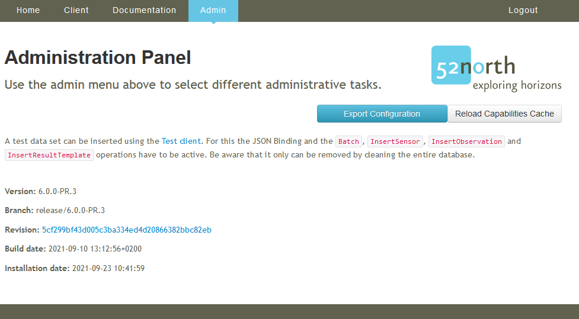
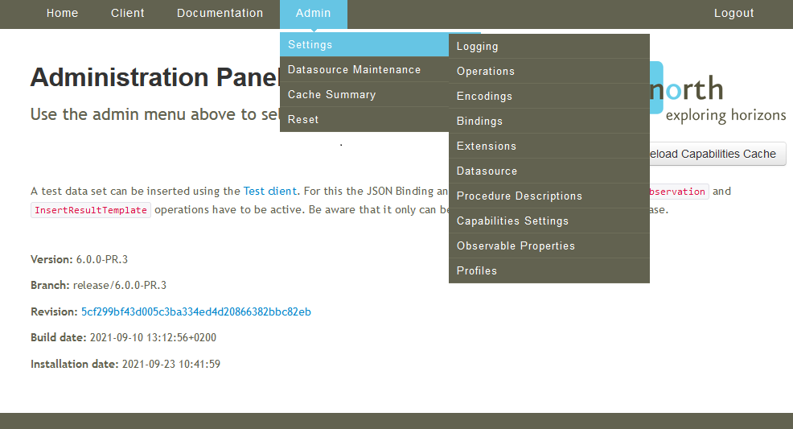
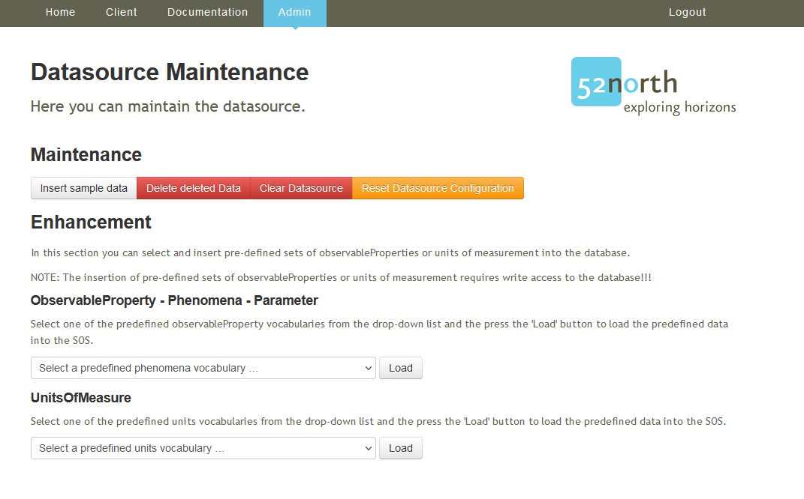
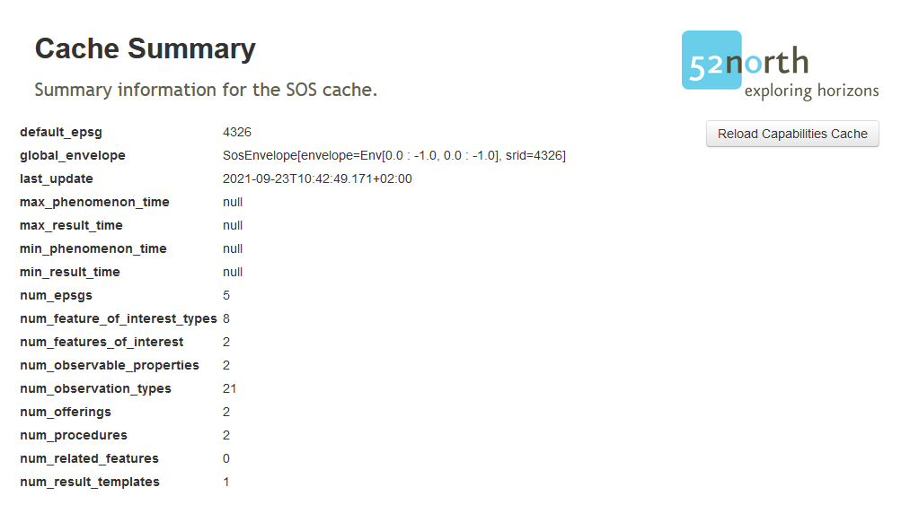
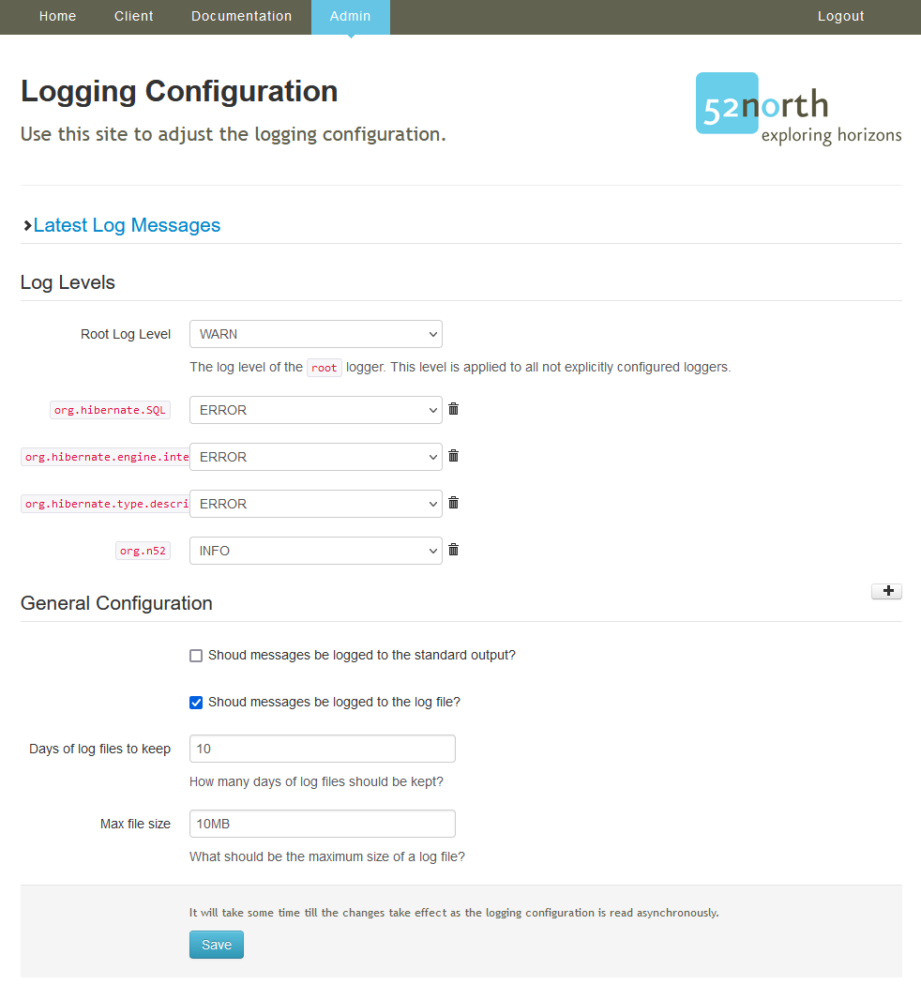
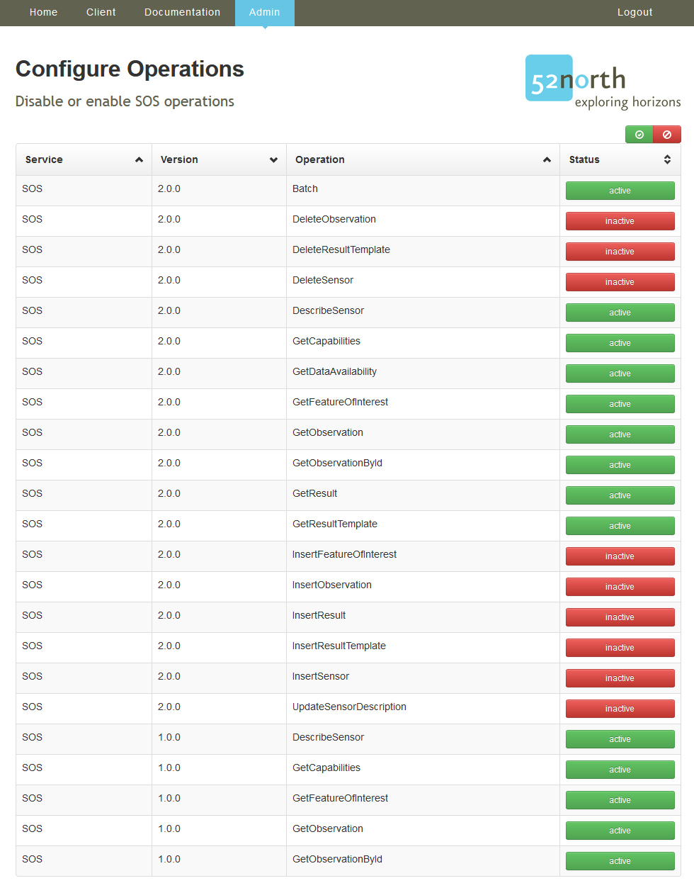
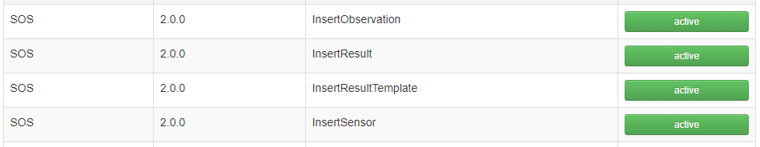
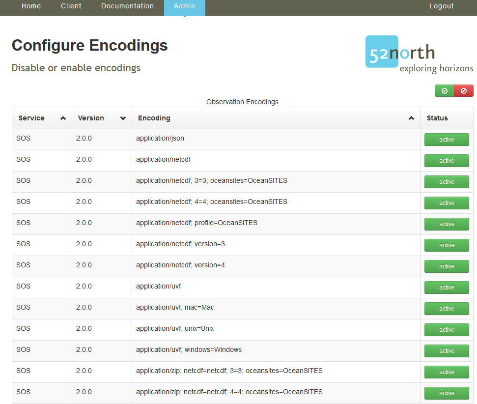
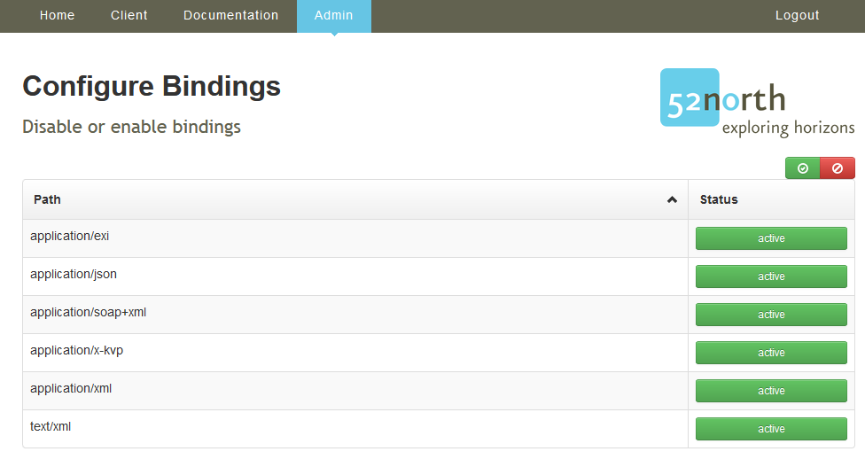
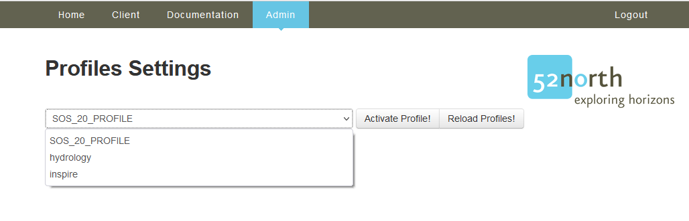

### Introduction

With the `Admin` interface you can change the settings, de-/activate operations, encodings and bindings or change the logging and check the latest log statements. 

During the set-up of the SOS you have already learned about the relevant settings of the SOS server. However, this tutorial shows you a set of further settings that might be changed during the operation of your SOS server.

#### Admin interface

The admin interface allows the administrator to change the settings or modify the behavior of the SOS.

> ####### Activity 1
>
> 1. Click `Admin`

Now you see the Admin start page with information about the Version and the build and installation date.

> ####### Activity 2
>
> 1. Click the blue `Export Configuration` button

A new browser tab opens with the configuration of the SOS formatted in JSON. This file can be saved and [loaded during the installation](09_01_sos_installation_war_file.md#upload-a-configuration-file){target=_blank} of the SOS.

If you hover over `Admin` then *move* to `Settings` an further list appears with additional configurations.

#### Settings

> ####### Activity 2
>
> 1. Hover over the `Admin` and *click* on `Settings`

Now you see the same settings which we have described in the [installation](09_01_sos_installation_war_file.md#settings){target=_blank} process.

An additional tab exists in the admin settings, the `Credentials` tab to change the admin password.

##### Datasource Maintenance

With the *Datasource Maintenance* the administrator can

* clear all data from the database
* delete data which are marked as delete (when deleting data via the transactional SOS operations, the data is only marked as deleted but not yet removed from the database; with this option you can delete all data marked as deleted form the database)
* insert some sample data (only for testing purposes; this should not be executed in an operational database)
* reset the datasource configuration (e.g. if you database server has changed)
* insert predefined observableProperties and units (this is a comfort functionality so that you can add a pre-defined vocabulary to your SOS server)

> ####### Activity 3
>
> 1. Hover over the `Admin` and *click* on `Datasource Maintenance`

##### Cache Summery

A brief summery of the contained data.

> ####### Activity 4
>
> 1. Hover over the `Admin` and *click* on `Cache Summery`

You can see a short summary of the number of the entities contained in the SOS and the bbox and temporal extends of the data. This is an important functionality for checking if SOS and database interact properly. Especially the following information is important:
* last_update: this timestamp indicates the last time when the content of the SOS cache was successfully complete; if this timestamp is present, the interaction between SOS and database is working
* max_phenomenontime and min_phenomenon_time: these timestamps indicate for which time period your SOS server contains data
* num_* These entries show how many entities are contained in the different tables of the database

##### Logging

Configuration of the logging of the SOS.

Here you can make adjustments of the logging of your SOS server. This includes especially the modification of log levels. For regular operation we recommend to use WARN or ERROR. For debugging purposes other log levels such as DEBUG or TRACE can be used.

Furthermore, you can define the maximum size of log files and how long the log files should be kept.

> ####### Activity 5
>
> We modify the days to keep and the file size
>
> 1. Hover over the `Admin` and `Settings` and *click* on `Logging`
> 1. Set *Days of log files to keep* to `5`
> 1. Set *Max file size* to `5MB`
> 1. Save the changes

##### Operations

This configuration page allows the de-/activation of the supported operations. You can activate/deactive the operations by clicking on the corresponding buttons.

For an explanation of these operations, please refer to the session with the SOS introdcution.

> ####### Activity 6
>
> 1. Hover over the `Admin` and `Settings` and *click* on `Operations`

To follow the given examples in the next chapter we activate the
transactional SOS operations.

> ####### Activity 7
>
> We activate the following operations
>
> 1. Click the *red inactive* button behind `InsertObservation`
> 1. Click the *red inactive* button behind `InsertResult`
> 1. Click the *red inactive* button behind `InsertResultTemplate`
> 1. Click the *red inactive* button behind `InsertSensor`

These operations will later on be needed for our hands-on to insert data into the SOS server.

##### Encodings

This configuration page allows the de-/activation of the supported encodings.

> ####### Activity 8
>
> 1. Hover over the `Admin` and `Settings` and *click* on `Encodings`

##### Bindings

This configuration page allows the de-/activation of the supported bindings.

> ####### Activity 9
>
> 1. Hover over the `Admin` and `Settings` and *click* on `Bindings`

> ####### Activity 10
>
> We deactivate the following bindings
>
> 1. Click the *green active* button behind `application/exi`

##### Profiles

Select the profile the SOS should comply with.

> ####### Activity 11
>
> 1. Hover over the `Admin` and `Settings` and *click* on `Profiles`

The profiles allows us to change the *default* behavior of the SOS. Especially, the default response format of the *GetObservation* requests.

Currently, the 52N SOS provides three profiles:

* *SOS_20_PROFILE* -> default SOS 2.0, Observations are returned in OGC O&M 2.0
* *hydrology* -> default SOS 2.0, Observations are returned in OGC WaterML 2.0
* *inspire* -> default SOS 2.0, Observations are returned in Inspire OMSO 3.0 (specialized O&M 2.0)

##### Further configurations

The following configuration are not part of the tutorial and are only mentioned briefly here.

* *Extensions* -> de-/activate extensions
* *Datasource* -> change the datasource settings (connections, user, password, ...)
* *Procedure Descriptions* -> modify procedure descriptions
* *Capabilities Settings* -> create static Capabilities or add Capabilities extensions
* *Observable Properties* -> change the observableProperties identifier
