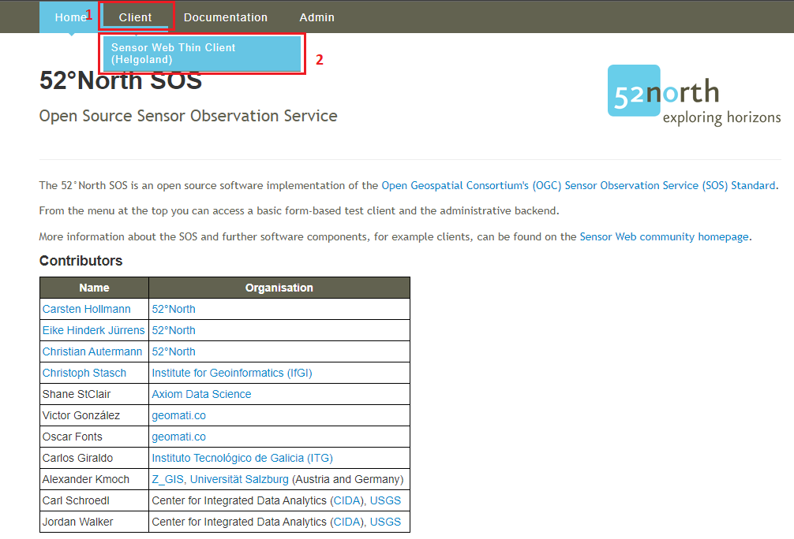
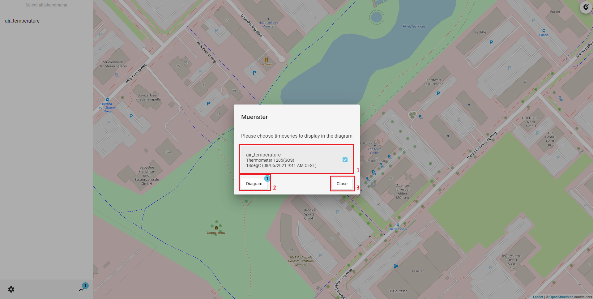
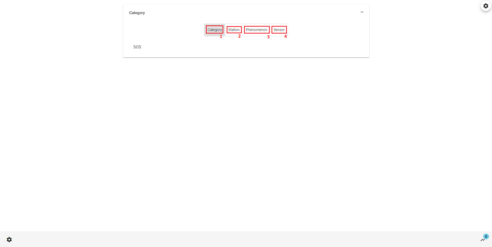

## 52°North Helgoland Client

The **52°North Helgoland Client** is a lightweight web application that enables the exploration, visualization
and analysis of sensor web data in various fields of use, e.g. hydrology, meteorology, environmental monitoring,
traffic management. This tutorial shows you how to use the Helgoland Client. In this tutorial we use as an
example the **52°North SOS** which was installed in the [SOS Installation War File](09_01_sos_installation_war_file.md)
tutorial and we use the data which was added to the SOS in the [SOS Example Request](09_03_sos_example_request.md)
tutorial. But you can also follow along the tutorial with different data.

### Workflow

The workflow would be:

* [Open Helgoland Client](#open-helgoland-client)
* [Explore Sensor Web Data on Map](#explore-sensor-web-data-on-map)
* [Select Time Series Data](#select-time-series-data)
* [Visualize Time Series Data](#visualize-time-series-data)

### Open Helgoland Client

The **52°North Helgoland Client** is part of the **52°North SOS** installation. You can access
the Helgoland Client from the SOS menu.



> ####### Activity 1
>
> 1. Hover your mouse over `Client`
> 1. Click `Sensor Web Thin Client (Helgoland)` in the drop down menu

### Explore Sensor Web Data on Map

When you open the Helgoland Client you come to the `Diagram` tab. Because you opened the
Helgoland Client for the first time you have no data selected to be shown in the diagram.


1. Here you can choose timeseries in a map view to be shown in the diagram
1. Here you can choose timeseries in a list view to be shown in the diagram
1. Here you can change the view to a `Darkmode` or adjust the `Language` (currently supported languages
are English and German)

> ####### Activity 2
>
> 1. Select your language
> 1. Click on `Add timeseris by map`

Now you can explore all the measurement stations, which are provided by the service. In this example
it is only on station, which measures the air temperature. If you start the Helgoland Client for the
first time, you have to select a provider before you can see the map.


1. Select a phenomenon to filter which stations are displayed in the map
1. Here you can adjust the provider
1. This symbol marks a measurment station
1. Here you can navigate back to the diagram

If you have chosen a station, which timeseries data you want to present in a diagram, you can select it
by clicking on it.

> ####### Activity 3
>
> 1. Select the station by clicking on the symbol in the map

### Select Time Series Data

After you clicked on a station a popup opens. In this you can select timeseries data and confirm
your decision.



> ####### Activity 4
>
> 1. Select timeseries data
> 1. Click on `Diagram`

### Visualize Time Series Data

The diagram now displays your chosen timeseries data. You can now visualize the data or go back
to the map to add more timeseries data.


1. By clicking here you can highlight the timeseries
1. Here you can enable or disable the visibility of the data in the diagram.
1. Here you can style the timeseries
1. By clicking on the star you can add the timeseries data to your favorites.
1. Here you can delete the timeseries data from the diagram.
1. Here you can configurate the diagram settings
1. This button clears all data from the diagram.
1. Here you can save a link to you clipboard to share your diagram
1. Here you can see your saved favorites
1. By clicking on the plus you can add more timeseries to the diagram
1. By moving the red window or the edges of the window you can adjust the displayed period of time.

> ####### Activity 5
>
> 1. Try the different options and find the best way to visualize your data

### List Selection

Alternativ to the `Map` tab you can use the `List selection` tab to add new timeseries data to the diagram.



> ####### Activity 6
>
> 1. Choose a filter option
> 1. Select an item from the list below to filter by

Next you have to select your timeseries data by choosing a category, a station, a phenomenon and a sensor
from the list. When you select all criteria, the timeseries data is added to the diagram.


> ####### Activity 7
>
> 1. Click on `Timeseries`
> 1. Select a timeseries data
> 1. Click on the diagram symbol to navigate back to the diagram

Now you successfully  learnt how to use the **52°North Helgoland Client** and can explore, visualize
and analyse your sensor web data.

### Standalone installation

#### Requirements

* Application server__ compatible to Java Servlet-API 2.5 or higher

#### Installation

When your system matches the requirements above, download the latest release __war-file__ from here:

> [52°North Helgoland](https://github.com/52North/helgoland/releases){target=_blank}

* Select the *helgoland-timeseries.war* to download
* Copy the downloaded file into the folder application server webapp folder, e.g. `/opt/tomcat/webapps`

After a moment the __war-file__ gets converted and in the folder should be a new
folder `helgoland-timeseries`. If this is the case than you can reach the webapp with this URL:

> [http://localhost:8080/helgoland-timeseries/](http://localhost:8080/helgoland-timeseries/){target=_blank}

### Configuration

* Go to the application server webapp folder, e.g. `/opt/tomcat/webapps`
* Go to
  * **standalone**: `/helgoland-timeseries/assets/`
  * **SOS**: `/52n-sos-webapp/static/client/helgoland/assets/`
* Open `settings.json` in an editor

The most important setting is the `datasetApis` where you define the `Helgoland-API`s the client should use.
Here you can defined multiple Helgoland-API and SensorThings-API services.

Other settings are

* **providerBlackList**: If an API provides multiple services you can blacklist some services
* **defaultTimeseriesTimeduration**: The default time duration for the timeseries in the diagram
* **languages**: Supported languages. The translation files are stored in the `/i18n` folder of the assets folder. Filename is defined `code` + `.json`, e.g. `en.json`
* **timespanPresets**: Predefined timespans which can be selected instead of start and end time.

```json
{
  "providerBlackList": [{
    "serviceId": "srv_42c69c781d20426f2d383c11625a26b5",
    "apiUrl": "https://sensorweb.demo.52north.org/sensorwebclient-webapp-stable/api/v1/"
  }],
  "defaultTimeseriesTimeduration": {
    "duration": {
      "days": 7
    },
    "align": "end"
  },
  "datasetApis": [
    {
      "name": "localhost",
      "url": "http://localhost:8080/52n-sos-webapp/api/"
    }
  ],
  "languages": [{
      "label": "Deutsch",
      "code": "de"
    },
    {
      "label": "English",
      "code": "en"
    },
    {
      "label": "Portuguese",
      "code": "pt"
    }
  ],
  "proxyUrl": "https://cors-anywhere.herokuapp.com/",
  "timespanPresets": [{
      "name": "lastHour",
      "label": "timeSelection.presets.lastHour",
      "timespan": {
        "from": "moment().subtract(1, 'hours')",
        "to": "moment()"
      },
      "seperatorAfterThisItem": true
    },
    {
      "name": "today",
      "label": "timeSelection.presets.today",
      "timespan": {
        "from": "moment().startOf('day')",
        "to": "moment().endOf('day')"
      }
    },
    {
      "name": "yesterday",
      "label": "timeSelection.presets.yesterday",
      "timespan": {
        "from": "moment().subtract(1, 'days').startOf('day')",
        "to": "moment().subtract(1, 'days').endOf('day')"
      }
    },
    {
      "name": "todayYesterday",
      "label": "timeSelection.presets.todayYesterday",
      "timespan": {
        "from": "moment().subtract(1, 'days').startOf('day')",
        "to": "moment().endOf('day')"
      },
      "seperatorAfterThisItem": true
    },
    {
      "name": "thisWeek",
      "label": "timeSelection.presets.thisWeek",
      "timespan": {
        "from": "moment().startOf('isoWeek')",
        "to": "moment().endOf('isoWeek')"
      }
    },
    {
      "name": "lastWeek",
      "label": "timeSelection.presets.lastWeek",
      "timespan": {
        "from": "moment().subtract(1, 'weeks').startOf('isoWeek')",
        "to": "moment().subtract(1, 'weeks').endOf('isoWeek')"
      },
      "seperatorAfterThisItem": true
    },
    {
      "name": "thisMonth",
      "label": "timeSelection.presets.thisMonth",
      "timespan": {
        "from": "moment().startOf('month')",
        "to": "moment().endOf('month')"
      }
    },
    {
      "name": "lastMonth",
      "label": "timeSelection.presets.lastMonth",
      "timespan": {
        "from": "moment().subtract(1, 'months').startOf('month')",
        "to": "moment().subtract(1, 'months').endOf('month')"
      },
      "seperatorAfterThisItem": true
    },
    {
      "name": "thisYear",
      "label": "timeSelection.presets.thisYear",
      "timespan": {
        "from": "moment().startOf('year')",
        "to": "moment().endOf('year')"
      }
    },
    {
      "name": "lastYear",
      "label": "timeSelection.presets.lastYear",
      "timespan": {
        "from": "moment().subtract(1, 'years').startOf('year')",
        "to": "moment().subtract(1, 'years').endOf('year')"
      }
    }
  ]
}
```
