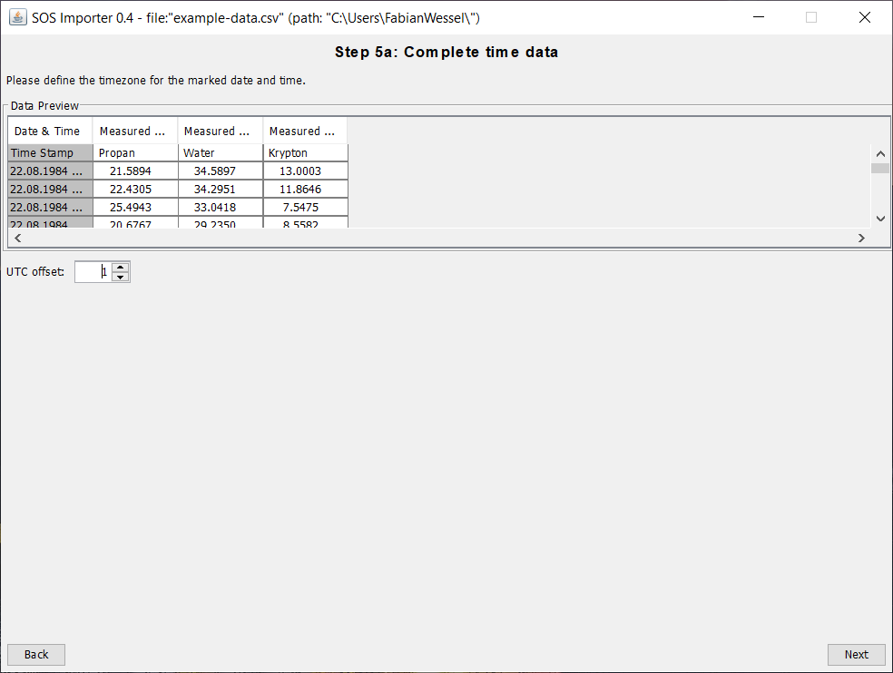

## 52°North SOS Importer

The **52°North SOS Importer** is a tool for importing observations from CSV files into a running SOS instance.
Those CSV files can either be locally available or remotely (FTP support). The application makes
use of the wizard design pattern which guides the user through different steps. This tutorial shows,
how to load a locally available CSV file into a running SOS instance.

### Workflow

The workflow would be:

* [Start SOS Importer Wizard](#start-sos-importer-wizard)
* [Choose CSV File](#choose-csv-file)
* [Define CSV File Metadata](#define-csv-file-metadata)
* [Choose Metadata for the selected Column](#choose-metadata-for-the-selected-column)
* [Complete Time Data](#complete-time-data)
* [Add missing Metadata](#add-missing-metadata)
* [Add missing Positions](#add-missing-positions)
* [Final Configuration](#final-configuration)
* [Final Step](#final-step)

### Start SOS Importer Wizard

At first you need to download the current **SOS Importer Wizard**
([52n-sos-importer-wizard-0.4.2-bin.jar](https://github.com/52North/sos-importer/releases/download/v0.4.2/52n-sos-importer-wizard-0.4.2-bin.jar))
and the current **SOS Importer Feeder**
([52n-sos-importer-feeder-0.4.2-bin.jar](https://github.com/52North/sos-importer/releases/download/v0.4.2/52n-sos-importer-feeder-0.4.2-bin.jar)).

When the files are downloaded you can store them together in a folder of your choice. Next you need
a csv-file with data you want to import. You can download the example csv-file which is used in this tutorial
here: [Download](https://52north.org/delivery/SensorWeb/Workshops/Frejus_2021/example-data.csv)

After that you need to make sure you have a running SOS instance. If you do not have a running
SOS instance you can check out this tutorial, how to set up a SOS:
[Tutorial](09_01_sos_installation_war_file.md)

Now you can execute the `52n-sos-importer-wizard-VERSION_NUMBER-bin.jar` which will guide you
through the process of setting up the import of the csv-file.

> ####### Activity 1
>
> 1. Download the SOS Importer Wizard
> 1. Download the SOS Importer Feeder
> 1. Download the `example-data.csv`
> 1. Make sure you have a running SOS instance
> 1. Execute the SOS Importer Wizard

### Choose CSV File

After you execute the **SOS Importer Wizard** the following window opens. There you select the csv-file
you want to import into the SOS. Moreover you can change the language between English and German and
you can choose if you want to use a `One-Time-Feed from a local CSV file` or a
`One-Time-Feed/ Repetitive Feed from a FTP-Server`. In this tutorial we choose the
`One-Time-Feed from a local CSV file`.

> ####### Activity 2
>
> 1. Change the language to your language (supported languages are English and German)
> 1. Select in the dropdown-menu `One-Time-Feed from a local CSV file`
> 1. Select the `example-data.csv`
> 1. Select `UTF-8` as the input file encoding
> 1. Continue by clicking on `Next`

### Define CSV File Metadata

In the next step you select the column separator, the text qualifier and the decimal separator of the
csv-file. Also you can choose until which line the data should be ignored. In this tutorial we
choose 1 line because the headings of the columns should be ignored.

> ####### Activity 3
>
> 1. Choose as column separator `,`
> 1. Choose a text qualifier `"`
> 1. Ingore data until line 1 to leave out the column headings
> 1. Choose as decimal separator `.`
> 1. Continue by clicking on `Next`

### Choose Metadata for the selected Column

In this step you need to choose the metadata for the selected column. In the example data the first
column contains the date and time. For the date and time you need to choose a format from the
dropdown-menu. When the needed format is missing, you can add it by clicking on the pencil.

> ####### Activity 4
>
> 1. Select the metadata `Date & Time`
> 1. Select the format `dd.MM.yyyy HH:mm`
> 1. Continue by clicking on `Next`

The other three columns contain measured values which are numeric values.

> ####### Activity 5
>
> 1. Select the metadata `Measured Value`
> 1. Select the type `Numeric Value`
> 1. Continue by clicking on `Next`
> 1. Repeat this activity for the columns 3 and 4

### Complete Time Data

After that step you need to define the timezone for the marked date and time by setting an UTC offset.

> ####### Activity 6
>
> 1. Define the timezone for the marked date and time by entering the UTC offset
> 1. Continue by clicking on `Next`

### Add missing Metadata

Now you only need to add the data which is missing in the csv-file. First you need to add a
**Feature of Interest** to every column of measurements. Select `Set identifier manually` and add your
**Feature of Interest** by setting a name and a URI.

> ####### Activity 7
>
> 1. Select `Set identifier manually`
> 1. Add a Name for the **Feature of Interest**
> 1. Add an URI for the **Feature of Interest**
> 1. Continue by clicking on `Next`
> 1. Repeat this activity for the columns 3 and 4

Next you need to choose an **Observed Property** for every column of measurements.

> ####### Activity 8
>
> 1. Select `Set identifier manually`
> 1. Add a Name for the **Observed Property**
> 1. Add an URI for the **Observed Property**
> 1. Continue by clicking on `Next`
> 1. Repeat this activity for the columns 3 and 4

Following you need to set a **Unit of Measurement** for every column of measurements.

> ####### Activity 9
>
> 1. Select `Set identifier manually`
> 1. Add a Name for the **Unit of Measurement**
> 1. Add an URI for the **Unit of Measurement**
> 1. Continue by clicking on `Next`
> 1. Repeat this activity for the columns 3 and 4

Last you need to add a **Sensor** to every column of measurements.

> ####### Activity 10
>
> 1. Select `Set identifier manually`
> 1. Add a Name for the **Sensor**
> 1. Add an URI for the **Sensor**
> 1. Continue by clicking on `Next`
> 1. Repeat this activity for the columns 3 and 4

### Add missing Positions

In this step you need to add a position to the **Feature of Interest** by adding a latitude,
a longitude and an altitude. `WGS84` is the reference system in this tutorial.

> ####### Activity 11
>
> 1. Add a Latitude for the **Feature of Interest**
> 1. Add a Longitude for the **Feature of Interest**
> 1. Add a Altitude for the **Feature of Interest**
> 1. Select `WGS84` as reference system
> 1. Continue by clicking on `Next`

### Final Configuration

In this final step of the configuration you need to add the URL of the SOS, choose a folder for the
configuration file and name the configuration file. In this tutorial the offering is generated from the
sensor name, the specification version is `2.0.0`, the binding is `POX` and as an import strategy
`Single Observation` is used.

> ####### Activity 12
>
> 1. Enter the URL of the SOS (here: `http://localhost:8080/52n-sos-webapp/service`)
> 1. Choose a folder where the configuration file should be saved
> 1. Enter a name for the configuration file
> 1. Activate the generation of the offering from the sensor name
> 1. Choose the specifictation version `2.0.0` and the binding `POX`
> 1. Select the import strategy `Single Observation`
> 1. Continue by clicking on `Next`

### Final Step

When you see this window, a configuration file was generated and stored at the defined location.
By clicking on `Start` you can now start the import of the data file.

> ####### Activity 13
>
> 1. Start the import of the csv-file by clicking on `Start`

After the import is finished the window should look like the following. Now you have successfully
imported the data from the csv-file. You can close the window by clicking on `Finish`.

> ####### Activity 14
>
> 1. Close the SOS Import Wizard by clicking on `Finish`
